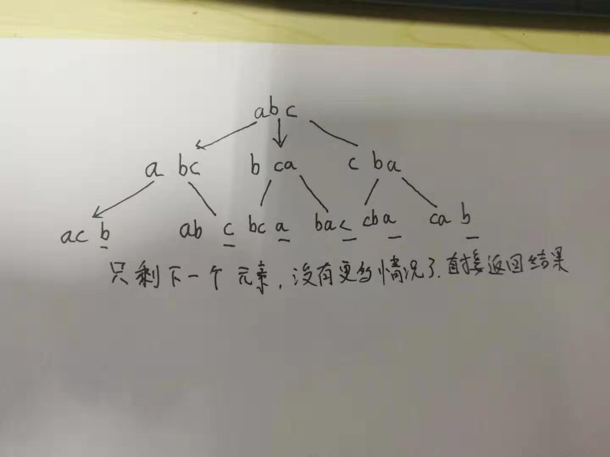

字符串的全排列问题，在算法导论和数据结构里面都讲过这个题，算是很常见的一个比较经典的题目。
<!-- more -->
题目描述
输入一个字符串,按字典序打印出该字符串中字符的所有排列。例如输入字符串abc,则打印出由字符a,b,c所能排列出来的所有字符串abc,acb,bac,bca,cab和cba。
#思路
首先判断字符串的长度，如果小于等于1就没必要进行下去了，然后正题开始，以abc的全排列做个比方，要求它的全排列，首先将首字母a的位置是后面的任一字符和它自己都可以放在这里的（因为是全排列），所以将其与自身以及后面的bc中的任一字符交换，得到abc、bac、cba三种第一个字符可能出现的情况，现在相当于已经求到了所有可能在第一个位置出现的字符了，一共三种情况，下面再对这三种情况分别做分析，首先是abc，因为a的位置已经确定了，那么再对bc做分析，同理，b的位置c也可以放，b自己也可以放，那么它下面就有两种情况：abc和acb，对于bac和cba来说也是一样的道理，同样可以得出他们下面可以分出bca、bac以及cab、cba，然后就是第三个位置上的字符进行确定了，因为第三个字符后面没有字符了，他是back(),所以就不用再和任何字符交换，返回结果abc、acb、bac、bca、cba、cab，具体分析看下图：

#code

	class Solution {
	public:
	    void digui(string str,int begin,int l,vector<string> &res)
	    {
	        if(begin==l)
	            res.push_back(str);
	        else
	        {
	            for(int i=begin;i<=l;i++)
	            {
	                if(begin!=i&&str[begin]==str[i])//防止有相同的字符，就不用进行交换了，前面个判断条件是因为自身也需要交换一次，如果不加，就会一起跳过，就本来的排列都不会被添加进结果。。
	                    continue;
	                swap(str[begin],str[i]);
	                digui(str,begin+1,l,res);
	                swap(str[begin],str[i]);
	            }
	        }
	        return ;
	    }
	    vector<string> Permutation(string str) {
	        vector<string> res;
	        if(str.size()==0)
	            return res;
	        int l=str.size()-1;
	        digui(str,0,l,res);
	        sort(res.begin(),res.end());//纯粹是因为顺序不对不能AC所以才加上的。
	        return res;        
	    }
	};