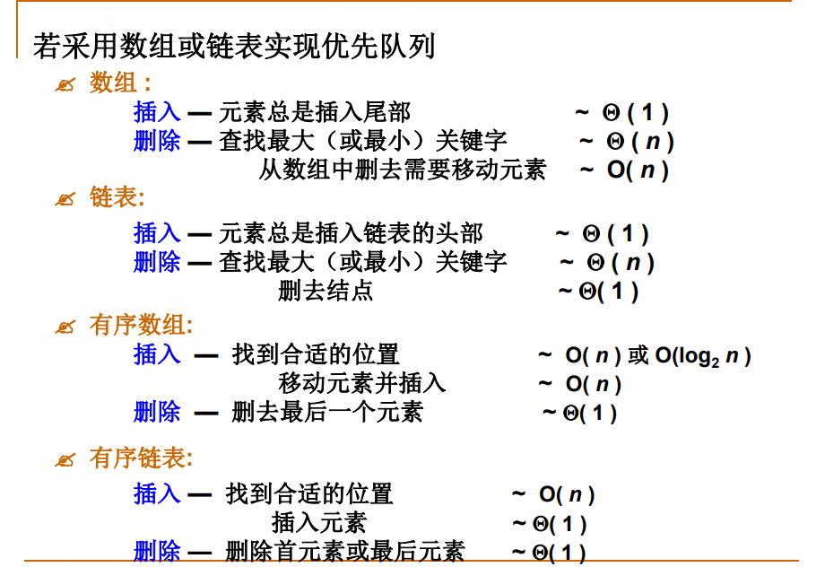
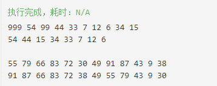

<!-- more -->
什么是堆？
堆是为了处理一种特殊的情况而建立的一种特殊的队列，取出的元素的顺序是按照元素的优先权的大小，而不是依照元素进入队列的先后顺序。
那如何组织这种形式呢？依靠顺序存储或者链表都有各种不尽人意的地方，平均损耗如下所示：

所以我们采用完全二叉树来进行存储，这样插入和删除都是O（log（n）），而且是完全二叉树，所以并不会照成空间上太多的浪费。
堆的两个特性：
（1）结构性：用数组表示的完全二叉树
（2）有序性：任意节点的关键字是其所有子树所有节点的最大值或者最小值，相应的就称为最大堆或者最小堆，也称大顶堆或者小顶堆。
堆关注的三个问题，一个是删除，一个是插入，一个是堆的建立。
**一、堆的删除（以最大堆举例）**
取出根节点元素，同时删除堆中的根节点，为了保证最大堆的性质，我们需要将其进行改造，如果从下方选择一个子树节点值上移，会造成许多麻烦的操作，所以我们选择将存储数组的最后一个节点（即最后一个入队的元素放在根节点的位置），然后不断的进行比较，将其放在其应该处于的位置。
**二、最大堆的插入**
将新插入的节点放在存储数组最后的位置，然后我们不断的将其与其父节点进行比较，如果大于就上移，否则就留着原位，并且插入结束。
**三、最大堆的建立**
将已经存在的N哥元素按照最大堆的要求存放在一个一维数组中，我们有两种方法。
1、通过插入操作，一个个相继插入到初始为空的堆中去，其时间代价在最大的情况下为O（NlogN）。
2、我们可以在线性复杂度下建立最大堆。
    2.1 、将N个元素按照输入顺序直接存入，先满足完全二叉树的结构特性
    2.2 、调整各节点的位置，以满足最大堆的有序特性，采用自底向上的调整方式，从最后一个具有孩子节点的节点开始，往前开始调整，确保调整过的每一个节点的子树都是最大堆，它是树中各路径的高度和，时间复杂度计算如下所示：

单纯的从代码和图示来看，也是O（nlogn）,但是我们说过了，这是一个自底向上的过程，所以它就变成了O（n）。
N个节点的完全二叉树最多存在log2(n+1)层(向下取整)，我们设为h，在树的第j层最多有2e(j-1)个节点，每一层可能向下交换的次数为层数减一，所以根节点最多交换次数为层数减一。这样每一个的节点最多比较的次数就是h-j,其中j是自己的层数，h是总的层数，那倒数第二层的节点的比较次数就是1*2^(h-1)次(与左右孩子分别比较，所以乘上了2)，由于是bottom-top建立堆，因此在调整上层元素的时候，并不需要同下层所有元素做比较，只需要同其中之一分支作比较，而作比较次数则是树的高度减去当前节点的高度。因此，第x层元素的计算量为2^(x) * (h-x)，又以上通项公式可得知，构造树高为h的二叉堆的精确时间复杂度为：

S = 2^(h-1) × 1 + 2^(h-2) × 2 + …… +1 × (h-1) ①

通过观察上述公式可知，该求和公式为等差数列和等比数列的乘积，因此用错位想减发求解，给公式左右两侧同时乘以2，可知： 

2S = 2^h × 1 + 2^(h-1) × 2+ …… +2 × (h-1) ②

用②减去①可得： S =2^h+2^(h-1)+……- h +1 ③

将h = ㏒n 带入③，得出如下结论：

S =2n-log(n+1)+1= O(n)

上述操作的代码如下：

	#include<stdio.h>
	#include<stdlib.h>
	typedef int ElementType;
	typedef struct HNode *Heap; /* 堆的类型定义 */
	#define BOOL int
	#define true 1
	#define false 0
	struct HNode {
	    ElementType *Data; /* 存储元素的数组 */
	    int Size;          /* 堆中当前元素个数 */
	    int Capacity;      /* 堆的最大容量 */
	};
	typedef Heap MaxHeap; /* 最大堆 */
	typedef Heap MinHeap; /* 最小堆 */
	
	#define MAXDATA 1000  /* 该值应根据具体情况定义为大于堆中所有可能元素的值 */
	
	MaxHeap CreateHeap( int MaxSize )
	{ /* 创建容量为MaxSize的空的最大堆 */
	
	    MaxHeap H = (MaxHeap)malloc(sizeof(struct HNode));
	    H->Data = (ElementType *)malloc((MaxSize+1)*sizeof(ElementType));
	    H->Size = 0;
	    H->Capacity = MaxSize;
	    H->Data[0] = MAXDATA; /* 定义"哨兵"为大于堆中所有可能元素的值*/
	
	    return H;
	}
	
	int IsFull( MaxHeap H )
	{   
		if(H->Size == H->Capacity)
			return 1;
		return 0;
	}
	int Insert( MaxHeap H, ElementType X )
	{ /* 将元素X插入最大堆H，其中H->Data[0]已经定义为哨兵 */
	    int i;
	 
	    if ( IsFull(H) ) { 
	        printf("最大堆已满");
	        return 0;
	    }
	    i = ++H->Size; /* i指向插入后堆中的最后一个元素的位置 */
	    for ( ; H->Data[i/2] < X; i/=2 )
	        H->Data[i] = H->Data[i/2]; /* 上滤X */
	    H->Data[i] = X; /* 将X插入 */
	    return 1;
	}
	#define ERROR -1 /* 错误标识应根据具体情况定义为堆中不可能出现的元素值 */
	
	int IsEmpty( MaxHeap H )
	{
		if(H->Size==0)
			return true;
		return false;
	}
	
	ElementType DeleteMax( MaxHeap H )
	{ /* 从最大堆H中取出键值为最大的元素，并删除一个结点 */
	    int Parent, Child;
	    ElementType MaxItem, X;
	
	    if ( IsEmpty(H) ) {
	        printf("最大堆已为空");
	        return ERROR;
	    }
	
	    MaxItem = H->Data[1]; /* 取出根结点存放的最大值 */
	    /* 用最大堆中最后一个元素从根结点开始向上过滤下层结点 */
	    X = H->Data[H->Size--]; /* 注意当前堆的规模要减小 */
	    for( Parent=1; Parent*2<=H->Size; Parent=Child ) {
	        Child = Parent * 2;
	        if( (Child!=H->Size) && (H->Data[Child]<H->Data[Child+1]) )
	            Child++;  /* Child指向左右子结点的较大者 */
	        if( X >= H->Data[Child] ) break; /* 找到了合适位置 */
	        else  /* 下滤X */
	            H->Data[Parent] = H->Data[Child];
	    }
	    H->Data[Parent] = X;
	
	    return MaxItem;
	} 
	
	/*----------- 建造最大堆 -----------*/
	void PercDown( MaxHeap H, int p )
	{ /* 下滤：将H中以H->Data[p]为根的子堆调整为最大堆 */
	    int Parent, Child;
	    ElementType X;
	    X = H->Data[p]; /* 取出根结点存放的值 */
	    for( Parent=p; Parent*2<=H->Size; Parent=Child ) {
	        Child = Parent * 2;
	        if( (Child!=H->Size) && (H->Data[Child]<H->Data[Child+1]) )
	            Child++;  /* Child指向左右子结点的较大者 */
	        if( X >= H->Data[Child] ) break; /* 找到了合适位置 */
	        else  /* 下滤X */
	            H->Data[Parent] = H->Data[Child];
	    }
	    H->Data[Parent] = X;
	}
	
	void BuildHeap( MaxHeap H )
	{ /* 调整H->Data[]中的元素，使满足最大堆的有序性  */
	  /* 这里假设所有H->Size个元素已经存在H->Data[]中 */
	
	    int i;
	    /* 从最后一个结点的父节点开始，到根结点1 */
	    for( i = H->Size/2; i>0; i-- )
	        PercDown( H, i );
	}
	void Show(MaxHeap p) 
	{
		int len=p->Size;
		for(int i=1;i<=len;i++)
			printf("%d ",p->Data[i]);
		printf("\n");
	}
	void main()
	{
		MaxHeap p=CreateHeap(20);
		Insert(p,44);
		Insert(p,33);
		Insert(p,7);
		Insert(p,6);
		Insert(p,99);
		Insert(p,12);
		Insert(p,999);
		Insert(p,54);
		Insert(p,34);
		Insert(p,15);
		Show(p);
		DeleteMax( p);
		DeleteMax( p);
		Show(p);
		printf("\n");
	 
		MaxHeap p1= CreateHeap(15);
		int a[]={55,79,66,83,72,30,49,91,87,43,9,38};
		int len=sizeof(a)/sizeof(int);
		p1->Size=len;
		for(int i=0;i<len;i++)
			p1->Data[i+1]=a[i];
		Show(p1);
	    BuildHeap(p1);
		Show(p1);
		system("pause");
		}

什么是哈夫曼编码以及哈夫曼树？
我们在对数据进行查找或者编码的时候，如果不考虑数据出现的频率，单纯的将每一个数据看成等概率的操作，就会造成资源的浪费，哈夫曼树就是为了解决这个问题的。
哈夫曼树的定义：
带权路径长度(WPL)：设二叉树有n个叶子结点，每个叶子结点带有权值 w，从根结点到每个叶子结点的长度为 l，则每个叶子结
点的带权路径长度之和就是：WPL=w*l(从第一个节点到第n个节点)
最优二叉树或哈夫曼树: WPL最小的二叉树
哈夫曼树的构造就是每次把权值最小的两棵二叉树进行合并。
我们依托最小堆进行实现，代码如下：

	typedef struct TreeNode *HuffmanTree;
		struct TreeNode{
		int Weight;
		HuffmanTree Left, Right;
	}
	HuffmanTree Huffman( MinHeap H )
	{ /* 假设H->Size个权值已经存在H->Elements[]->Weight里 */
		 int i; HuffmanTree T;
		 BuildMinHeap(H); /*将H->Elements[]按权值调整为最小堆*/
		 for (i = 1; i < H->Size; i++)
	     { 	/*做H->Size-1次合并*/
			 T = malloc( sizeof( struct TreeNode) ); /*建立新结点*/
			 T->Left = DeleteMin(H);
			 /*从最小堆中删除一个结点，作为新T的左子结点*/
			 T->Right = DeleteMin(H);
			 /*从最小堆中删除一个结点，作为新T的右子结点*/
			 T->Weight = T->Left->Weight+T->Right->Weight;
			 /*计算新权值*/
			 Insert( H, T ); /*将新T插入最小堆*/
		 }
		 T = DeleteMin(H);
		 return T;
	 }

整体复杂度为O（NlogN）.
哈夫曼树的特点：
（1）没有度为1的节点
（2）n个叶子节点的哈夫曼树共有2n-1个节点
（3）哈夫曼树的任意非叶子节点的左右子树交换后扔是哈夫曼树
（4）对同一权值的一组数据，存在不同构的两棵哈夫曼树
像哈夫曼编码这种不等长编码，最重要的就是避免二义性，必须任意字符的编码都不是另一个字符编码的前缀，如此才可以无二义的解码，根据这一特点，我们利用二叉树进行编码，遵循下列两个条件：
（1）左右分支分别为0，1.
（2）字符只在叶子节点上。

