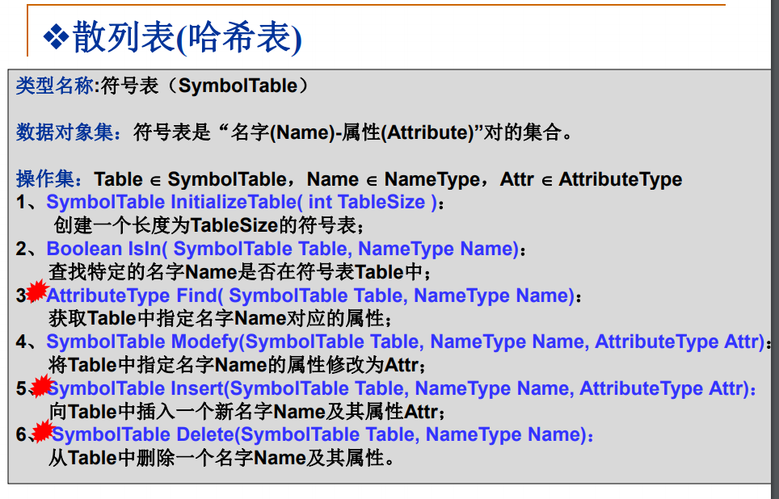
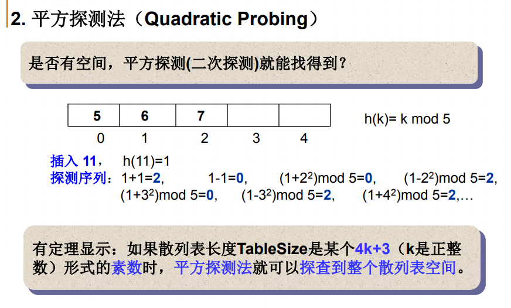
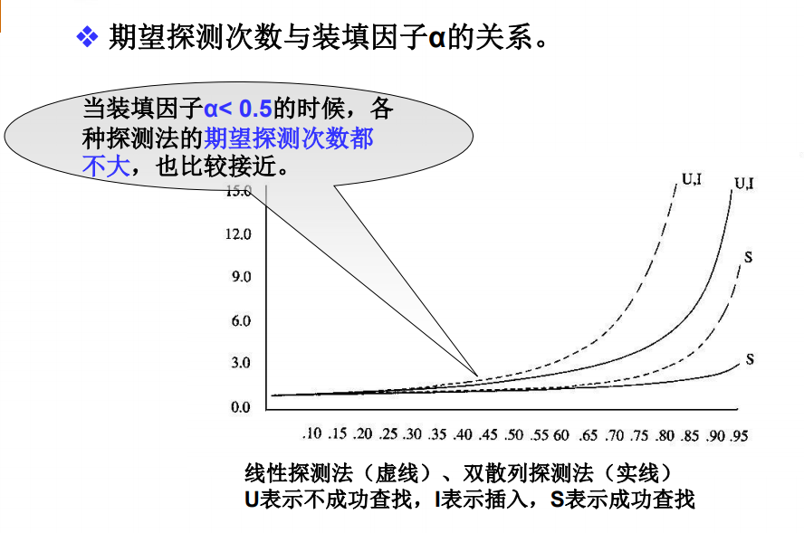

散列查找与散列表
<!-- more -->
目前我们已知的几种查找方法是顺序查找（O（N））、二分查找（静态查找，O（longN）），二叉搜索树（O（h），其中h为树高），平衡二叉树（O（logN））。当有一个庞大用户群的时候，用二分查找或者树查找法确实速度也可以接受，但是当动态查找时，需要进行插入和删除，为了让数据满足这几种查找所需要的特定的数据排序，需要移动大量的数据，耗时很高。并且上述的查找办法，默认的是进行查找操作的时候，对于关键字的比较时间很快，大多是一个整形变量，所以时间很快，但是查找操作可能面对字符型关键字，这样比较过程也需要很多时间。并且总结上述几种办法，会发现它们之所以很快，是因为它们需要有序的安排对象，让查找的数据对象呈现出一种有序（二分查找）、半序（树查找）的情况，散列查找不同，散列查找是通过关键字的特性，直接算出对象应该存储的位置。
介绍下散列查找的两项基本工作：
（1）计算位置：构造散列函数确定关键词的存储位置
（2）解决冲突：应用某种策略解决多个关键词位置相同的问题
一个构造良好的散列函数，可以保证它的查找时间复杂度几乎是常量：O（1），即查找时间和问题的规模是无关的。
下图是一个散列表的抽象数据结构，阐述了散列表需要有的基本操作。

散列的基本思想就是：
（1）以关键字key为自变量，通过一个确定的函数h（散列函数），计算出对应的函数值h（key），作为数据对象的存储地址。
（2）可能不同的关键字会映射到同一散列地址上，即h（key1）=h（key2）（当key1！=key2），称为冲突，这时就需要某种解决冲突解决策略。
装填因子：α=n/m，其中m为散列表的空间大小为m，填入表中的元素个数是n。
一个好的散列函数一般应考虑下列两个因素：
（1）计算简单，以便提高转换速度
（2）关键词对应的地址空间分布均匀，以尽量减少冲突
假如关键词是数字的，那可以参考下列几种散列函数的构造方式：
（1）直接定址法
取关键词的某个线性函数值作为散列地址，即h（key）=a * key+b（a、b为常数）
（2）除留余数法
散列函数为：h（key）=key mod p，一般情况下这里的p会选择一个素数。
（3）数字分析法
分析数字关键字在各个位置上的变换情况，取其中比较随机的位作为散列地址，例如知道手机号码前三位基本分为几类，中四位是地区编号，的后四位比较随机，所以可以取后四位作为地址。
（4）折叠法
把关键词分割成位数相同的几个部分，然后进行叠加，例如56793542，计算出h（56793542）为542+793+056=1391，取的1391的其中几位作为地址。
（5）平方取中法
依然是例如56793542，对其求平方得到56793542 x 56793542=322550 641 2905764，取中间的641作为地址。
上述的数字型关键词的几种散列函数构造方法，接下来说一说字符型的关键词的散列函数构造方法：
（1）ascii码求和
简单快捷，但是冲突非常严重，比如：a3、b2、c1；eat、tea。
（2）做一个简单的改进，前三个字符移位法
h(key)=（key[0]*27^2+key[1]*27^1+key[2] * 27^0）mod tablesize（这是散列表的长度），但是依然是一个比较不高效的散列函数，很明显的可以计算出它的空间浪费为3000/26^3=30%（前三个字符的不同组合在实际使用中大概有3000种可能，我们假设所有的字母（26个英文字母）排列组合有26^3种情况，散列表只用到30%）。
（3）好的散列函数-移位法
这个散列函数涉及到了关键词的所有N个字符，并且分布得很好：h(key)=((i从0到N-1)key[n-i-1]*32^i)mod tablesize,可以利用秦九昭算法进行快速运算。

	Index Hash ( const char *Key, int TableSize )
	{
		 unsigned int h = 0; /* 散列函数值，初始化为0 */
		 while ( *Key != ‘\0’) /* 位移映射 */
			 h = ( h << 5 ) + *Key++;
		 return h % TableSize;
	}

接下来说道的是一个无法回避的问题，冲突问题，如何解决冲突呢？采用的两种基本的解决思想如下：
（1）换个位置：开放地址法
（2）同一位置的冲突对象组织在一起：链地址法
首先讲的是开放地址法，这个方法就是一旦产生了冲突（该地址有了其它元素），就按照某种规则去寻找另外一个空地址。基本的公式是h(key)=(h(key)+d)mod tablesize，其中不同d决定了不同的解决冲突的方案：线性探测(d=i)、平方探测(d=(+or-)i^2)、双散列(d=i*h2(key))。
（1）线性探测法
以增量序列1，2，3，4.....，(tablesize-1)循环试探下一个存储地址，例如存入地址1，地址1有元素，那么存入地址2，如果地址2没元素，直接存入，如果有，接着试探地址3，直到找到一个空存储单元插入为止，这个方法简单是简单，但是很容易发生聚集现象，就是元素挤在一块插入，照成插入和查找的时间成本都增加了。
（2）平方探测法
平方探测法：以增量序列1^2,-1^2,2^2,-2^2,.....,q^2,-q^2且q ≤ TableSize/2循环试探下一个存储地址。但是平方探测法有一个致命的缺陷，针对某些特定地址，它不一定能探测到所有空间，如下图所示：

3、双散列探测法
这个方法就是简单的将d换成另一个散列函数与i的乘积，但是要注意，不允许有d等于0这种情况出现，因为出现这样的情况，那双散列探测其实就是普通的散列函数，探测序列还应该保证所有的散列存储单元都应该能够被探测到。选择以下形式有良好的效果：h2(key)=p-(key mod p),其中p<tablesize,p、tablesize都是素数。

**attention：在开放地址散列表中，删除操作要很小心。通常只能“懒惰删除”，即需要增加一个“删除标记(Deleted)”，而并不是真正删除它。以便查找时不会“断链”。其空间可以在下次插入时重用。
**
下面讲一下再散列问题，不管散列函数效果再怎么优越，在这个区间内元素越来越多的时候，查找效率的下降是肯定的，所以在装填因子α太大的时候，加倍扩大散列表，这个过程叫做“再散列（Rehashing）”，比较实用最大装填因子一般取 0.5 <= α<= 0.85。
开放地址法差不多就讲完了，接下来说一下分离链接法。
一句话就概括了，它是将相应位置上冲突的所有关键词存储在同一个单链表中。
接下来进行对散列表的性能分析，从两个方面着手：
（1）平均查找长度（ASL）用来度量散列表查找效率：成功、不成功
（2）关键词的比较次数，取决于产生冲突的多少
影响上述两个方面的有三个因素：
（1）散列函数是否均匀
（2）处理冲突的方法
（3）散列表的装填因子
1.线性探测法的查找性能
对于插入和不成功查找而言，探测次数满足p=[1+1/(1-α)^2]/2,对于成功查找而言，p=[1+1/(1-α)]/2.
2.平方探测法和双散列探测法的查找性能
对于插入和不成功查找而言，两者探测次数满足p=1/(1-α),对于成功查找而言，p=(-1/α)*ln(1-α).
通过下面一张图可以看出三种方法的期望探测次数和α的关系：

由上图可以明显得出随着 α 的增大，线性探测法的期望探测次数增加较快，不成功查找和插入操作的期望探测次数比成功查找的期望探测次数要大，由图中可知，合理的最大装入因子α应该不超过0.85.
2.分离链表法的查找性能
所有地址链表的平均长度定义成装填因子α，很明显α可能会超过1.
对于插入和不成功查找而言，探测次数满足p=α+e^(-α),对于成功查找而言，p=1+α/2.
选择合适的 h(key) ，散列法的查找效率期望是常数O(1)，它几乎与关键字的空间的大小n无关！也适合于关键字直接比较计算量大的问题,但它是以较小的α为前提。因此，散列方法是一个以空间换时间的办法，散列方法的存储对关键字是随机的，不便于顺序查找关键字，也不适合于范围查找，或最大值最小值查找，这也是之前字典不能排序，输出随机的原因，比较一下开房地址法和分离链表法吧。
（1）开放地址法
散列表是一个数组，存储效率高，随机查找。
散列表有“聚集”现象。
（2）分离链表法
散列表是顺序存储和链式存储的结合，链表部分的存储效率和查找效率都比较低。
太小的α可能导致空间浪费，大的α又将付出更多的时间代价，不均匀的链表长度导致时间效率的严重下降。
关键字删除不需要“懒惰删除”法，从而没有存储“垃圾”。

最后的最后，写一下几个c代码吧。

	这是分离链表发的散列函数
	#define KEYLENGTH 15                   /* 关键词字符串的最大长度 */
	typedef char ElementType[KEYLENGTH+1]; /* 关键词类型用字符串 */
	typedef int Index;                     /* 散列地址类型 */
	/******** 以下是单链表的定义 ********/
	typedef struct LNode *PtrToLNode;
	struct LNode {
	    ElementType Data;
	    PtrToLNode Next;
	};
	typedef PtrToLNode Position;
	typedef PtrToLNode List;
	/******** 以上是单链表的定义 ********/
	
	typedef struct TblNode *HashTable; /* 散列表类型 */
	struct TblNode {   /* 散列表结点定义 */
	    int TableSize; /* 表的最大长度 */
	    List Heads;    /* 指向链表头结点的数组 */
	};
	
	HashTable CreateTable( int TableSize )
	{
	    HashTable H;
	    int i;
	
	    H = (HashTable)malloc(sizeof(struct TblNode));
	    /* 保证散列表最大长度是素数，*/
	    H->TableSize = NextPrime(TableSize);
	
	    /* 以下分配链表头结点数组 */
	    H->Heads = (List)malloc(H->TableSize*sizeof(struct LNode));
	    /* 初始化表头结点 */
	    for( i=0; i<H->TableSize; i++ ) {
	         H->Heads[i].Data[0] = '\0';
	         H->Heads[i].Next = NULL;
	    }
	
	    return H;
	}
	这是平方探测法的函数
	Position Find( HashTable H, ElementType Key )
	{
	    Position P;
	    Index Pos;
	    
	    Pos = Hash( Key, H->TableSize ); /* 初始散列位置 */
	    P = H->Heads[Pos].Next; /* 从该链表的第1个结点开始 */
	    /* 当未到表尾，并且Key未找到时 */ 
	    while( P && strcmp(P->Data, Key) )
	        P = P->Next;
	
	    return P; /* 此时P或者指向找到的结点，或者为NULL */
	}
	
	bool Insert( HashTable H, ElementType Key )
	{
	    Position P, NewCell;
	    Index Pos;
	    
	    P = Find( H, Key );
	    if ( !P ) { /* 关键词未找到，可以插入 */
	        NewCell = (Position)malloc(sizeof(struct LNode));
	        strcpy(NewCell->Data, Key);
	        Pos = Hash( Key, H->TableSize ); /* 初始散列位置 */
	        /* 将NewCell插入为H->Heads[Pos]链表的第1个结点 */
	        NewCell->Next = H->Heads[Pos].Next;
	        H->Heads[Pos].Next = NewCell; 
	        return true;
	    }
	    else { /* 关键词已存在 */
	        printf("键值已存在");
	        return false;
	    }
	}
	
	void DestroyTable( HashTable H )
	{
	    int i;
	    Position P, Tmp;
	    
	    /* 释放每个链表的结点 */
	    for( i=0; i<H->TableSize; i++ ) {
	        P = H->Heads[i].Next;
	        while( P ) {
	            Tmp = P->Next;
	            free( P );
	            P = Tmp;
	        }
	    }
	    free( H->Heads ); /* 释放头结点数组 */
	    free( H );        /* 释放散列表结点 */
	}
	
	Position Find( HashTable H, ElementType Key )
	{
	    Position CurrentPos, NewPos;
	    int CNum = 0; /* 记录冲突次数 */
	
	    NewPos = CurrentPos = Hash( Key, H->TableSize ); /* 初始散列位置 */
	    /* 当该位置的单元非空，并且不是要找的元素时，发生冲突 */
	    while( H->Cells[NewPos].Info!=Empty && H->Cells[NewPos].Data!=Key ) {
	                                           /* 字符串类型的关键词需要 strcmp 函数!! */
	        /* 统计1次冲突，并判断奇偶次 */
	        if( ++CNum%2 ){ /* 奇数次冲突 */
	            NewPos = CurrentPos + (CNum+1)*(CNum+1)/4; /* 增量为+[(CNum+1)/2]^2 */
	            if ( NewPos >= H->TableSize )
	                NewPos = NewPos % H->TableSize; /* 调整为合法地址 */
	        }
	        else { /* 偶数次冲突 */
	            NewPos = CurrentPos - CNum*CNum/4; /* 增量为-(CNum/2)^2 */
	            while( NewPos < 0 )
	                NewPos += H->TableSize; /* 调整为合法地址 */
	        }
	    }
	    return NewPos; /* 此时NewPos或者是Key的位置，或者是一个空单元的位置（表示找不到）*/
	}
	
	bool Insert( HashTable H, ElementType Key )
	{
	    Position Pos = Find( H, Key ); /* 先检查Key是否已经存在 */
	
	    if( H->Cells[Pos].Info != Legitimate ) { /* 如果这个单元没有被占，说明Key可以插入在此 */
	        H->Cells[Pos].Info = Legitimate;
	        H->Cells[Pos].Data = Key;
	        /*字符串类型的关键词需要 strcpy 函数!! */
	        return true;
	    }
	    else {
	        printf("键值已存在");
	        return false;
	    }
	}
	
	这是开放地址法的散列函数
	#define MAXTABLESIZE 100000 /* 允许开辟的最大散列表长度 */
	typedef int ElementType;    /* 关键词类型用整型 */
	typedef int Index;          /* 散列地址类型 */
	typedef Index Position;     /* 数据所在位置与散列地址是同一类型 */
	/* 散列单元状态类型，分别对应：有合法元素、空单元、有已删除元素 */
	typedef enum { Legitimate, Empty, Deleted } EntryType;
	
	typedef struct HashEntry Cell; /* 散列表单元类型 */
	struct HashEntry{
	    ElementType Data; /* 存放元素 */
	    EntryType Info;   /* 单元状态 */
	};
	
	typedef struct TblNode *HashTable; /* 散列表类型 */
	struct TblNode {   /* 散列表结点定义 */
	    int TableSize; /* 表的最大长度 */
	    Cell *Cells;   /* 存放散列单元数据的数组 */
	};
	
	int NextPrime( int N )
	{ /* 返回大于N且不超过MAXTABLESIZE的最小素数 */
	    int i, p = (N%2)? N+2 : N+1; /*从大于N的下一个奇数开始 */
	
	    while( p <= MAXTABLESIZE ) {
	        for( i=(int)sqrt(p); i>2; i-- )
	            if ( !(p%i) ) break; /* p不是素数 */
	        if ( i==2 ) break; /* for正常结束，说明p是素数 */
	        else  p += 2; /* 否则试探下一个奇数 */
	    }
	    return p;
	}
	
	HashTable CreateTable( int TableSize )
	{
	    HashTable H;
	    int i;
	
	    H = (HashTable)malloc(sizeof(struct TblNode));
	    /* 保证散列表最大长度是素数 */
	    H->TableSize = NextPrime(TableSize);
	    /* 声明单元数组 */
	    H->Cells = (Cell *)malloc(H->TableSize*sizeof(Cell));
	    /* 初始化单元状态为“空单元” */
	    for( i=0; i<H->TableSize; i++ )
	        H->Cells[i].Info = Empty;
	
	    return H;
	}
