二叉搜索树、二叉平衡树
<!-- more -->
因为客观世界中的许多事物存在着层次关系，所以树这种结构能够很好的表示这种层次关系。通过这种分层次组织在管理上具有更高的效率，典型例子之一就是基本操作查找（二分查找如下图所示），查找分为静态查找（无插入和删除操作）和动态查找（包括插入和删除）。
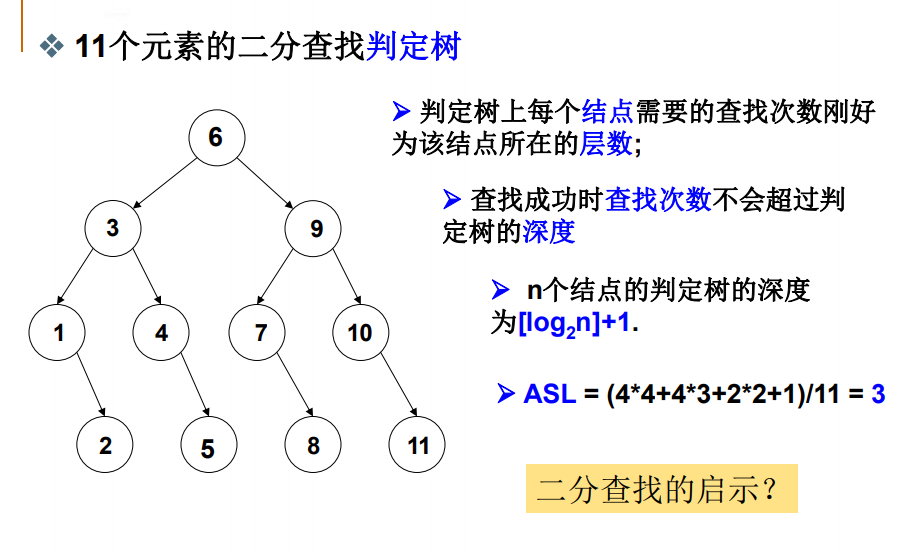
从上图我们可以看出，这是将一个顺序存储的组织方式转换成了一个分层次的树形结构来进行查找，可以明显看出，查找速度从顺序查找的o(n)变成了o(log(n))。
树的几个定义：
（1）子树不相交
（2）根节点之外，每个节点有且仅有一个父节点
（3）N个节点的树有N-1条边。
树的一些基本术语：
（1）节点的度：节点的子树的个数
（2）树的度：树的所有的节点中最大的度数
（3）叶节点：度为0的点
（4）父节点：有子树的节点是其子树的根节点的父节点
（5）子节点：是父节点的子节点
（6）兄弟节点：具有同一父节点的各节点彼此为兄弟节点
（7）路径和路径长度：路径所包含的边为路径长度，路径指的是两个节点之间的序列（n1，n2，n3.....nk），其中ni是ni+1的父节点。
（8）祖先节点：沿树根到某一结点路径上的所有结点都是这个结点的祖先结点
（9）子孙结点(Descendant)：某一结点的子树中的所有结点是这个结点的子孙
（10）结点的层次（Level）：规定根结点在1层，其它任一结点的层数是其父结点的层数加1
（11）树的深度（Depth）：树中所有结点中的最大层次是这棵树的深度
树的表示我们采用儿子——兄弟表示法：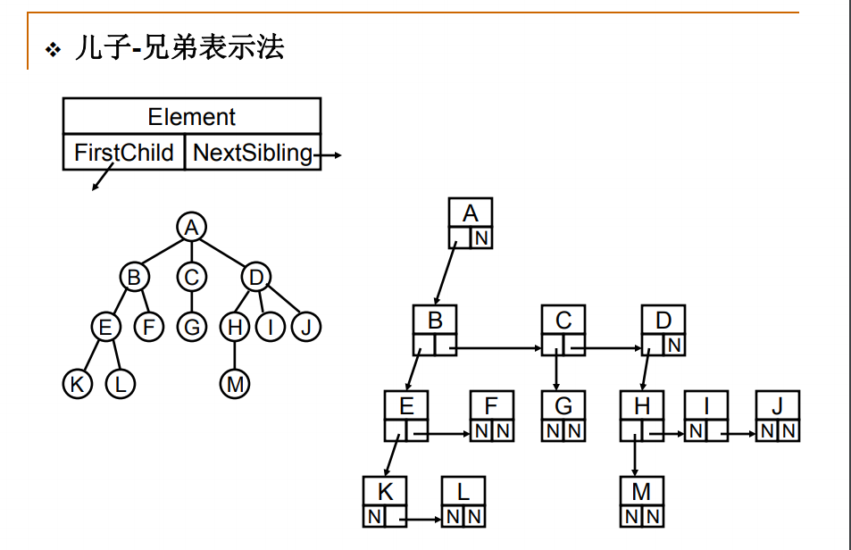

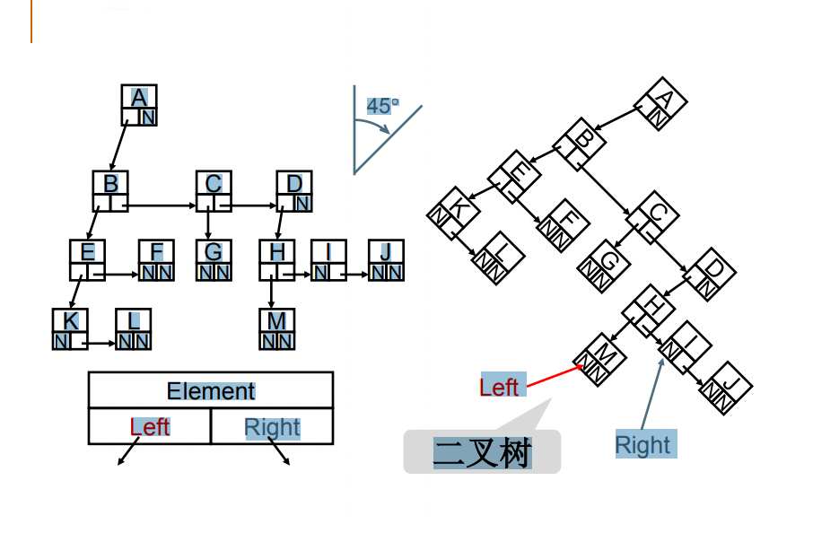

二叉树有完美二叉树（满二叉树）和完全二叉树（有n个结点的二叉树，对树中结点按从上至下、从左到右顺序进行编号，编号为i（1 ≤ i ≤ n）结点与满二叉树中编号为 i 结点在二叉树中位置相同），完美二叉树和完全二叉树可以用顺序存储来表示，比较简单方便。
二叉树具有几个重要的性质：
（1）一个二叉树第i层最大的节点数为：2e(i-1),i>=1
（2）深度为k的二叉树最多拥有2e(k)-1个节点，k>=1
（3）对于任何非空二叉树T，若n0表示叶节点的个数、n2是度为2的非叶节点个数，那两者一定满足关系n0=n2+1；
    证明：已知一个有用n个点的二叉树的边为n-1条，那么拥有度为2的节点记为n2，度为1的记为n1，度为0的记为n0（也就是叶节点），由二叉树的性质我们可知：n0+n1+n2=0*n0+1*n1+2*n2+1，两边进行正负抵消可得：n0=n2+1；
接下来介绍二叉树的存储结构，上面我们说过，因为完全二叉树的性质，所以我们用顺序存储结构可以很好的表示它，如下图所示：
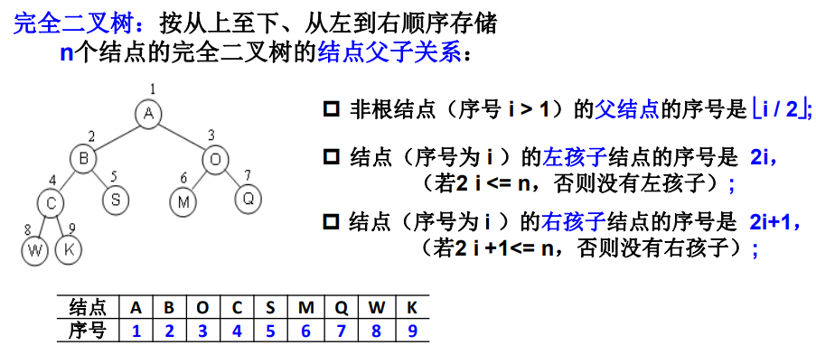

但是一般的二叉树采用这种存储方式会造成很大的空间浪费，所以采用链表存储，代码如下：

	typedef struct TNode *Position;
	typedef Position BinTree; /* 二叉树类型 */
	struct TNode{ /* 树结点定义 */
	    ElementType Data; /* 结点数据 */
	    BinTree Left;     /* 指向左子树 */
	    BinTree Right;    /* 指向右子树 */
	};

二叉树具有四种遍历方式：
（1）先序遍历
遍历的过程为：首先访问根节点，先序访问其左子树，先序访问其右子树，代码如下：

	void PreOrderTraversal( BinTree BT )
	{
	 if( BT ) {
	 printf(“%d”, BT->Data);
	 PreOrderTraversal( BT->Left );
	 PreOrderTraversal( BT->Right );
	 }
	}

（2）中序遍历
遍历过程为：首先中序遍历其左子树，访问根结点，中序遍历其右子树，代码如下：

	void InOrderTraversal( BinTree BT )
	{
	 if( BT ) {
	 InOrderTraversal( BT->Left );
	 printf(“%d”, BT->Data);
	 InOrderTraversal( BT->Right );
	 }
	}

（3）后序遍历
遍历过程为：后序遍历其左子树，后序遍历其右子树，访问根结点，代码如下:

	void PostOrderTraversal( BinTree BT )
	{
	 if( BT ) {
	 PostOrderTraversal( BT->Left );
	 PostOrderTraversal( BT->Right);
	 printf(“%d”, BT->Data);
	 }
	}

我们通过一张图可以看出三者的遍历顺序是一样的，只是说访问节点的时机不同：
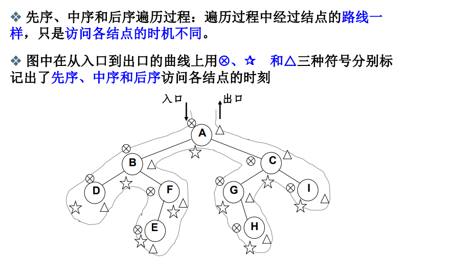

递归的访问比较简单，那我们如何实现非递归的访问呢，递归是利用了堆栈存储函数状态，我们非递归直接利用堆栈存储节点。
（1）中序遍历
当遇到一个节点，将其压入栈中，并去访问其左子树，左子树遍历结束后，从栈顶弹出这个节点并访问它，然后按照其右指针再去中序遍历该节点的右子树，代码如下：

	void InOrderTraversal( BinTree BT )
	{ BinTree T=BT;
		Stack S = CreatStack( MaxSize ); /*创建并初始化堆栈S*/
		while( T || !IsEmpty(S) ){
			 while(T){ /*一直向左并将沿途结点压入堆栈*/
					 Push(S,T);
					 T = T->Left;
			 }
			 if(!IsEmpty(S)){
				 T = Pop(S); /*结点弹出堆栈*/
				 printf(“%5d”, T->Data); /*（访问）打印结点*/
				 T = T->Right; /*转向右子树*/
			 }
		}
	}

（2）先序遍历
由我们之前说过的可以得知，三种遍历方式顺序相同，只是访问节点的时机不同，所以我们通过改变“printf(“%5d”, T->Data);”语句的位置就可以实现不同的遍历方式，代码如下：

	void PreOrderTraversal( BinTree BT )
	{ BinTree T BT;
		Stack S = CreatStack( MaxSize ); /*创建并初始化堆栈S*/
		while( T || !IsEmpty(S) ){
			 while(T){ /*一直向左并将沿途结点压入堆栈*/
	             printf(“%5d”, T->Data); /*（访问）打印结点*/
				 Push(S,T);
				 T = T->Left;
				 }
			 if(!IsEmpty(S)){
				 T = Pop(S); /*结点弹出堆栈*/
				 T = T->Right; /*转向右子树*/
				 }
		}
	}

（3）后序遍历
对于一个节点而言，要实现访问顺序为左儿子-右儿子-根节点，可以利用后进先出的栈，在节点不为空的前提下，依次将根节点，右儿子，左儿子压栈。故我们需要按照根节点-右儿子-左儿子的顺序遍历树，而我们已经知道先序遍历的顺序是根节点-左儿子-右儿子，故只需将先序遍历的左右调换并把访问方式打印改为压入另一个栈即可。最后一起打印栈中的元素。代码如下：

	void PostOrderTraversal(BinTree BT)
	{
	    BinTree T = BT;
	    Stack S1 = CreatStack(MAX_SIZE);    //创建并初始化堆栈S1
	    Stack S2 = CreatStack(MAX_SIZE);    //创建并初始化堆栈S2   
	    while(T || !IsEmpty(S1))
	    {
	        while(T)        //一直向右并将沿途节点访问（压入S2）后压入堆栈S1 
	        {
	            Push(S2, T);
	            Push(S1, T);
	            T = T->Right;
	        }
	        if (!IsEmpty(S1))
	        {
	            T = Pop(S1);    //节点弹出堆栈
	            T = T->Left;  //转向左子树
	        }
	    }
	    while(!IsEmpty(S2))    //访问（打印）S2中元素
	    {
	        T = Pop(S2);
	        printf("%d\n", T->Data);
	    }          
	}

上述三种遍历的c++实现：
    vector<int> preorderTraversal(TreeNode* root) {
        if(root==NULL)
            return {};
        vector<int>res;
        stack<TreeNode*> fuzhu;
        while(root||!fuzhu.empty())
        {
            while(root)
            {
                fuzhu.push(root);
                res.push_back(root->val);
                root=root->left;
            }
            if(!fuzhu.empty())
            {
                TreeNode* p=fuzhu.top();
                fuzhu.pop();
                root=p->right;
            }
        }
        return res;
    }
    vector<int> inorderTraversal(TreeNode* root) {
        if(root==NULL)
            return {};
        vector<int>res;
        stack<TreeNode*> fuzhu;
        while(root||!fuzhu.empty())
        {
            while(root)
            {
                fuzhu.push(root);
                root=root->left;
            }
            if(!fuzhu.empty())
            {
                TreeNode* p=fuzhu.top();
                fuzhu.pop();
                res.push_back(p->val);
                root=p->right;
            }
        }
        return res;
    }
    vector<int> postorderTraversal(TreeNode* root) {
        if(root==NULL)
            return {};
        vector<int>res;
        stack<TreeNode*> fuzhu1;
        stack<TreeNode*> fuzhu2;
        while(root||!fuzhu1.empty())
        {
            while(root)
            {
                fuzhu1.push(root);
                fuzhu2.push(root);
                root=root->right;
            }
            if(!fuzhu1.empty())
            {
                TreeNode* p=fuzhu1.top();
                fuzhu1.pop();
                root=p->left;
            }
        }
        while(!fuzhu2.empty())
            {
                TreeNode* p=fuzhu2.top();
                fuzhu2.pop();
                res.push_back(p->val);
            }
        return res;
    }

（4）层序遍历
其实遍历过程就是一个二维树结构的线性化，不同的遍历方式就是不同的线性化过程，层序遍历我们是利用队列实现的，首先从根结点开始，首先将根结点入队，然后开始执行循环：结点出队、访问该结点、其左右儿子入队，代码如下：

	void LevelOrderTraversal ( BinTree BT )
	{   Queue Q; BinTree T;
		if ( !BT ) return; /* 若是空树则直接返回 */
		Q = CreatQueue( MaxSize ); /*创建并初始化队列Q*/
		AddQ( Q, BT );
		while ( !IsEmptyQ( Q ) )
	    {
			 T = DeleteQ( Q );
			printf(“%d\n”, T->Data); /*访问取出队列的结点*/
			if ( T->Left ) AddQ( Q, T->Left );
			if ( T->Right ) AddQ( Q, T->Right );
		}
	}
遍历二叉树可以利用到许多实际例子当中去，比如说判断是否是叶子节点，我们只需要在遍历后输出的那一条语句上加上判断语句"!BT-Left && !BT->Right",就可以输出叶子节点。
例如求二叉树的高度，我们可以利用递归的方式进行求解：
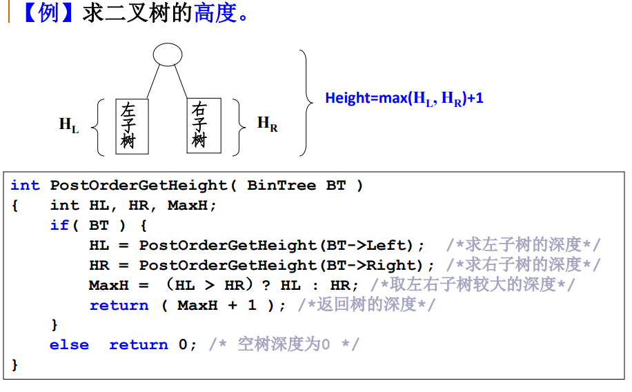
二元运算表达式树也可以输出它的遍历，但是它的中序表达式会受到运算符优先级的影响不准确，但是先序和后序得到的表达式是正确的，解决中序的办法是加上括号，确保不受优先级影响。
通过两种遍历方式可以唯一确定一个二叉树，但是必须要有中序遍历，因为在只有先序和后序两种情况下，我们无法判断一个节点的左右，因为先序是根左右，后序是左右根，我们无法判断左右的界限在哪里。
那如何通过先序和中序（后序和中序同理）来确定一个二叉树呢，我们依然是利用递归的方式：
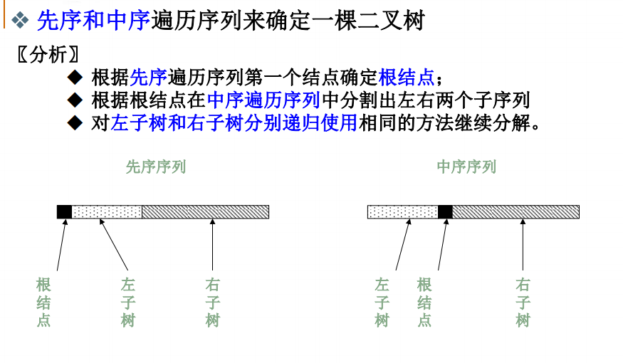
什么是二叉搜索树？
二叉搜索树也称为二叉排序树或者二叉查找树（BST），满足如下性质：
（1）非空左子树的所有健值小于其根节点的健值
（2）非空右子树的所有健值大于其根节点的健值
（3）左右子树都是二叉搜索树
我们默认二叉搜索树中没有两个相同的健值。
查找操作：类似于二分查找，比较节点健值，如果目标值大于节点健值，去右子树寻找，相等就返回，否则去左子树寻找，使用递归可以很容易的实现，代码如下：

	Position Find（ElementType X，BinTree BST）
	｛
		if(!BST)return NULL;
	    if(X>BST->data)return Find(X,BST->right);
		else if(X<BST->data)return Find(X,BST->left);
		elsereturn BST;
	｝

非递归版本：

	Position Find（ElementType X，BinTree BST）
	｛
		while(BST)
		{
		if(X>BST->data)
			BST=BST->right;
		else if(X<BST->data)
			BST=BST->left;
		else
			return BST;
		}
		return NULL;
	｝

由于二叉搜索树的性质，所以我们明显可得最大元素一定是在树的最右分支的端节点上，最小元素一定是在树的最左分支的端节点上，代码如下：

	Position FindMIN（BinTree BST）
	｛
		if(BST)//不能一上来就用BST->left作为判断条件，因为空节点就会出错。
		{
			while(BST->left) BST=BST->left;
		}
		return BST;
	｝
	Position FindMAX（BinTree BST）
	｛
		if(！BST)return NULL；
	    else if（BST->right） return FindMAX(BST->right);
	    else return BST;
	｝

接下来就是二叉搜索树的插入问题了，这个的关键是寻找到可以进行插入的位置，我们可以用类似与find函数的操作，找到一个叶子节点，它是和节点最为接近的，代码如下：

	BinTree Insert( ElementType X, BinTree BST )
	｛
		if(!BST)
		{
		BST=malloc(sizeof(struct TreeNode));
		BST->data=X;
		BST->left=BST->right=NULL;
		}
	else{
		if(X>BST->data)
			{BST->right=Insert(X,BST->right);}
		else if(X<BST->data)//之所以要打成else if是因为还有X已经存在的情况，存在的情况我们默认是不进行处理的。
			{BST->left=Insert(X,BST->right);}
	    }
	return BST;
	｝

搜索树的删除就比较复杂，我们将要删除的点分为三种情况：
（1）是个叶子节点，直接进行删除。
（2）只有一颗的子树，那直接用那颗子树的根节点代替此节点即可，即将其父结点的指针指向要删除结点的孩子结点。
（3）最复杂的情况，两边子树都有，我们有两种方案进行删除，一是用左子树的最大节点代替被删除的节点，二是用右子树的最小节点代替被删除的节点。
代码：

	BinTree Delete( BinTree BST, ElementType X ) 
	{ 
	    Position Tmp; 
	    if( !BST ) 
	        printf("要删除的元素未找到"); 
	    else {
	        if( X < BST->Data ) 
	            BST->Left = Delete( BST->Left, X );   /* 从左子树递归删除 */
	        else if( X > BST->Data ) 
	            BST->Right = Delete( BST->Right, X ); /* 从右子树递归删除 */
	        else { /* BST就是要删除的结点 */
	            /* 如果被删除结点有左右两个子结点 */ 
	            if( BST->Left && BST->Right ) {
	                /* 从右子树中找最小的元素填充删除结点 */
	                Tmp = FindMin( BST->Right );
	                BST->Data = Tmp->Data;
	                /* 从右子树中删除最小元素 */
	                BST->Right = Delete( BST->Right, BST->Data );
	            }
	            else { /* 被删除结点有一个或无子结点 */
	                Tmp = BST; 
	                if( !BST->Left )       /* 只有右孩子或无子结点 */
	                    BST = BST->Right; 
	                else                   /* 只有左孩子 */
	                    BST = BST->Left;
	                free( Tmp );//没有孩子就删除节点。
	            }
	        }
	    }
	    return BST;
	}

删除部分也可以写为：

	if( BST->Left && BST->Right ) {
	        /* 从左子树中找最大的元素填充删除结点 */
	        Tmp = FindMAX( BST->left );
	        BST->Data = Tmp->Data;
	        /* 从右子树中删除最小元素 */
	        BST->left = Delete( BST->left, BST->Data );
		            }

什么是平衡二叉树？
顾名思义，平衡两个字就代表了我们需要将左右两颗子树的高度控制一下，让其基本一致。单单对于二叉搜索树来说，不同的插入次序，将会导致不同的深度和平均查找长度，这在最差情况下，二叉搜索树退化成了一个线性存储了。所以我们加入一个平衡因子来对二叉搜索树进行平衡，一个节点的平衡因子是指一个节点的左子树和右子树之差的绝对值，我们在插入过程中要保证每个节点的平衡因子的值不得大于1.通过加入平衡因子，我们可以保证给定节点数为n的AVL树的最大高度为O（logn），证明如下：
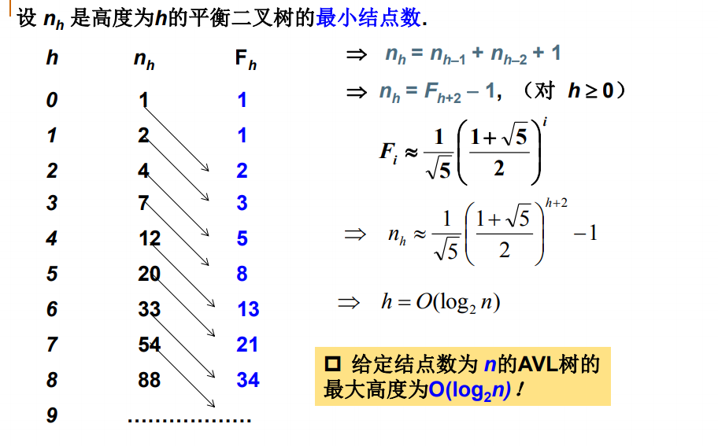

那当二叉树插入之后不满足条件我们该如何进行调整？
首先，插入肯定是插入到叶子节点，插入后不满足条件的，那原本的叶子节点的平衡因子只能是0，所以，现在它变为-1，而它的父节点可能就变成-2，通过右单旋解决此问题，同理我们有左单旋，有左右双旋，有右左双旋，如图所示：
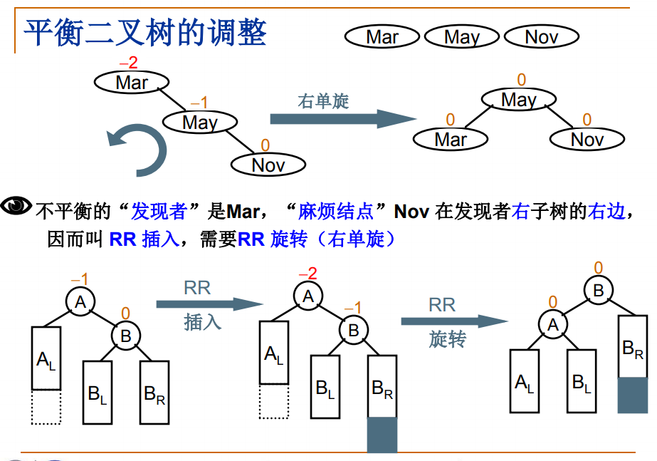
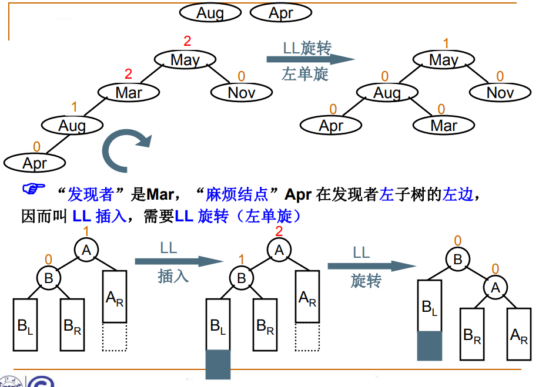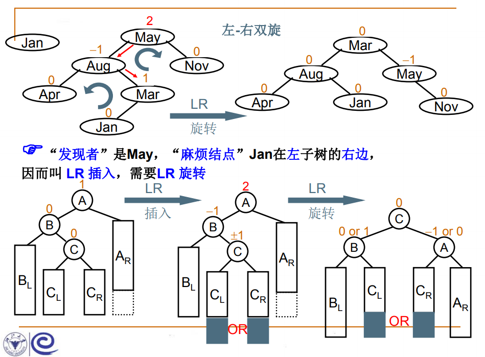代码如下：

	#include <stdlib.h>
	#include<stdio.h> 
	typedef struct AVLNode *Position;
	typedef Position AVLTree; /* AVL树类型 */
	typedef int ElementType;
	struct AVLNode{
		ElementType Data; /* 结点数据 */
		AVLTree Left;     /* 指向左子树 */
		AVLTree Right;    /* 指向右子树 */
		int Height;       /* 树高 */
	};
		
	int Max ( int a, int b )
	{
		return a > b ? a : b;
	}
	int GetHeight(AVLTree A )
	{
		if(A==NULL)
			return 0;
		else
			return A->Height;
	}
	AVLTree SingleLeftRotation ( AVLTree A )
	{ /* 注意：A必须有一个左子结点B */
		/* 将A与B做左单旋，更新A与B的高度，返回新的根结点B */     
		
		AVLTree B = A->Left;
		A->Left = B->Right;
		B->Right = A;
		A->Height = Max( GetHeight(A->Left), GetHeight(A->Right) ) + 1;
		B->Height = Max( GetHeight(B->Left), A->Height ) + 1;
		return B;
	}
	AVLTree SingleRightRotation(AVLTree A)
	{
		AVLTree B = A->Right;
		A->Right = B->Left;
		B->Left = A;
		A->Height = Max( GetHeight(A->Left), GetHeight(A->Right) ) + 1;
		B->Height = Max( GetHeight(B->Left), A->Height ) + 1;
		return B;
	}
		
	AVLTree DoubleLeftRightRotation ( AVLTree A )
	{ /* 注意：A必须有一个左子结点B，且B必须有一个右子结点C */
		/* 将A、B与C做两次单旋，返回新的根结点C */
		    
		/* 将B与C做右单旋，C被返回 */
		A->Left = SingleRightRotation(A->Left);
		/* 将A与C做左单旋，C被返回 */
		return SingleLeftRotation(A);
	}
	
	AVLTree DoubleRightLeftRotation ( AVLTree A )
	{ /* 注意：A必须有一个左子结点B，且B必须有一个右子结点C */
		/* 将A、B与C做两次单旋，返回新的根结点C */
		    
		/* 将B与C做右单旋，C被返回 */
		A->Right = SingleLeftRotation(A->Right);
		/* 将A与C做左单旋，C被返回 */
		return SingleRightRotation(A);
	}
		
	/*************************************/
	/* 对称的右单旋与右-左双旋请自己实现 */
	/*************************************/
		
	AVLTree Insert( AVLTree T, ElementType X )
	{ /* 将X插入AVL树T中，并且返回调整后的AVL树 */
		if ( !T ) { /* 若插入空树，则新建包含一个结点的树 */
		    T = (AVLTree)malloc(sizeof(struct AVLNode));
		    T->Data = X;
		    T->Height = 0;
		    T->Left = T->Right = NULL;
		} /* if (插入空树) 结束 */
		
		else if ( X < T->Data ) {
		    /* 插入T的左子树 */
		    T->Left = Insert( T->Left, X);
		    /* 如果需要左旋 */
		    if ( GetHeight(T->Left)-GetHeight(T->Right) == 2 )
		        if ( X < T->Left->Data ) 
		            T = SingleLeftRotation(T);      /* 左单旋 */
		        else 
		            T = DoubleLeftRightRotation(T); /* 左-右双旋 */
		} /* else if (插入左子树) 结束 */
		    
		else if ( X > T->Data ) {
		    /* 插入T的右子树 */
		    T->Right = Insert( T->Right, X );
		    /* 如果需要右旋 */
		    if ( GetHeight(T->Left)-GetHeight(T->Right) == -2 )
		        if ( X > T->Right->Data ) 
		            T = SingleRightRotation(T);     /* 右单旋 */
		        else 
		            T = DoubleRightLeftRotation(T); /* 右-左双旋 */
		} /* else if (插入右子树) 结束 */
		
		/* else X == T->Data，无须插入 */
		
		/* 别忘了更新树高 */
		T->Height = Max( GetHeight(T->Left), GetHeight(T->Right) ) + 1;
		    
		return T;
	}
	
	int main()//对四种旋转进行测试。
	{
		Position A=(Position)malloc(sizeof(struct AVLNode));
		A->Height=0;
		A->Data=9;
		A->Left=NULL;
		A->Right=NULL;
		A=Insert(A,4);
		A=Insert(A,3);//右单旋
		printf("%d ",A->Left->Data);
		printf("%d ",A->Right->Data);
		printf( "\n" );
		A=Insert(A,11);
		A=Insert(A,19);//左单旋
		printf("%d ",A->Left->Data);
		printf("%d ",A->Right->Data);
		printf( "\n" );
		A=Insert(A,10);//右左双旋
		printf("%d ",A->Left->Data);
		printf("%d ",A->Right->Data);
		printf( "\n" );
		A=Insert(A,12);
		A=Insert(A,17);//左右双旋
		printf("%d ",A->Right->Left->Data);
		printf("%d ",A->Right->Right->Data);
		system("pause");
		return 0;
	}

运行结果如下图所示：

之前提到了，如何通过先序遍历和中序遍历找出一个树的后序遍历，代码如下：

	void solve( int preL, int inL, int postL, int n )
	{   if (n==0) return;
		if (n==1) {post[postL] = pre[preL]; return;}
		root = pre[preL];
		post[postL+n-1] = root;
		for (i=0; i<n; i++)
		if (in[inL+i] == root) break;
		L = i; R = n-L-1;
		solve(preL+1, inL, postL, L);
		solve(preL+L+1, inL+L+1, postL+L, R);
	}

