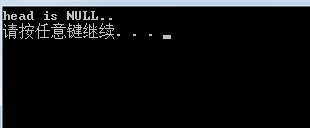
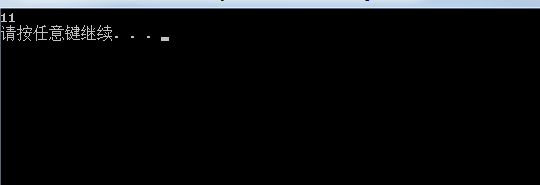

<!-- more -->
在看书的时候有个往链表里添加节点的函数，代码中考虑到可能给出的头指针为空，并做另外一些处理。具体代码如下：

	#include <iostream>
	#include <string>
	using namespace std;
	struct ListNode
	{
		int val;
		ListNode* next;
	};
	void AddToTail(ListNode** pHead, int value);
	int main() {
		// TODO
	}
	void AddToTail(ListNode** pHead, int value) {
		ListNode* pNew = new ListNode();//申请一个新的节点，并且此节点的位置用指针pNEW指向。
		pNew->val = value;
		pNew->next = NULL;
		if (*pHead == NULL) {
			*pHead = pNew;//考虑没有元素时，链表指向空，如果这样，直接让其指向我们新添加的元素。
		}
		else {
			ListNode* p = *pHead;
			while (p->next != NULL) {
				p = p->next;
			}
			p->next = pNew;
		}
	}

网上其他人的博客中对函数AddToTail的参数的描述跟书中如出一辙：第一个参数pHead是一个指向指针的指针，当向一个空链表插入一个节点时，新插入的节点是链表的头指针，此时会改动头指针，因此必须把pHead参数设置为指向指针的指针。为什么呢？在以前学习C++的时候，我们只知道在参数中，以传值的形式作为参数的变量在函数体内被修改之后，出了函数体就会失效，准确的说这个变量没有被修改过，因此需要传入该变量的指针或者使用引用传参的方式。可是上述AddToTail中已经是一个指针了啊？于是我测试了一下，不使用指针的指针会怎样：

	#include <iostream>
	#include <string>
	using namespace std;
	struct ListNode
	{
		int val;
		ListNode* next;
	};
	void AddToTail(ListNode* pHead, int value);
	int main() {
		ListNode* head = NULL;
		AddToTail(head, 10);
		if (head != NULL) {
			cout << head->val << endl;
		}
		else {
			cout << "head is NULL.." << endl;
		}
	    system("pause");
	    return 0;
	}
	void AddToTail(ListNode* pHead, int value) {
		ListNode* pNew = new ListNode();
		pNew->val = value;
		pNew->next = NULL;
		if (pHead == NULL) {
			pHead = pNew;//因为pHead是个复制品，所以更改的并不是原来的pHead;
		}
		else {
			ListNode* p = pHead;
			while (p->next != NULL) {
				p = p->next;
			}
			p->next = pNew;
		}
	}

输出结果如下图：

作为指针pHead竟然真的没被修改过！其实真的很好理解，既然你懂得函数中的值传参，假设int a，作为参数传入的时候没被修改，所以需要用指向a的指针，那么应该也可以理解，指针变量pHead作为参数传入的时候被修改无效，因此需要用指向pHead的指针，只不过pHead本身就是一个指针了，所以才存在有指针的指针看起来稍微复杂一点的说法。因为，指向a的指针作为参数传入进去时，如果你对它进行修改，其实也是无效的，但是修改指针指向的内容的修改是有效的，也即，（&a）对a取地址得到的指针传入进去之后，此时你修改这个指针也是没有什么实际作用的。但是，你修改指针指向的内容这就有效了，因此通常我们在函数体内是修改对指针取内容后的内存，即*(&a)。

所以，你对指针pHead的修改时无效的，只有对指向pHead的指针指向的内容（很绕吧，其实就是pHead），这时候才是有效的，因此AddToTail的第一个参数必须用指针的指针。现在来说说为什么对值传参在函数体内的修改无效。因为a传进去的时候会被复制了一份copy，此后的修改都是在临时变量copy上，出了函数体copy被销毁，a还是原来的a，根本就没被修改过，所以才会值传参对变量的修改无效。要使得对a的修改有效，一方面是传入a的地址，也就是对指向a的指针作为值传参（反正修改的不是a的指针，修改了也无所谓，反正只是修改a的指针的copy），此时a的指针的copy指向的内容也是a，因此对copy指向的内容修改会导致a的内容也被修改！另外一种方式就是引用传参，引用传参往往要比值传参高效，因为它是直接将a作为参数传入进去，而少了对a进行复制这部分的开销，既然传入进去的是a，那么对a的修改肯定也生效。
为了验证上述的想法，我们通过重新改写AddToTail函数还进行论证：
	

```
#include <iostream>
	#include <string>
	using namespace std;
	struct ListNode
	{
		int val;
		ListNode* next;
	};
	void AddToTail(ListNode* &pHead, int value);//由原来的传形参改成了引用。
	int main() {
		// TODO
		ListNode* head = NULL;
		AddToTail(head, 10);
		if (head != NULL) {
			cout << head->val << endl;
		}
		else {
			cout << "head is NULL.." << endl;
		}
}
 
void AddToTail(ListNode* &pHead, int value) {
	ListNode* pNew = new ListNode();
	pNew->val = value;
	pNew->next = NULL;
 
	if (pHead == NULL) {
		pHead = pNew;
	}
	else {
		ListNode* p = pHead;
		while (p->next != NULL) {
			p = p->next;
		}
		p->next = pNew;
	}
}
```

输出结果如下图：
