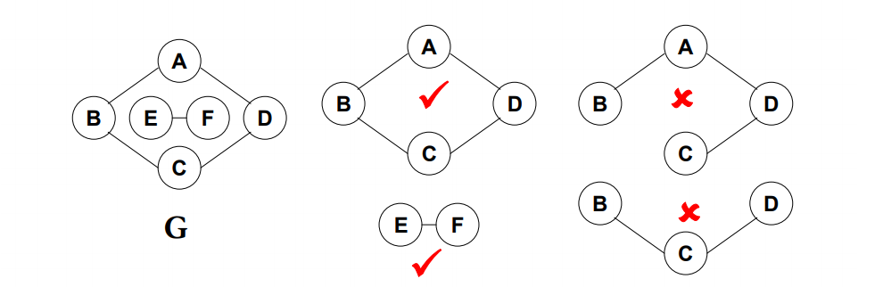

<!-- more -->
集合的运算：交、并、补、差，判定一个元素是否属于某一个集合
并查集：可以使用树结构表示集合，树的每个节点代表了一个集合元素。

例如采用双亲表示法：孩子指向双亲。
存储结构采用数组的存储形式，每个数据域跟着一个父域，其中如果父域的值指向-1，代表为根节点，否则指向父亲节点，也就是说负数表示根结点，非负数表示双亲结点的下标。
集合的查找运算：
寻找集合中是否存在某个节点，并且返回它的根节点，代码如下：

	typedef struct {
	 ElementType Data;
	 int Parent;
	} SetType;
	int Find( SetType S[ ], ElementType X )
	{ /* 在数组S中查找值为X的元素所属的集合 */
	 /* MaxSize是全局变量，为数组S的最大长度 */
		 int i;
		 for ( i=0; i < MaxSize && S[i].Data != X; i++) ;//查找速度是比较慢的
		 if( i >= MaxSize ) return -1; /* 未找到X，返回-1 */
		 for( ; S[i].Parent >= 0; i = S[i].Parent ) ;
		 return i; /* 找到X所属集合，返回树根结点在数组S中的下标 */
	}

集合的并运算：
分别找到X1和X2两个元素所在集合树的根节点，如果它们不同根，则将其中一个根节点的父节点指针设置成另一个根节点的数组下标，代码如下：

	void Union( SetType S[ ], ElementType X1, ElementType X2 )
	{
		 int Root1, Root2;
		 Root1 = Find(S, X1);
		 Root2 = Find(S, X2);
		 if（ Root1 != Root2 ）S[Root2].Parent = Root1;
	}

上述只是单纯的将两个两个集合并起来，但是在特殊情况下，会造成集合原来越大，所以我们可以采用将小集合合并到大集合的方式，改善合并以后的查找性能，这里面设计两种大，一个大是树的深度大，一个大是树的规模大，看你怎么选择，我们怎么存储这个树的大小呢？我们上文提到，我们将根节点的父域设置成-1，代表它是一个根节点，但是我们完全可以利用起来这个数据域，将其设置为树的大小，只不过用负数表示就可以了，修改之后的代码如下所示：

	#define MAXN 1000                  /* 集合最大元素个数 */
	typedef int ElementType;           /* 默认元素可以用非负整数表示 */
	typedef int SetName;               /* 默认用根结点的下标作为集合名称 */
	typedef ElementType SetType[MAXN]; /* 假设集合元素下标从0开始 */
	
	void Union( SetType S, SetName Root1, SetName Root2 )
	{ /* 这里默认Root1和Root2是不同集合的根结点 */
	    /* 保证小集合并入大集合 */
	    if ( S[Root2] < S[Root1] ) { /* 如果集合2比较大 */
	        S[Root2] += S[Root1];     /* 集合1并入集合2，这里是将两者的规模相加，采用的是第二种大的定义方法*/
	        S[Root1] = Root2;
	    }
	    else {                         /* 如果集合1比较大 */
	        S[Root1] += S[Root2];     /* 集合2并入集合1  */
	        S[Root2] = Root1;
	    }
	}
	
	SetName Find( SetType S, ElementType X )
	{ /* 默认集合元素全部初始化为-1 */
	    if ( S[X] < 0 ) /* 找到集合的根 */
	        return X;
	    else
	        return S[X] = Find( S, S[X] ); /* 路径压缩，这里是用递归实现路径压缩，让这棵树内的每个元素的父域都指向根节点 */
	}
	 void Union( SetType S, SetName Root1, SetName Root2 )
	{//按照树的高度进行比较。
		if ( S[Root2] < S[Root1] )
		S[Root1] = Root2;
		else {
		if ( S[Root1]==S[Root2] ) S[Root1]--;
		S[Root2] = Root1;
		}
	｝

什么是图？
它用于表示一种多对多的关系，通常包含一组顶点以及一组边，边分为有向边和无向边，一般不考虑重边和自回路。
如何在程序中表示一个图，目前我学习的是邻接表和邻接矩阵，顾名思义，一个是用链表，一个是用数组来表示，两者各有各的好处。
邻接矩阵：
（1）优点：直观，简单，易理解，方便检查任意一对顶点之间是否存在边，方便找任一顶点的所有领接点，方便计算任一顶点的度。（对于有向图，度分为入度和出度，无向图统一就是度）
（2）缺点：浪费空间，尤其是在存稀疏图（点很多而边很少）的时候有大量的无效元素，对稠密图（特别是完全图）是很合算的，浪费时间，在稀疏图中统计图一共有多少条边。
邻接表（是一个指针数组，对应矩阵每行一个链表，只存非零元素）：
（1）优点：节约空间，但是一定要够稀疏才划算，因为还要开辟额外的空间来存储指针域（需要N哥头指针+2E个节点域），方便寻找任意顶点的所有领接点，方便计算任一顶点的度（仅限于无向图，对于有向图，需要额外构建逆邻接表）。
（2）缺点：难以检查任一一对顶点间是否存在边。
下面是两种方式的代码：

	#define MaxVertexNum 100    /* 最大顶点数设为100 */
	#define INFINITY 65535        /* ∞设为双字节无符号整数的最大值65535*/
	typedef int Vertex;         /* 用顶点下标表示顶点,为整型 */
	typedef int WeightType;        /* 边的权值设为整型 */
	typedef char DataType;        /* 顶点存储的数据类型设为字符型 */
	
	/* 边的定义 */
	typedef struct ENode *PtrToENode;
	struct ENode{
	    Vertex V1, V2;      /* 有向边<V1, V2> */
	    WeightType Weight;  /* 权重 */
	};
	typedef PtrToENode Edge;
	       
	/* 图结点的定义 */
	typedef struct GNode *PtrToGNode;
	struct GNode{
	    int Nv;  /* 顶点数 */
	    int Ne;  /* 边数   */
	    WeightType G[MaxVertexNum][MaxVertexNum]; /* 邻接矩阵 */
	    DataType Data[MaxVertexNum];      /* 存顶点的数据 */
	    /* 注意：很多情况下，顶点无数据，此时Data[]可以不用出现 */
	};
	typedef PtrToGNode MGraph; /* 以邻接矩阵存储的图类型 */

	MGraph CreateGraph( int VertexNum )
	{ /* 初始化一个有VertexNum个顶点但没有边的图 */
	    Vertex V, W;
	    MGraph Graph;
	    
	    Graph = (MGraph)malloc(sizeof(struct GNode)); /* 建立图 */
	    Graph->Nv = VertexNum;
	    Graph->Ne = 0;
	    /* 初始化邻接矩阵 */
	    /* 注意：这里默认顶点编号从0开始，到(Graph->Nv - 1) */
	    for (V=0; V<Graph->Nv; V++)
	        for (W=0; W<Graph->Nv; W++)  
	            Graph->G[V][W] = INFINITY;
	            
	    return Graph; 
	}
	       
	void InsertEdge( MGraph Graph, Edge E )
	{
	     /* 插入边 <V1, V2> */
	     Graph->G[E->V1][E->V2] = E->Weight;    
	     /* 若是无向图，还要插入边<V2, V1> */
	     Graph->G[E->V2][E->V1] = E->Weight;
	}
	
	MGraph BuildGraph()
	{
	    MGraph Graph;
	    Edge E;
	    Vertex V;
	    int Nv, i;
	    
	    scanf("%d", &Nv);   /* 读入顶点个数 */
	    Graph = CreateGraph(Nv); /* 初始化有Nv个顶点但没有边的图 */ 
	    
	    scanf("%d", &(Graph->Ne));   /* 读入边数 */
	    if ( Graph->Ne != 0 ) { /* 如果有边 */ 
	        E = (Edge)malloc(sizeof(struct ENode)); /* 建立边结点 */ 
	        /* 读入边，格式为"起点 终点 权重"，插入邻接矩阵 */
	        for (i=0; i<Graph->Ne; i++) {
	            scanf("%d %d %d", &E->V1, &E->V2, &E->Weight); 
	            /* 注意：如果权重不是整型，Weight的读入格式要改 */
	            InsertEdge( Graph, E );
	        }
	    } 
	
	    /* 如果顶点有数据的话，读入数据 */
	    for (V=0; V<Graph->Nv; V++) 
	        scanf(" %c", &(Graph->Data[V]));
	
	    return Graph;
	}
	
	#define MaxVertexNum 100    /* 最大顶点数设为100 */
	typedef int Vertex;         /* 用顶点下标表示顶点,为整型 */
	typedef int WeightType;        /* 边的权值设为整型 */
	typedef char DataType;        /* 顶点存储的数据类型设为字符型 */
	
	/* 边的定义 */
	typedef struct ENode *PtrToENode;
	struct ENode{
	    Vertex V1, V2;      /* 有向边<V1, V2> */
	    WeightType Weight;  /* 权重 */
	};
	typedef PtrToENode Edge;
	
	/* 邻接点的定义 */
	typedef struct AdjVNode *PtrToAdjVNode; 
	struct AdjVNode{
	    Vertex AdjV;        /* 邻接点下标 */
	    WeightType Weight;  /* 边权重 */
	    PtrToAdjVNode Next;    /* 指向下一个邻接点的指针 */
	};
	
	/* 顶点表头结点的定义 */
	typedef struct Vnode{
	    PtrToAdjVNode FirstEdge;/* 边表头指针 */
	    DataType Data;            /* 存顶点的数据 */
	    /* 注意：很多情况下，顶点无数据，此时Data可以不用出现 */
	} AdjList[MaxVertexNum];    /* AdjList是邻接表类型 */
	
	/* 图结点的定义 */
	typedef struct GNode *PtrToGNode;
	struct GNode{  
	    int Nv;     /* 顶点数 */
	    int Ne;     /* 边数   */
	    AdjList G;  /* 邻接表 */
	};
	typedef PtrToGNode LGraph; /* 以邻接表方式存储的图类型 */

	LGraph CreateGraph( int VertexNum )
	{ /* 初始化一个有VertexNum个顶点但没有边的图 */
	    Vertex V;
	    LGraph Graph;
	    
	    Graph = (LGraph)malloc( sizeof(struct GNode) ); /* 建立图 */
	    Graph->Nv = VertexNum;
	    Graph->Ne = 0;
	    /* 初始化邻接表头指针 */
	    /* 注意：这里默认顶点编号从0开始，到(Graph->Nv - 1) */
	       for (V=0; V<Graph->Nv; V++)
	        Graph->G[V].FirstEdge = NULL;
	            
	    return Graph; 
	}
	       
	void InsertEdge( LGraph Graph, Edge E )
	{
	    PtrToAdjVNode NewNode;
	    
	    /* 插入边 <V1, V2> */
	    /* 为V2建立新的邻接点 */
	    NewNode = (PtrToAdjVNode)malloc(sizeof(struct AdjVNode));
	    NewNode->AdjV = E->V2;
	    NewNode->Weight = E->Weight;
	    /* 将V2插入V1的表头 */
	    NewNode->Next = Graph->G[E->V1].FirstEdge;
	    Graph->G[E->V1].FirstEdge = NewNode;
	        
	    /* 若是无向图，还要插入边 <V2, V1> */
	    /* 为V1建立新的邻接点 */
	    NewNode = (PtrToAdjVNode)malloc(sizeof(struct AdjVNode));
	    NewNode->AdjV = E->V1;
	    NewNode->Weight = E->Weight;
	    /* 将V1插入V2的表头 */
	    NewNode->Next = Graph->G[E->V2].FirstEdge;
	    Graph->G[E->V2].FirstEdge = NewNode;
	}
	
	LGraph BuildGraph()
	{
	    LGraph Graph;
	    Edge E;
	    Vertex V;
	    int Nv, i;
	    
	    scanf("%d", &Nv);   /* 读入顶点个数 */
	    Graph = CreateGraph(Nv); /* 初始化有Nv个顶点但没有边的图 */ 
	    
	    scanf("%d", &(Graph->Ne));   /* 读入边数 */
	    if ( Graph->Ne != 0 ) { /* 如果有边 */ 
	        E = (Edge)malloc( sizeof(struct ENode) ); /* 建立边结点 */ 
	        /* 读入边，格式为"起点 终点 权重"，插入邻接矩阵 */
	        for (i=0; i<Graph->Ne; i++) {
	            scanf("%d %d %d", &E->V1, &E->V2, &E->Weight); 
	            /* 注意：如果权重不是整型，Weight的读入格式要改 */
	            InsertEdge( Graph, E );
	        }
	    } 
	
	    /* 如果顶点有数据的话，读入数据 */
	    for (V=0; V<Graph->Nv; V++) 
	        scanf(" %c", &(Graph->G[V].Data));
	
	    return Graph;
	}

数据结构的作用是为了让我们调用的时候速度更快，所以接下来我们介绍两种遍历方式：1、深度优先搜索 2、广度优先搜索
（1）DFS（Depth First Search, 深度优先搜索）
它是一种类似于树的先序遍历的遍历方法，访问某个节点，然后对它的第一个领接节点进行访问，再对这个领结节点的第一个领接节点进行访问，直到没有未被访问的邻接节点再退回，然后访问上一层节点的第二个邻接节点，知道全部访问结束，代码如下：

	void DFS ( Vertex V )
	{   visited[ V ] = true;
		for ( V 的每个邻接点 W )
	   {
		  if ( !visited[ W ] )
		       DFS( W );
	   }
	}

对于有N个顶点、E条边的一个图，时间复杂度是：1、O（N+E）邻接表 2、O(N^2) 邻接矩阵 
理由如下，对于领结矩阵来说，我们一共要遍历它的N^2个矩阵数据，所以得出时间复杂度是N^2,但是对于领结矩阵，我们只需要遍历它的链表元素的个数次就可以了，由领结表的定义可知一共会有E个元素，与边的数目相同，再加上前面的visited[ V ] = true这条语句一共要做顶点个数次，所以加起来是N+E。
（2）BFS(Breadth First Search, 广度优先搜索)
这是一种类似于层序遍历的遍历方法，依次将每个弹出的顶点元素的所有领结点都进行访问，然后再开始访问下一个点，代码如下：

	void BFS ( Vertex V )
	{   visited[V] = true;
		Enqueue(V, Q);
		while(!IsEmpty(Q)){
			V = Dequeue(Q);
			for ( V 的每个邻接点 W )｛
			if ( !visited[W] ) 
	        {
				visited[W] = true;
				Enqueue(W, Q);
			}
			｝
		}
	}

对于有N个顶点、E条边的一个图，时间复杂度是：1、O（N+E）邻接表 2、O(N^2) 邻接矩阵 
理由如下，对于领结矩阵来说，我们一共要遍历它的N^2个矩阵数据，所以得出时间复杂度是N^2,但是对于领结矩阵，我们只需要遍历它的链表元素的个数次就可以了，由领结表的定义可知一共会有E个元素，与边的数目相同，再加上前面的visited[ V ] = true这条语句一共要做顶点个数次，所以加起来是N+E。（理由是一样的，我就是复制下来的）
既然两种遍历都具有差不多的时间复杂度，那么为什么还需要两种遍历方式呢，那是因为对于不同的问题需要不同的解决方案，比如查找元素，如果待查找的元素离你开始查找的元素点比较近，那么广度优先遍历就比较有优势，如果离得比较远，那么就是深度优先遍历比较有优势了。
那什么又是联通呢？
只要存在一条路径可以从V到W，那么就称V和W是联通的。路径就是一系列的顶点的集合，其中任意相邻的顶点间都有图中的边，路径的长度就是路径中的边数，如果是带权图就是所有边的权重和，如果V到W之间的所有顶点都不同，则称为简单路径，我们一般就是做这种简单路径。回路是指起点等于终点的路径，连通图是指图中的任意两个顶点均连通。
什么是连通分量？
无向图的极大联通子图，满足下面两个条件
（1）极大顶点数：再加一个顶点就不连通了
（2）极大边数：包含子图中所有顶点相连的所有边
下图是一个例子：

下面介绍下，两种遍历的代码：

	/* 邻接表存储的图 - DFS */
	void Visit( Vertex V )
	{
	    printf("正在访问顶点%d\n", V);
	}
	
	/* Visited[]为全局变量，已经初始化为false */
	void DFS( LGraph Graph, Vertex V, void (*Visit)(Vertex) )
	{   /* 以V为出发点对邻接表存储的图Graph进行DFS搜索 */
	    PtrToAdjVNode W;
	    
	    Visit( V ); /* 访问第V个顶点 */
	    Visited[V] = true; /* 标记V已访问 */
	
	    for( W=Graph->G[V].FirstEdge; W; W=W->Next ) /* 对V的每个邻接点W->AdjV */
	        if ( !Visited[W->AdjV] )    /* 若W->AdjV未被访问 */
	            DFS( Graph, W->AdjV, Visit );    /* 则递归访问之 */
	}
	/* 邻接矩阵存储的图 - BFS */
	/* IsEdge(Graph, V, W)检查<V, W>是否图Graph中的一条边，即W是否V的邻接点。  */
	/* 此函数根据图的不同类型要做不同的实现，关键取决于对不存在的边的表示方法。*/
	/* 例如对有权图, 如果不存在的边被初始化为INFINITY, 则函数实现如下:         */
	bool IsEdge( MGraph Graph, Vertex V, Vertex W )
	{
	    return Graph->G[V][W]<INFINITY ? true : false;
	}
	
	/* Visited[]为全局变量，已经初始化为false */
	void BFS ( MGraph Graph, Vertex S, void (*Visit)(Vertex) )
	{   /* 以S为出发点对邻接矩阵存储的图Graph进行BFS搜索 */
	    Queue Q;     
	    Vertex V, W;
	
	    Q = CreateQueue( MaxSize ); /* 创建空队列, MaxSize为外部定义的常数 */
	    /* 访问顶点S：此处可根据具体访问需要改写 */
	    Visit( S );
	    Visited[S] = true; /* 标记S已访问 */
	    AddQ(Q, S); /* S入队列 */
	    
	    while ( !IsEmpty(Q) ) {
	        V = DeleteQ(Q);  /* 弹出V */
	        for( W=0; W<Graph->Nv; W++ ) /* 对图中的每个顶点W */
	            /* 若W是V的邻接点并且未访问过 */
	            if ( !Visited[W] && IsEdge(Graph, V, W) ) {
	                /* 访问顶点W */
	                Visit( W );
	                Visited[W] = true; /* 标记W已访问 */
	                AddQ(Q, W); /* W入队列 */
	            }
	    } /* while结束*/
	}

遍历结束之后就是图中的一个很明显的问题，如何求最短路径？
它是求两个不同顶点之间的所有路径中，边的权值之和最小的那一条路径，这条路径就是两点之间的最短路径，第一个顶点为源点，最后一个顶点为终点，这种问题还分为单源问题和多源问题。
其中无权图当中的单元最短路径算法是比较简单的，主要是通过一个递增（非递减，这一点很重要）的顺序找出各个顶点之间的最短路径，将之前的BFS算法稍微修改一下就可以了，伪代码如下：

	void Unweighted ( Vertex S )
	{   Enqueue(S, Q);
		while(!IsEmpty(Q)){
			V = Dequeue(Q);
			for ( V 的每个邻接点 W )
			if ( dist[W]==-1 ) {
				dist[W] = dist[V]+1;
				path[W] = V;
				Enqueue(W, Q);
		    }
	    }
	}

这个算法的时间复杂度为（E+V），算法的思想很简单，就是我们从源节点s进行遍历，其中dist这个数组我们用来存储s到每个元素最短的距离，其中dist[s]=0,path[w]是用来存储s到w的路上经过的上一个顶点，然后首先遍历源节点的领结节点，将其全部加入队列中，并且将他们的dist数组的值设置为1，然后path设置为源节点，然后遍历源节点的某一个领结节点的所有未访问过的领结节点，他们到源节点的距离，等于此节点加一，然后将他们的psth设置为此节点，表明他们要经过此节点到达源节点。

那假如是一个有权图，我们就不能简单的使用上面的方法，必须考虑到路径的权值，我们采用了一个特别牛皮的算法，它的名字就叫做dijkstra算法，它的基本思想也还是按照递增的顺序找出到各个顶点的最短路径，其中图中不能存在负值圈，否则我们只需要不停的经过这个负值圈就行了，最短路径为无穷小。

Dijkstra 算法的基本思想：
令S={源点s + 已经确定了最短路径的顶点vi}
对任一未收录的顶点v，定义dist[v]为s到v的最短路径长度，但该路径仅经过S中的顶点。即路径{s->(vi属于S)->v}的最小长度，若路径是按照递增（非递减）的顺序生成的，则真正的最短路必须只经过S中的顶点，因为我们大哥比方，如果我们要把v加入s中，有另外一条路径a->w->v要比a->v距离小，可是我们是按递增顺序生成的，应该优先加入w节点，所以说w肯定已经在s当中了。每次从未收录的顶点中选一个dist最小的收录（贪心算法），增加一个v进入S，可能影响另外一个w的dist值！更改方式为dist[w] = min{dist[w], dist[v] + <v,w>的权重，这里我们默认了W只可能是V的领结节点，想知道为什么吗？因为首先我们改变了W的值，那么说明W一定是在集合内的，要满足W不是V的领结节点这一个条件，我们肯定要满足条件V->z->w这样的路径，那么z到源点的距离肯定比V到源点要大，但是我们的S是递增的，如果存在这样的点，那么V肯定会在Z之前入S，这就矛盾了，所以这样的z肯定是不在s当中的，所以V如果改变了W的值，那么V和W之间肯定是有一条边的，伪代码如下所示：

	void Dijkstra( Vertex s )
	{   while (1) {
		V = 未收录顶点中dist最小者;//很大程度决定算法的复杂度
		if ( 这样的V不存在 )
		   break;
		collected[V] = true;
		for ( V 的每个邻接点 W )
		 if ( collected[W] == false )
		    if ( dist[V]+E<V,W> < dist[W] ) {
			    dist[W] = dist[V] + E<V,W> ;
			    path[W] = V;
		} 
		}
	}//不能解决存在负边的情况

如何确定未收录的最小顶点呢，一个是我们遍历所有节点，那么遍历一次用的是O（V），所以时间复杂度就是O（v^2+E），对于稠密图来说效果更好，因为稠密图的E很大。二是我们利用最小堆来进行实现，我们将dist存储在最小堆当中，这样每次更新dist的值需要O（logV）的时间，总的时间就是O（E * logV）,显然这对于稀疏图的效果更好。
下一个我们介绍多源最短路算法，同样有两种方法：
（1）直接将单源最短路算法调用V遍，这样对于稀疏图来说效果好一点，它的时间复杂度是O（V^3+E*V）。
（2）就是利用Floyd算法，它的时间复杂度是O(V^3),对于稠密图效果好。
下面我们介绍下多源最短路算法Floyd算法：
1、D^k[i][j]=路径i到j的最小长度，此路径经过了k个顶点中的某些或全部顶点。
2、随着k的不断增加，当k增加到了v时，就给出了i到j的真正最短路径。
3、我们假设一下这个过程，假设D^(k-1)已经完成，那我们要推导D^k时，如果我们改变了i到j的最短路径，那么该路径肯定是由D^k[i][j]=D^(k-1)[i][k]+D^(k-1)[k][j]所组成，如果没有改变，那么D^(k-1)=D^k，伪代码如下：

	void Floyd()
	{ for ( i = 0; i < N; i++ )
		for( j = 0; j < N; j++ ) {
			D[i][j] = G[i][j];
			path[i][j] = -1;
		}
	  for( k = 0; k < N; k++ )
		for( i = 0; i < N; i++ )
			for( j = 0; j < N; j++ )
				if( D[i][k] + D[k][j] < D[i][j] ) {
					D[i][j] = D[i][k] + D[k][j];
					path[i][j] = k;
					}
	}

通过下面的c代码我们可以实现三种最短路径：

	/* 邻接表存储 - 无权图的单源最短路算法 */
	
	/* dist[]和path[]全部初始化为-1 */
	void Unweighted ( LGraph Graph, int dist[], int path[], Vertex S )
	{
	    Queue Q;
	    Vertex V;
	    PtrToAdjVNode W;
	    Q = CreateQueue( Graph->Nv ); /* 创建空队列, MaxSize为外部定义的常数 */
	    dist[S] = 0; /* 初始化源点 */
	    AddQ (Q, S);
	
	    while( !IsEmpty(Q) ){
	        V = DeleteQ(Q);
	        for ( W=Graph->G[V].FirstEdge; W; W=W->Next ) /* 对V的每个邻接点W->AdjV */
	            if ( dist[W->AdjV]==-1 ) { /* 若W->AdjV未被访问过 */
	                dist[W->AdjV] = dist[V]+1; /* W->AdjV到S的距离更新 */
	                path[W->AdjV] = V; /* 将V记录在S到W->AdjV的路径上 */
	                AddQ(Q, W->AdjV);
	            }
	    } /* while结束*/
	} 
	/* 邻接矩阵存储 - 有权图的单源最短路算法 */
	
	Vertex FindMinDist( MGraph Graph, int dist[], int collected[] )
	{ /* 返回未被收录顶点中dist最小者 */
	    Vertex MinV, V;
	    int MinDist = INFINITY;
	
	    for (V=0; V<Graph->Nv; V++) {
	        if ( collected[V]==false && dist[V]<MinDist) {
	            /* 若V未被收录，且dist[V]更小 */
	            MinDist = dist[V]; /* 更新最小距离 */
	            MinV = V; /* 更新对应顶点 */
	        }
	    }
	    if (MinDist < INFINITY) /* 若找到最小dist */
	        return MinV; /* 返回对应的顶点下标 */
	    else return ERROR;  /* 若这样的顶点不存在，返回错误标记 */
	}
	
	bool Dijkstra( MGraph Graph, int dist[], int path[], Vertex S )
	{
	    int collected[MaxVertexNum];
	    Vertex V, W;
	
	    /* 初始化：此处默认邻接矩阵中不存在的边用INFINITY表示 */
	    for ( V=0; V<Graph->Nv; V++ ) {
	        dist[V] = Graph->G[S][V];
	        if ( dist[V]<INFINITY )
	            path[V] = S;
	        else
	            path[V] = -1;
	        collected[V] = false;
	    }
	    /* 先将起点收入集合 */
	    dist[S] = 0;
	    collected[S] = true;
	
	    while (1) {
	        /* V = 未被收录顶点中dist最小者 */
	        V = FindMinDist( Graph, dist, collected );
	        if ( V==ERROR ) /* 若这样的V不存在 */
	            break;      /* 算法结束 */
	        collected[V] = true;  /* 收录V */
	        for( W=0; W<Graph->Nv; W++ ) /* 对图中的每个顶点W */
	            /* 若W是V的邻接点并且未被收录 */
	            if ( collected[W]==false && Graph->G[V][W]<INFINITY ) {
	                if ( Graph->G[V][W]<0 ) /* 若有负边 */
	                    return false; /* 不能正确解决，返回错误标记 */
	                /* 若收录V使得dist[W]变小 */
	                if ( dist[V]+Graph->G[V][W] < dist[W] ) {
	                    dist[W] = dist[V]+Graph->G[V][W]; /* 更新dist[W] */
	                    path[W] = V; /* 更新S到W的路径 */
	                }
	            }
	    } /* while结束*/
	    return true; /* 算法执行完毕，返回正确标记 */
	}
	
	/* 邻接矩阵存储 - 多源最短路算法 */
	
	bool Floyd( MGraph Graph, WeightType D[][MaxVertexNum], Vertex path[][MaxVertexNum] )
	{
	    Vertex i, j, k;
	
	    /* 初始化 */
	    for ( i=0; i<Graph->Nv; i++ )
	        for( j=0; j<Graph->Nv; j++ ) {
	            D[i][j] = Graph->G[i][j];
	            path[i][j] = -1;
	        }
	
	    for( k=0; k<Graph->Nv; k++ )
	        for( i=0; i<Graph->Nv; i++ )
	            for( j=0; j<Graph->Nv; j++ )
	                if( D[i][k] + D[k][j] < D[i][j] ) {
	                    D[i][j] = D[i][k] + D[k][j];
	                    if ( i==j && D[i][j]<0 ) /* 若发现负值圈 */
	                        return false; /* 不能正确解决，返回错误标记 */
	                    path[i][j] = k;
	                }
	    return true; /* 算法执行完毕，返回正确标记 */
	}

什么是最小生成树？
包含全部顶点，V个顶点一定有V-1条边，V-1条边都是图中含有的边，向生成树中任意加一条边都肯定构成回路。
利用贪心算法来构造最小生成树，在只能用图中有的边、只能正好用掉V-1条边、不能有回路的约束下 每一步都选择权重最小的边。
有两种算法：
（1）Prim算法，这个算法的思想就是让一棵小树慢慢长大，它的时间复杂度是V^2，对于稠密图很合算。
（2）Kruskal算法，它的想法是将森林合并成树，就是我们分别开始构建，然后最后将这些树和成一颗树，时间复杂度为E*logE。
两者的代码如下：

	/* 邻接矩阵存储 - Prim最小生成树算法 */
	
	Vertex FindMinDist( MGraph Graph, WeightType dist[] )
	{ /* 返回未被收录顶点中dist最小者 */
	    Vertex MinV, V;
	    WeightType MinDist = INFINITY;
	
	    for (V=0; V<Graph->Nv; V++) {
	        if ( dist[V]!=0 && dist[V]<MinDist) {
	            /* 若V未被收录，且dist[V]更小 */
	            MinDist = dist[V]; /* 更新最小距离 */
	            MinV = V; /* 更新对应顶点 */
	        }
	    }
	    if (MinDist < INFINITY) /* 若找到最小dist */
	        return MinV; /* 返回对应的顶点下标 */
	    else return ERROR;  /* 若这样的顶点不存在，返回-1作为标记 */
	}
	
	int Prim( MGraph Graph, LGraph MST )
	{ /* 将最小生成树保存为邻接表存储的图MST，返回最小权重和 */
	    WeightType dist[MaxVertexNum], TotalWeight;
	    Vertex parent[MaxVertexNum], V, W;
	    int VCount;
	    Edge E;
	    
	    /* 初始化。默认初始点下标是0 */
	       for (V=0; V<Graph->Nv; V++) {
	        /* 这里假设若V到W没有直接的边，则Graph->G[V][W]定义为INFINITY */
	           dist[V] = Graph->G[0][V];
	           parent[V] = 0; /* 暂且定义所有顶点的父结点都是初始点0 */ 
	    }
	    TotalWeight = 0; /* 初始化权重和     */
	    VCount = 0;      /* 初始化收录的顶点数 */
	    /* 创建包含所有顶点但没有边的图。注意用邻接表版本 */
	    MST = CreateGraph(Graph->Nv);
	    E = (Edge)malloc( sizeof(struct ENode) ); /* 建立空的边结点 */
	           
	    /* 将初始点0收录进MST */
	    dist[0] = 0;
	    VCount ++;
	    parent[0] = -1; /* 当前树根是0 */
	
	    while (1) {
	        V = FindMinDist( Graph, dist );
	        /* V = 未被收录顶点中dist最小者 */
	        if ( V==ERROR ) /* 若这样的V不存在 */
	            break;   /* 算法结束 */
	            
	        /* 将V及相应的边<parent[V], V>收录进MST */
	        E->V1 = parent[V];
	        E->V2 = V;
	        E->Weight = dist[V];
	        InsertEdge( MST, E );
	        TotalWeight += dist[V];
	        dist[V] = 0;
	        VCount++;
	        
	        for( W=0; W<Graph->Nv; W++ ) /* 对图中的每个顶点W */
	            if ( dist[W]!=0 && Graph->G[V][W]<INFINITY ) {
	            /* 若W是V的邻接点并且未被收录 */
	                if ( Graph->G[V][W] < dist[W] ) {
	                /* 若收录V使得dist[W]变小 */
	                    dist[W] = Graph->G[V][W]; /* 更新dist[W] */
	                    parent[W] = V; /* 更新树 */
	                }
	            }
	    } /* while结束*/
	    if ( VCount < Graph->Nv ) /* MST中收的顶点不到|V|个 */
	       TotalWeight = ERROR;
	    return TotalWeight;   /* 算法执行完毕，返回最小权重和或错误标记 */
	}
	/* 邻接表存储 - Kruskal最小生成树算法 */
	
	/*-------------------- 顶点并查集定义 --------------------*/
	typedef Vertex ElementType; /* 默认元素可以用非负整数表示 */
	typedef Vertex SetName;     /* 默认用根结点的下标作为集合名称 */
	typedef ElementType SetType[MaxVertexNum]; /* 假设集合元素下标从0开始 */
	
	void InitializeVSet( SetType S, int N )
	{ /* 初始化并查集 */
	    ElementType X;
	
	    for ( X=0; X<N; X++ ) S[X] = -1;
	}
	
	void Union( SetType S, SetName Root1, SetName Root2 )
	{ /* 这里默认Root1和Root2是不同集合的根结点 */
	    /* 保证小集合并入大集合 */
	    if ( S[Root2] < S[Root1] ) { /* 如果集合2比较大 */
	        S[Root2] += S[Root1];     /* 集合1并入集合2  */
	        S[Root1] = Root2;
	    }
	    else {                         /* 如果集合1比较大 */
	        S[Root1] += S[Root2];     /* 集合2并入集合1  */
	        S[Root2] = Root1;
	    }
	}
	
	SetName Find( SetType S, ElementType X )
	{ /* 默认集合元素全部初始化为-1 */
	    if ( S[X] < 0 ) /* 找到集合的根 */
	        return X;
	    else
	        return S[X] = Find( S, S[X] ); /* 路径压缩 */
	}
	
	bool CheckCycle( SetType VSet, Vertex V1, Vertex V2 )
	{ /* 检查连接V1和V2的边是否在现有的最小生成树子集中构成回路 */
	    Vertex Root1, Root2;
	
	    Root1 = Find( VSet, V1 ); /* 得到V1所属的连通集名称 */
	    Root2 = Find( VSet, V2 ); /* 得到V2所属的连通集名称 */
	
	    if( Root1==Root2 ) /* 若V1和V2已经连通，则该边不能要 */
	        return false;
	    else { /* 否则该边可以被收集，同时将V1和V2并入同一连通集 */
	        Union( VSet, Root1, Root2 );
	        return true;
	    }
	}
	/*-------------------- 并查集定义结束 --------------------*/
	
	/*-------------------- 边的最小堆定义 --------------------*/
	void PercDown( Edge ESet, int p, int N )
	{ /* 改编代码4.24的PercDown( MaxHeap H, int p )    */
	  /* 将N个元素的边数组中以ESet[p]为根的子堆调整为关于Weight的最小堆 */
	    int Parent, Child;
	    struct ENode X;
	
	    X = ESet[p]; /* 取出根结点存放的值 */
	    for( Parent=p; (Parent*2+1)<N; Parent=Child ) {
	        Child = Parent * 2 + 1;
	        if( (Child!=N-1) && (ESet[Child].Weight>ESet[Child+1].Weight) )
	            Child++;  /* Child指向左右子结点的较小者 */
	        if( X.Weight <= ESet[Child].Weight ) break; /* 找到了合适位置 */
	        else  /* 下滤X */
	            ESet[Parent] = ESet[Child];
	    }
	    ESet[Parent] = X;
	}
	
	void InitializeESet( LGraph Graph, Edge ESet )
	{ /* 将图的边存入数组ESet，并且初始化为最小堆 */
	    Vertex V;
	    PtrToAdjVNode W;
	    int ECount;
	
	    /* 将图的边存入数组ESet */
	    ECount = 0;
	    for ( V=0; V<Graph->Nv; V++ )
	        for ( W=Graph->G[V].FirstEdge; W; W=W->Next )
	            if ( V < W->AdjV ) { /* 避免重复录入无向图的边，只收V1<V2的边 */
	                ESet[ECount].V1 = V;
	                ESet[ECount].V2 = W->AdjV;
	                ESet[ECount++].Weight = W->Weight;
	            }
	    /* 初始化为最小堆 */
	    for ( ECount=Graph->Ne/2; ECount>=0; ECount-- )
	        PercDown( ESet, ECount, Graph->Ne );
	}
	
	int GetEdge( Edge ESet, int CurrentSize )
	{ /* 给定当前堆的大小CurrentSize，将当前最小边位置弹出并调整堆 */
	
	    /* 将最小边与当前堆的最后一个位置的边交换 */
	    Swap( &ESet[0], &ESet[CurrentSize-1]);
	    /* 将剩下的边继续调整成最小堆 */
	    PercDown( ESet, 0, CurrentSize-1 );
	
	    return CurrentSize-1; /* 返回最小边所在位置 */
	}
	/*-------------------- 最小堆定义结束 --------------------*/

	int Kruskal( LGraph Graph, LGraph MST )
	{ /* 将最小生成树保存为邻接表存储的图MST，返回最小权重和 */
	    WeightType TotalWeight;
	    int ECount, NextEdge;
	    SetType VSet; /* 顶点数组 */
	    Edge ESet;    /* 边数组 */
	
	    InitializeVSet( VSet, Graph->Nv ); /* 初始化顶点并查集 */
	    ESet = (Edge)malloc( sizeof(struct ENode)*Graph->Ne );
	    InitializeESet( Graph, ESet ); /* 初始化边的最小堆 */
	    /* 创建包含所有顶点但没有边的图。注意用邻接表版本 */
	    MST = CreateGraph(Graph->Nv);
	    TotalWeight = 0; /* 初始化权重和     */
	    ECount = 0;      /* 初始化收录的边数 */
	
	    NextEdge = Graph->Ne; /* 原始边集的规模 */
	    while ( ECount < Graph->Nv-1 ) {  /* 当收集的边不足以构成树时 */
	        NextEdge = GetEdge( ESet, NextEdge ); /* 从边集中得到最小边的位置 */
	        if (NextEdge < 0) /* 边集已空 */
	            break;
	        /* 如果该边的加入不构成回路，即两端结点不属于同一连通集 */
	        if ( CheckCycle( VSet, ESet[NextEdge].V1, ESet[NextEdge].V2 )==true ) {
	            /* 将该边插入MST */
	            InsertEdge( MST, ESet+NextEdge );
	            TotalWeight += ESet[NextEdge].Weight; /* 累计权重 */
	            ECount++; /* 生成树中边数加1 */
	        }
	    }
	    if ( ECount < Graph->Nv-1 )
	        TotalWeight = -1; /* 设置错误标记，表示生成树不存在 */
	
	    return TotalWeight;
	}

