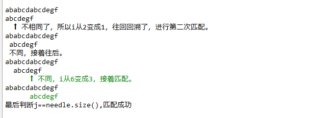

<!-- more -->
KMP算法是用来计算在某个字符串中是否包含另一个字符串的，其实就是leetcode28. 实现 strStr()这种问题，分别就尝试了一下分别用暴力法和KMP算法解决这个题，结果是KMP算法用了8ms，暴力法16ms，差不多一倍的时间，所以就想开个帖子记录下KMP算法。
题目：
实现 strStr() 函数。
给定一个 haystack 字符串和一个 needle 字符串，在 haystack 字符串中找出 needle 字符串出现的第一个位置 (从0开始)。如果不存在，则返回  -1。

示例 1:
输入: haystack = "hello", needle = "ll"
输出: 2

示例 2:
输入: haystack = "aaaaa", needle = "bba"
输出: -1

首先介绍下暴力法的代码：

	int strStr(string haystack, string needle)
	    {
	        int l1=haystack.size();
	        int l2=needle.size();
	        if(l2>l1)
	            return -1;
	        if(l2==0)
	            return 0;
	        int j=0;//needle指针
	        int i=0;
	        
	        for(int i=0;i<(l1-l2+1);++i)
	        {
	            int a=0;
	            for(int b=0;b<l2;++b)
	            {
	                if(haystack[i+a]==needle[a])
	                    a++;
	                if(a==l2)
	                    return i;
	            }
	        }
	        return -1;
	    }

以haystack="ababcdabcdefg",needle="abcdefg"举例，对于暴力法，设i为指向haystack的索引，j为指向needle的索引，两者初始赋值为0，首先去h[0]与n[0]进行比较，a==a，所以继续往后判断，直到h[2]!=n[2]，然后i变为1，j又变为0，重新开始匹配，第三次匹配一直匹配到j=4，又不相等了，又返回，i变成2，j又变成0，直到退出循环或者满足j==needle.size()代表匹配成功。

很明显可以看出暴力法的时间复杂度是O（m*n），并且从上面的叙述可以看出，每次都要让i进行回溯，这才是浪费时间的很大的因素，KMP算法就可以成功实现保证i只会往前走，通过调整j的位置进行匹配。

首先看一下KMP算法的代码：

	void arr_next(vector<int> &next,string p)
	{
	    int pLen = p.size();
	    next[0] = -1;
	    int k = -1;
	    int j = 0;
	    while (j < pLen - 1)
	    {
	        //p[k]表示前缀，p[j]表示后缀  
	        if (k == -1 || p[j] == p[k])
	        {
	            ++j;
	            ++k;
	            //较之前next数组求法，改动在下面4行
	            if (p[j] != p[k])
	                next[j] = k;   //之前只有这一行
	            else
	                //因为不能出现p[j] = p[ next[j ]]，所以当出现时需要继续递归，k = next[k] = next[next[k]]
	                next[j] = next[k];
	        }
	        else
	        {
	            k = next[k];
	        }
	    }
	    }
	int strStr(string haystack, string needle) {
	    int l1=haystack.size();
	    int l2=needle.size();
	    if(l2>l1)
	        return -1;
	    if(l2==0)
	        return 0;
	    int j=0;//needle指针
	    int i=0;
	    vector<int>next(l2,0);
	    arr_next(next,needle);
	    while(i<l1&&j<l2)
	    {
	        if (j == -1 ||haystack[i] == needle[j]){
	            j++;
	            i++;
	        } 
	        else{
	            j=next[j];
	        }
	    }
	    if (j==l2)
	    {//判断完成
	        return i - l2;
	    }
	    return -1;
	}

​      

由上述代码可以看出，对于KMP算法来说，当匹配失败的时候，并不是和上面的暴力法一样让i，j回溯回去，而是让i不变，j往前回溯，其实原理比较好说，利用与字符串2等长的next数组存储前缀后缀相同的最长长度，举个例子，比如对于字符串abcdabcde来说，对于next[8]来说，它的前面前缀和后缀相同的最大长度为4，因为abcd abcd e，由这个可以判断出，当匹配到e的时候，如果e没有匹配上，那么j往前回溯，回溯到多少呢？就因为abcd和abcd相同，所以只需要回溯到j=4，从abcd abcde开始匹配，因为都能匹配到e，那么说明在这前面肯定是有abcdabcd的，e没有匹配上，可以直接往前回溯一个最长的相等前后缀。

next数组为｛-1，0，0，0，0，1，2，3，4｝//这个版本的next数组还是会有冗余的，起始上述的算法计算出来的next数组是
｛-1 0 0 0 -1 0 0 0 4｝,因为以next[5]举例，因为str[5]和str[1]是相同的，所以str[5]都匹配不上，str[1]肯定也匹配不上了，所以就可以直接将两者的next值写成一样的，节约计算时间，但是下面的遍历过程是按照第一种数组来的。

