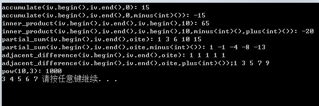

再好的编程技巧，也无法让一个笨拙的算法起死回生，选择了错误的算法，就注定了失败的命运。
<!-- more -->
本篇介绍了被记录于STL之中的，极具复用性的70余个STL算法，包括排序、查找、排列组合、数据的移动、复制、删除、比较、组合、运算等操作。特定的算法一般会搭配特定的数据结构，例如二叉搜索树和红黑树就是为了解决查找问题发展出来的特殊结构，散列表也是一种拥有快速查找能力的结构，像这种算法一般会与特定的容器相配合，在这里讲述的算法，大都是可用于无太多特殊条件限制的空间中的某一段元素区间的算法。
tips:算法有质变算法（mutating algorithms）、非质变算法（nonmutating algorithms），区别在于运算过程中是否会更改区间内的元素内容。
tips：STl泛型算法的一般形式都是前面两个参数为一对迭代器，用来表示一个前闭后开区间，也代表一个算法的作用域，这个区间的必要条件就是能够通过累加操作符的反复运用，从first到达last，这个条件如果不满足，会发生不可知的结果。 

一、数值算法
客户端必须包含表头<numeric>才能使用这些算法，它们实现在SGI STL中的<stl_numeric.h>文件，具体功能详见下面的源码剖析，在源码剖析的时候，针对每个元素都给出了使用例子，这样可以增加对其理解，代码及运算结果如下：

	#include<iostream>
	#include<iterator>
	#include<math.h>
	using namespace std;
	int main()
	{
		int ia[5]={1,2,3,4,5};
		vector<int>iv(ia,ia+5);
		cout<<"accumulate(iv.begin(),iv.end(),0): ";
		cout<<accumulate(iv.begin(),iv.end(),0)<<endl;
		cout<<"accumulate(iv.begin(),iv.end(),0,minus<int>()): "<<accumulate(iv.begin(),iv.end(),0,minus<int>())<<endl;
		cout<<"inner_product(iv.begin(),iv.end(),iv.begin(),10): "<<inner_product(iv.begin(),iv.end(),iv.begin(),10)<<endl;
		cout<<"inner_product(iv.begin(),iv.end(),iv.begin(),10,minus<int>(),plus<int>()): "<<inner_product(iv.begin(),iv.end(),iv.begin(),10,minus<int>(),plus<int>())<<endl;
		ostream_iterator<int> oite(cout," ");
		
		cout<<"partial_sum(iv.begin(),iv.end(),oite): ";
		partial_sum(iv.begin(),iv.end(),oite);
		cout<<endl;
		cout<<"partial_sum(iv.begin(),iv.end(),oite,minus<int>()): ";
		partial_sum(iv.begin(),iv.end(),oite,minus<int>());
		cout<<endl;
		cout<<"adjacent_difference(iv.begin(),iv.end(),oite): ";
		adjacent_difference(iv.begin(),iv.end(),oite);
		cout<<endl;
		cout<<"adjacent_difference(iv.begin(),iv.end(),oite,plus<int>());";
		adjacent_difference(iv.begin(),iv.end(),oite,plus<int>());
		cout<<endl;
		cout<<"pow(10,3): ";
		cout<<pow(10.0,3)<<endl;
		//cout<<"pow(10,3,plus<int>()): ";
		//cout<<pow(10.0,3,plus<int>())<<endl;
		int n=3;
		iota(iv.begin(),iv.end(),n);
		for(int i=0;i<iv.size();++i)
			cout<<iv[i]<<' ';
		system("pause");
		return 0;
	}

1.1 accumulate
源码如下所示，用来计算区间内所有元素和init的总和，必须提供init，这样保证在区间为空时候可以获得一个拥有明确定义的值，第二个版本对每一个元素执行一个二元操作。

	template <class _InputIterator, class _Tp>
	_Tp accumulate(_InputIterator __first, _InputIterator __last, _Tp __init)
	{
	  for ( ; __first != __last; ++__first)//遍历指定范围元素
	    __init = __init + *__first;//将每个元素累加到初始值init上，上述例子设init为0，最后计算出来的就是累加结果15
	  return __init;
	}
	//第二个版本：用户可自行指定二元操作函数
	template <class _InputIterator, class _Tp, class _BinaryOperation>
	_Tp accumulate(_InputIterator __first, _InputIterator __last, _Tp __init,
	               _BinaryOperation __binary_op)
	{
	  for ( ; __first != __last; ++__first)//遍历指定范围元素
	    __init = __binary_op(__init, *__first);//对每个元素执行二元操作，上述例子二元操作为减法运算，所以结果为-15。
	  return __init;
	}

1.2 adjacent_difference
源码如下所示，用来计算区间内相邻元素的差额，也就是说，它将*first赋给*result，针对[first+1,last)内的每个迭代器i，将*i-*（i-1）的值赋给*（result+（i-first）），第二个版本将两者相减换成提供的二元运算，当result等于first时，它是一个就地算法。

    template <class _InputIterator, class _OutputIterator>
    _OutputIterator
    adjacent_difference(_InputIterator __first,
                        _InputIterator __last, _OutputIterator __result)
    {
      if (__first == __last) return __result;//若为空直接返回
      *__result = *__first;//记录下第一个元素
      //也可以直接写成一个函数，不必传递调用。
      return __adjacent_difference(__first, __last, __result,__VALUE_TYPE(__first));
    }
    template <class _InputIterator, class _OutputIterator, class _Tp>
    _OutputIterator 
    __adjacent_difference(_InputIterator __first, _InputIterator __last,
                          _OutputIterator __result, _Tp*)
    {
      _Tp __value = *__first;
      while (++__first != __last) {//遍历区间
        _Tp __tmp = *__first;//初始化tmp
        *++__result = __tmp - __value;//计算相邻两元素的差额(后-前)，并赋给输出端，所以上述结果输出全是1.
        __value = __tmp;//更新当前值
      }
      return ++__result;
    }
    //版本二：可指定操作函数
    template <class _InputIterator, class _OutputIterator, class _Tp, 
              class _BinaryOperation>
    _OutputIterator
    __adjacent_difference(_InputIterator __first, _InputIterator __last, 
                          _OutputIterator __result, _Tp*,
                          _BinaryOperation __binary_op) {
      _Tp __value = *__first;
      while (++__first != __last) {//遍历区间
        _Tp __tmp = *__first;//初始化tmp
        *++__result = __binary_op(__tmp, __value);//计算相邻两元素的加法操作，并赋给输出端
        __value = __tmp;//因为这里是将tmp给的value，所以value和tmp还是相加的最开始的那个数，并没有从2变到3，所以这也是为什么结果是1、3、5、7、9的原因。
      }
      return ++__result;
    }
    
    template <class _InputIterator, class _OutputIterator, class _BinaryOperation>
    _OutputIterator 
    adjacent_difference(_InputIterator __first, _InputIterator __last,
                        _OutputIterator __result, _BinaryOperation __binary_op)
    {
      if (__first == __last) return __result;//若为空直接返回
      *__result = *__first;//初始值
      //调用上面的函数__adjacent_difference()
      return __adjacent_difference(__first, __last, __result,
                                   __VALUE_TYPE(__first),
                                   __binary_op);
    }

1.3 inner_difference
源码如下所示，用来计算区间1和等长区间2的一般内积，同理，必须提供init，这样保证在区间为空时候可以获得一个拥有明确定义的值，第一个版本的结果会加上init，第二个版本用自己提供的仿函数来代替operator+、operator*，从头到尾执行result=binary_op1(result,binary_op2(*i,*(first2+(i-first1))))。

	template <class _InputIterator1, class _InputIterator2, class _Tp>
	_Tp inner_product(_InputIterator1 __first1, _InputIterator1 __last1,
	                  _InputIterator2 __first2, _Tp __init)
	{
	  
	//以第一个序列的元素个数为据，将两个序列都走一遍
	  for ( ; __first1 != __last1; ++__first1, ++__first2)
	    //所以上述例子结果等于：10+1*1+2*2+....+5*5=65
	    __init = __init + (*__first1 * *__first2);//执行两个序列的内积与初始值init相加
	  return __init;
	}
	
	//版本二：用户可自行指定二元操作函数
	template <class _InputIterator1, class _InputIterator2, class _Tp,
	          class _BinaryOperation1, class _BinaryOperation2>
	_Tp inner_product(_InputIterator1 __first1, _InputIterator1 __last1,
	                  _InputIterator2 __first2, _Tp __init, 
	                  _BinaryOperation1 __binary_op1,
	                  _BinaryOperation2 __binary_op2)
	{
	  
	  //以第一个序列的元素个数为据，将两个序列都走一遍
	  for ( ; __first1 != __last1; ++__first1, ++__first2)
		  //首先指定__binary_op2操作，再指定__binary_op1操作，
	      //所以最后结果为5-5*5=-20
	    __init = __binary_op1(__init, __binary_op2(*__first1, *__first2));
	  return __init;
	}

1.4partial_sum
依然是提供了两个版本，用来计算局部总和，它将*first赋值给*reslut，将*first和*（first+1）的和赋值给*（result+1），同理，当first等于result时，是一个就地计算，是一个质变算法，本算法返回输出区间的最尾端位置result+（last-first）,第二个版本依然是利用外界提供二元仿函数代替本来的加法操作。

	template <class _InputIterator, class _OutputIterator, class _Tp>
	_OutputIterator 
	__partial_sum(_InputIterator __first, _InputIterator __last,
	              _OutputIterator __result, _Tp*)
	{
	  _Tp __value = *__first;
	  while (++__first != __last) {//遍历区间元素
	    __value = __value + *__first;//区间前n个元素的总和
	    *++__result = __value;//把元素赋给输出端
	  }
	  return ++__result;
	}
	
	template <class _InputIterator, class _OutputIterator>
	_OutputIterator 
	partial_sum(_InputIterator __first, _InputIterator __last,
	            _OutputIterator __result)
	{
	  
	  if (__first == __last) return __result;//若为空
	  *__result = *__first;//初始值
	  //调用上面的函数，萃取出first的类型方便上面函数使用
	  return __partial_sum(__first, __last, __result, __VALUE_TYPE(__first));
	}
	//版本二：用户指定二元操作函数
	template <class _InputIterator, class _OutputIterator, class _Tp,
	          class _BinaryOperation>
	_OutputIterator 
	__partial_sum(_InputIterator __first, _InputIterator __last, 
	              _OutputIterator __result, _Tp*, _BinaryOperation __binary_op)
	{
	  _Tp __value = *__first;
	  while (++__first != __last) {//遍历区间元素
	    __value = __binary_op(__value, *__first);//区间前n个元素的__binary_op
	    *++__result = __value;//把元素赋给输出端
	  }
	  return ++__result;
	}
	
	template <class _InputIterator, class _OutputIterator, class _BinaryOperation>
	_OutputIterator 
	partial_sum(_InputIterator __first, _InputIterator __last,
	            _OutputIterator __result, _BinaryOperation __binary_op)
	{
	  if (__first == __last) return __result;
	  *__result = *__first;
	  //调用上面的函数，萃取出first的类型方便上面函数使用
	  return __partial_sum(__first, __last, __result, __VALUE_TYPE(__first), 
	                       __binary_op);
	}

1.5power
我的c++没有找到power函数，所以这里就只放源码，上面没有对应的例子，这个算法是SGI专属的，不在STL标准里面，计算某数的n次方，运算类型可由外界指定，指定为乘法，就是乘幂。

	template <class _Tp, class _Integer, class _MonoidOperation>
	_Tp __power(_Tp __x, _Integer __n, _MonoidOperation __opr)
	{
	  if (__n == 0)
	    return identity_element(__opr);
	  else {
	    while ((__n & 1) == 0) {
	      __n >>= 1;
	      __x = __opr(__x, __x);
	    }
	
	    _Tp __result = __x;
	    __n >>= 1;
	    while (__n != 0) {
	      __x = __opr(__x, __x);
	      if ((__n & 1) != 0)
	        __result = __opr(__result, __x);
	      __n >>= 1;
	    }
	    return __result;
	  }
	}
	//版本二：以 multiplies<_Tp>()操作调用版本一
	template <class _Tp, class _Integer>
	inline _Tp __power(_Tp __x, _Integer __n)
	{
	  return __power(__x, __n, multiplies<_Tp>());
	}
	template <class _Tp, class _Integer, class _MonoidOperation>
	inline _Tp power(_Tp __x, _Integer __n, _MonoidOperation __opr)
	{
	  return __power(__x, __n, __opr);
	}
	
	template <class _Tp, class _Integer>
	inline _Tp power(_Tp __x, _Integer __n)
	{
	  return __power(__x, __n);
	}

1.6iota
这个算法同样是SGI专属的，不在STL标准里面，它用来指定某个区间内的内容，使其中的每一个元素从指定的value开始，呈现递增的情况。
	
	//函数意义：在区间内填入value、value+1、value+2......
	template<calss ForwardIterator, class T>
	void iota(ForwardIterator first,ForwardIterator last,T value)
	{while(first!=last)*first++=value++;}

​    