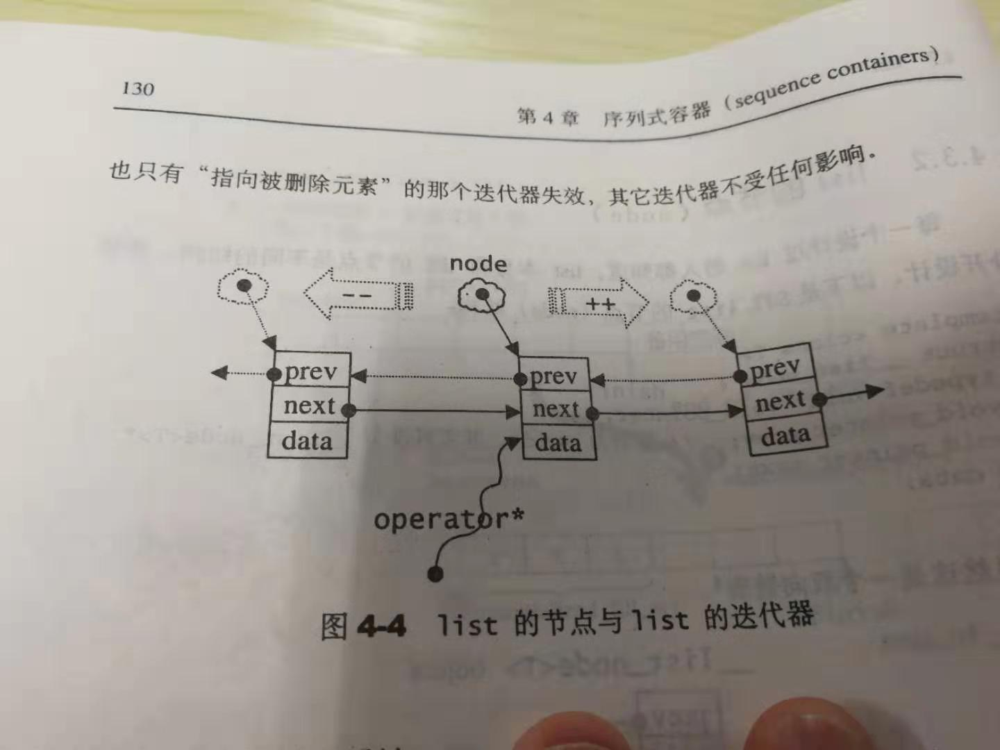
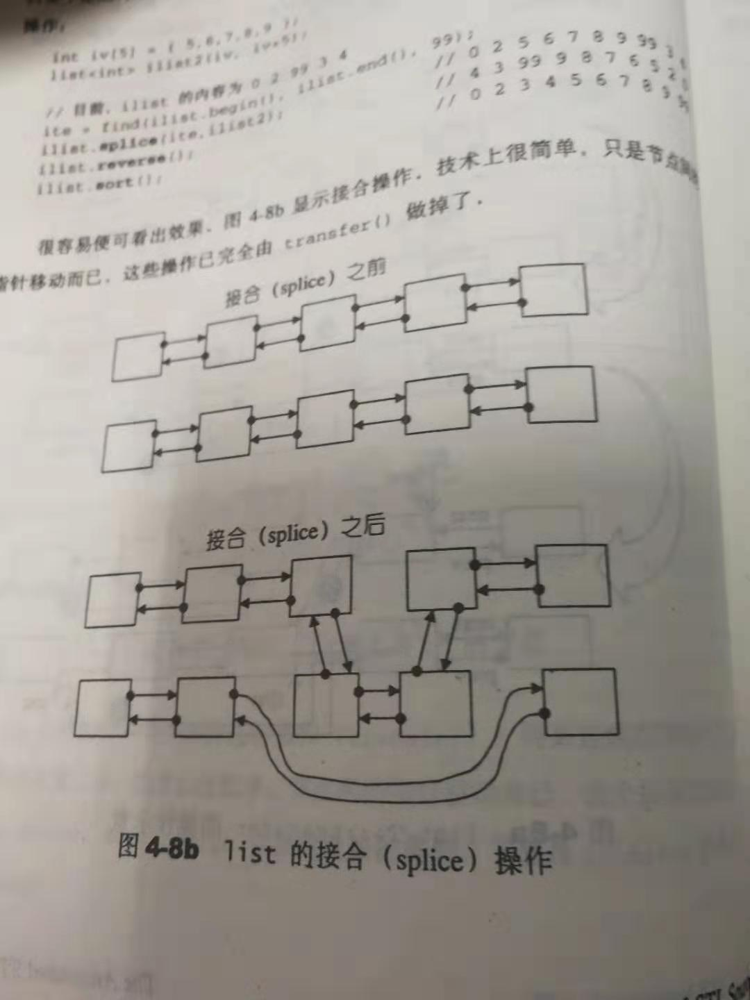

一些常用的序列式容器：vector、list、deque、stack、queue、heap、priority_queue、slist。
<!-- more -->
首先介绍下容器的概念，容器是将一些运用最广的数据结构实现出来，并且根据数据在容器中的排列特性，这些数据结构分为序列式容器以及关联式容器两种。其中序列式容器包括array（c++自建）、vector、heap、priority_queue（由heap演变）、list、slist、deque、stack和queue（由deque演变），关联式容器包括RB-tree、set和map和multiset和multimap（由RB-tree演变）、hashtable、hash_set和hash—map和hash-multiset和hash-multimap（由hashtable演变）。
1、序列式容器
  序列式容器中的元素都是可序的，但是未必有序，其中stack和queue只是将deque的接口修改了，技术上被归类为一种配接器（adapter）。
2、vector
vector各个方面和数组array都十分类似，惟一的区别是空间的运用的灵活性，array是一个固定了大小的静态空间，一旦配置之后就不能修改了，然后vector是一个动态的空间，随着新元素的加入，它的内部会自行扩充，vector的扩充也是一个配置新空间、数据移动、释放旧空间的大工程。
vector定义的源码如下所示：

	template<class T,class Alloc=alloc>
	class vector
	{
		public:
			typedef T value_type;
			typedef value_type* potinter;
			typedef value_type* iterator;//普通指针
			typedef value_type& reference;
			typedef size_t size_type;
			typedef ptrdiff_t difference_type;
	    protected:
			typedef simple_alloc<value_type,Alloc>data_allocator;
			iterator start;
			iterator finish;
			iterator end_of_storage;
			void insert_aux(iterator position ,const T& x);//在position位置前插入x。
			void deallocate(){
				if(start)
			       data_allocator::deallocate(start,end_of_storage-start);这是一个释放内存函数，deallocate，相对于allocator的申请空间
			}
			void fill_initialize(size_type n,const T& value)
			{
				start=allocate_and_fill(n,value);
				finish=start+n;
				end_of_storage=finish;
			    //这是一个填充函数，将我们申请的vector的长度为n的空间全部用value进行赋值。
			}
			public：
			iteration begin(){return start;}
			iteration end(){return finish;}
			size_type size()const{return size_type(end()-begin());}
			size_type capacity()const{return size_type(end_of_storage-begin());}
			bool empty()const{return begin()==end();}
			reference operator[] (size_type n){return *(begin()+n);}//返回从begin开始后的第n个元素的引用，这确保了可以赋值成功。
			vector():start(0),finish(0),end_of_storage(0){}
			vector(size_type n,const T& vlaue){fill_initialize(n,value);}
			vector(int n,const T& vlaue){fill_initialize(n,value);}
			vector(long n,const T& vlaue){fill_initialize(n,value);}
			explicit vector(size_type n){fill_initialize(n,T());}//声明为explicit的构造函数不能在隐式转换中使用，T()相当于一个调用默认初始化的构造函数，它的初始化的缺省值为0
			~vector(){
			destroy(start,finish);//这是个全局函数，是一个析构函数，负责调用类型的析构函数，销毁相应内存上的内容（但销毁后内存地址仍保留）
			deallocate();//负责释放内存（此时相应内存中的值在此之前应调用destory销毁，将内存地址返回给系统，代表这部分地址使用引用-1）
			}
			reference front(){return *begin();}
			reference back(){return *(end()-1);}
			void push_back(const T& x)
			{
				if(finish!=end_of_storage)
				{
					construct(finish,x);//全局函数，用于将指定指针位置的内容置为x
				    ++finish;
				}
				else 
				   insert_aux(end(),x);//没有备用空间，扩充空间（重新配置，移动数据，释放原空间）
			}
			void pop_back()
			{
				--finish;
			    destroy(finish);//销毁内容
			}
			iterator erase(iterator position)
			{
				if(position+1!=end())
			       copy(position+1,finish,position);
			    --finish;//如果加一等于end，说明指向的最后一个元素，和pop_back是一样的，如果没有指向最后一个，那么就挨个向前复制。
			    destroy(finish);
			    return position;
			}
			void resize(size_type new_size,const T& x)
			{
				if(new_size<size())
			       erase(begin()+new_size,end());//销毁多出来的元素，但是可用长度并没有改变。
			    else
			      insert(end(),new_size-size(),x);//如果过短，那么在最后再插入缺少的个数个x；
			}
	   protected:
			iterator allocate_and_fill(size_type n,const T& x)
			{
				iterator result=data_allocator::allocate(n);//配置n个元素空间
			    uninitialized_fill_n(result,n,x);//全局函数，将范围内指向的所有的未初始化的内存空间赋值x。
			    return result; 
			}
	}

因为vector是一个连续的线性空间，所以它的迭代器只要普通指针就可以满足了，并且普通指针也支持随机存取，所以vector提供的是一个random access iterators。它的数据机构很简单，以两个迭代器start以及finish分别指向配置得来的连续空间中目前被使用的范围，以end_of_storage代表整块连续空间的尾端。为了降低空间配置的速度成本，一般情况下实际配置大小会比需求更大一些，这就是capacity的概念，下面这张图可以很好的解释上面这段话：

配置空间的程序为：

	template<calss T,class Alloc>
	void vector<T,Alloc>::insert_aux(iterator position,const T& x)
	{
		if(finish!=end_of_storage)
	   //还有备用空间，在备用空间起始处构造元素，并将最后一个元素值设为其初值。
			construct(finish,*(finish-1));
		++finish;
	   //调整finish的位置。
		T x_copy=x;
	  //copy_backward是从后往前赋值，具体见下附图，这样刚好能够不覆盖掉元素。
		copy_backward(position,finsh-2,finish-1);
	  //将插入值赋给指针位置position。
		*position =x_copy;
	}
	else//无备用空间
	{
		const size_type old_size=size();//取出原来的大小
		const size_type len=old_size!=0?2*old_size:1;
	    //原来大小为0，就配置一个元素空间，否则就是配置原来大小的两倍空间，前半段用来放置原来的数据，后半段放新数据。
		iterator new_start=data_allocator::allocate(len);//配置空间。
		iterator new_finish=new_start;//内部暂无元素
		try{
			new_finish=uninitialized_copy(start,position,new_start);//将start到position位置的元素全部复制到新地址
			construct(new_finish,x);//将待插入的值放入最后可以备用空间
			++new_finish;//调整位置
			new_finish=uninitialized_copy(position,finish,new_finish);//将之前未复制完的后半段元素复制过来。
		}
		catch(.....){
			destroy(new_start,new_finish);//上述操作失败，那么析构掉已经复制元素的内存空间
		    data_allocator::deallocate(new_start,len);//释放掉内存空间
		    throw;
		}
		destroy(begin(),end())；//析构并释放原来的vector。
		deallocate();
		start=new_start;//调整start和finish和end_of_storage，使它们指向新的vector。
		finish=new_finish;
		end_of_storage=new_start+len;
	}
	}


注意一点，动态增加大小，从上述代码可以看出，并不是在原来的空间之后接上新的空间，而是要经过配置，复制，释放三个操作，因此，对vector的任何操作，一旦引起来空间重新配置，之前的指向原vector的迭代器就失效了，vector里面的函数包括void pop_back()、iterator erase(iterator first,iterator last)、iterator erase(iterator position)、void insert(iterator position ,size_type n,const T&x),挑选其中的几个进行复习。

	iterator erase(iterator first,iterator last)
	{
		iterator i=copy(last,finish,first);//全局函数,复制从last到finish的元素到从first开始的内存空间中，从前往后复制后，返回最后一个地址。
	    destroy(i,finish);
	    finish=finish-(last-first);
	    return first;
	}
	iterator erase(iterator position)
	{
		if(position+1!=end())//看是否是清除最后一个元素
		    copy(position+1,finish,position)
		--finish;
	    destroy(finish);
	    return position;
	}
	void clear(){erase(begin(),end());}
	void insert(iterator position, const T& value){
			insert(position, 1, value);
		}
	//在position位置之后，插入n个值为value的元素
	void insert(iterator position, size_type n, const T& value){
		if (n == 0)return;
		if ((end_of_storage - finish) >= n){//备用空间够插入n个新元素
			T x_copy = value;
			const  size_type size_from_position_to_end = finish - position;//计算从最后一个位置到要插入位置的元素个数
			iterator old_finish = finish;
			if (size_from_position_to_end > n)//如果插入元素个数小于插入位置之后的元素个数{
				uninitialized__copy(finish - n, finish, finish);//这是一个用于未初始化空间的复制函数，将倒数的n个元素往未初始化过的内存空间移动
				finish += n;//改变finish的值
				copy_backward(position, old_finish - n, old_finish);从后往前，将剩下的size_from_position_to_end-n个元素从之前的finish那个位置往前复制
				fill(position, position + n, x_copy);//填入新的值
			}
			else{//插入点之后元素个数小于新增元素个数
				uninitialized_fill_n(finish, n - size_from_position_to_end, x_copy);//先用x将finish之后的n-size_from_position_to_end个备用空间赋值。
				finish += n - size_from_position_to_end;更改finish的值
				uninitialized_copy(position, old_finish, finish);一个插入n个值，再将这剩下的size_from_position_to_end个之前的元素赋值到finish之后。
				finish += size_from_position_to_end;修改finish
				fill(position, old_finish, x_copy);用x将已经移动到最后的size_from_position_to_end个元素的空间赋值。
			}
		}
		else{
			//重新申请空间，并且决定新长度为旧长度的两倍或者说旧长度+新增元素个数。
			const size_type old_size = size();
			const size_type len=old_size+max(old_size,n);
			iterator new_start = data_allocator::allocate(len);
			iterator new_finish = new_start;
			//内存的分配要有原子性，即:要么全部成功，要么全部失败。
			try{
				new_finish = uninitialized_copy(begin(), position, new_start);//1.将原内容至position的所有元素(不包含position) 拷贝到新的vector
				new_finish = uninitialized_fill_n(new_finish, n, value);//2.将position位置到后面的n个元素都填充为value
				new_finish = uninitialized_copy(position, end(), new_finish);//3.拷贝从 position位置到end()位置的原vector的所有剩余元素
			}
			catch (...)//如果失败了
			{
				destroy(new_start, new_finish);
				data_allocator::deallocate(new_start,len);(等同于free(new_start);)//删除申请到的内存
				
				throw;        //抛出异常
			}
			//析构并释放原vector
			destroy(begin(), end());
			//删除内存
			deallocate();
			//调整迭代器，指向新的vector
			start = new_start;
			finish = new_finish;
			end_of_storage = new_start + len;
		}
	}

上述代码的操作可以用接下来的几幅图进行一个很直观的展示：


2、list
相比较于上面说到的vector，list就复杂很多，但是它每次插入或者删除一个元素，就配置或者释放一个元素空间。因此，list对于空间的运用有绝对的精准，对于任何位置的插入或删除，list都是常数时间。这两个是最常用的容器，一般是由元素的多少，元素的构造复杂度，元素的存取行为特性等决定使用哪一种容器的。
对于list来说，list本身和list的节点是两种不同的结构，需要对它进行分开设计，其中list的节点结构如下所示：

	template<calss T>
	struct _list_node{
		typedef void* void_pointer;
		void_pointer prev;//类型为void*，其实可以弄成_lsit_node<T>*.
		void_pointer next;
		T data;
	}

结构如图：

一个很明显的双向链表，容器中一个很重要的东西就是迭代器，并且很明显，不能再用普通指针作为迭代器了，因为list并不是在存储空间中连续存在的。list的迭代器要成功实现递增、递减、取值、成员存取等操作。所以list应该提供的是bidirectional iterators（双向迭代器）。list和vector不同的一个重要性质，无论是结合操作（splice）或是插入操作（insert）都不会造成原有的list迭代器失效，删除操作也只是让指向被删除的那个元素的迭代器失效，其它迭代器不受影响。

看一看迭代器的设计：
    
    // 至于为什么不使用默认参数, 这个是因为有一些编译器不能提供推导能力,
    // 而作者又不想维护两份代码, 故不使用默认参数
    template<class T,class Ref,class Ptr>
    struct _list_iterator{
    	// 定义相应型别
    	 typedef _list_iterator<T,T&,T*> iterator;
    	 typedef _list_iterator<T,Ref,Ptr> self;
    	 typedef bidirectional_iterator_tag iterator_category;
    	 typedef T value_type;
    	 typedef Ptr pointer;
    	 typedef Ref reference;
    	 typedef _list_node<T>* link_type;
    	 typedef size_t size_type;
    	 typedef ptrdiff_t difference_type;
        // 拥有一个指向对应结点的指针,一个普通指针，指向list节点。
        link_type node;
        // 构造函数
        __list_iterator() {}
        __list_iterator(link_type x) : node(x) {}
        __list_iterator(const iterator& x) : node(x.node) {}    
        // 在STL算法中需要迭代器提供支持
    	bool operator==(const self& x) const { return node == x.node; }
    	bool operator!=(const self& x) const { return node != x.node; }
        // 重载了iterator必须的操作符，对迭代器取值，取的是节点的数据值
        reference operator*() const { return (*node).data; }
        //对迭代器的成员存取（member access）运算子的标准做法
        pointer operator->() const { return &(operator*()); }
    	// 前缀自加，对迭代器累加1，就是前进一个节点，为了区分前后，用++()表示前自增，用++(int)后自增，传入一个0；
    	self& operator++()
    	{
    		node = (link_type)((*node).next);
    		return *this;
    	}
     
    	// 后缀自加, 需要先产生自身的一个副本, 然会再对自身操作, 最后返回副本，插一句话，一般使用前自增，这样函数开销比较小。后自增还需要一个临时副本存储元素，以便操作结束之后进行加一操作。
    	self operator++(int)
    	{
    		self tmp = *this;
    		++*this;//运用了前缀自加。
    		return tmp;
    	}
    	// 前缀自减，后退一个节点。
    	self& operator--()
    	{
    		node = (link_type)((*node).prev);
    		return *this;
    	}
     
    	self operator--(int)
    	{
    		self tmp = *this;
    		--*this;
    		return tmp;//返回的是未做处理前的节点，符合后缀操作先操作，后运行的道理，这也是为何开销会大，生成了一个复制副本。
    	}
    };

接下来说一说list的数据结构，并且list还是一个环状的双向链表，所以只需要一个指针，便可以通过遍历的方式完整的表现出整个数组。

	template <class T, class Alloc = alloc>  
	class list  
	{  
	protected:  
	 typedef __list_node<T> list_node;
	public：
	typedef list_node* link_type;
	protected:
	link_type node;
	......
	}

为了满足vector中的很多函数，所以将node刻意的指向尾端的一个空白节点，这样就实现了前闭后开的区间要求。这样下面的这些函数都能很好的完成。

下面这些函数里面不仅有list的内存管理和构造，还有它的元素操作，

	iterator begin(){return (link_type)((*node).next);}
	iterator end(){return node;}
	bool empty()const{return node->next==node;}
	size_type size()const{
	size_type result=0;
	distance(begin(),end(),result);//全局函数,用于计算两个迭代器之间的距离，针对不同迭代器计算方式不同。
	return result;
	}
	//取头尾节点的值
	reference front(){return *begin();}
	reference back(){return *(--end());}
	
	// 默认allocator为alloc, 其具体使用版本请参照<stl_alloc.h>  
	template <class T, class Alloc = alloc>  
	class list  
	{  
	protected:  
	    typedef void* void_pointer;  
	    typedef __list_node<T> list_node;  
	  
	    // 专属之空间配置器，每次配置一个节点大小，list_node_allocator（n）表示配置n个节点空间 
	    typedef simple_alloc<list_node, Alloc> list_node_allocator;  
	  
	public:  
	    typedef T value_type;  
	    typedef value_type* pointer;  
	    typedef value_type& reference;  
	    typedef list_node* link_type;  
	    typedef size_t size_type;  
	    typedef ptrdiff_t difference_type;  
	  
	    typedef __list_iterator<T, T&, T*>             iterator;  
	  
	protected:  
	    link_type node ;     // 只要一个指针，便可表示整个环状双向链表  
	    // 分配一个新结点, 注意这里并不进行构造,  
	    // 构造交给全局的construct, 见<stl_stl_uninitialized.h> ，配置一个节点内存空间并传回。 
	    link_type get_node() { return list_node_allocator::allocate(); }  
	  
	    // 释放指定结点, 不进行析构, 析构交给全局的destroy，这里直接进行内存释放了。  
	    void put_node(link_type p) { list_node_allocator::deallocate(p); }  
	  
	    // 产生（配置并构造）一个节点, 首先分配内存, 然后进行构造  
	    // 注: commit or rollback 提交或者回滚，就是成功或者释放所有申请的。  
	    link_type create_node(const T& x)  
	    {  
	        link_type p = get_node();  
	        construct(&p->data, x); //全局函数，老函数了 
	        return p;  
	    }  
	  
	    // 析构结点元素, 并释放内存  
	    void destroy_node(link_type p)  
	    {  
	        destroy(&p->data);//全局函数  
	        put_node(p);  
	    }  
	  
	protected:  
	    // 用于空链表的建立  
	    void empty_initialize()  
	    {  
	        node = get_node();   // 配置一个节点空间，令node指向它，显然为设定初值。  
	        node->next = node;   // 令node头尾都指向自己，不设元素值  
	        node->prev = node;  
	    }  
	  // 创建值为value共n个结点的链表  
	  // 注: commit or rollback  
	    void fill_initialize(size_type n, const T& value)  
	    {  
	        empty_initialize();  
	        __STL_TRY  
	        {  
	            // 此处插入操作时间复杂度O(1)  
	            insert(begin(), n, value);  
	        }  
	        __STL_UNWIND(clear(); put_node(node));  
	    }  


​	  
	public:  
	    list() { empty_initialize(); }//产生一个空链表，list包含很多constructors，这是个default constructor（默认构造函数）。  
	    iterator begin() { return (link_type)((*node).next); }  
	  
	    // 链表成环, 当指所以头节点也就是end  
	    iterator end() { return node; }  
	  
	    // 头结点指向自身说明链表中无元素  
	    bool empty() const { return node->next == node; }  
	  
	    // 使用全局函数distance()进行计算, 时间复杂度O(n)  
	    size_type size() const  
	    {  
	        size_type result = 0;  
	        distance(begin(), end(), result);  
	        return result;  
	    }  
	  
	    size_type max_size() const { return size_type(-1); }  
	    reference front() { return *begin(); }  
	    reference back() { return *(--end()); }  
	  
	    ////////////////////////////////////////////////////////////////////////////////  
	    // 在指定位置插入元素  
	    ////////////////////////////////////////////////////////////////////////////////  
	    //       insert(iterator position, const T& x)  
	    //                       ↓  
	    //                 create_node(x)  
	    //                 p = get_node();-------->list_node_allocator::allocate();  
	    //                 construct(&p->data, x);  
	    //                       ↓  
	    //            tmp->next = position.node;  
	    //            tmp->prev = position.node->prev;  
	    //            (link_type(position.node->prev))->next = tmp;  
	    //            position.node->prev = tmp;  
	    ////////////////////////////////////////////////////////////////////////////////  
	    //首先配置一个节点，然后在尾端进行适当的指针操作，将新节点插入进去。
	    iterator insert(iterator position, const T& x)  
	    {  
	        link_type tmp = create_node(x);   // 产生一个节点，值为x  
	        // 调整双向指针，使tmp插入进去  
	        tmp->next = position.node;  
	        tmp->prev = position.node->prev;  
	        (link_type(position.node->prev))->next = tmp;  
	        position.node->prev = tmp;  
	        return tmp;//插入后返回的依然是插入点，插入是指的插入在..之前。  
	    }  
	  
	  // 指定位置插入n个值为x的元素, 详细解析见实现部分  
	  void insert(iterator pos, size_type n, const T& x);  
	  void insert(iterator pos, int n, const T& x)  
	  {  
	      insert(pos, (size_type)n, x);  
	  }  
	  void insert(iterator pos, long n, const T& x)  
	  {  
	      insert(pos, (size_type)n, x);  
	  }  
	  
	  // 在链表前端插入结点  
	  void push_front(const T& x) { insert(begin(), x); }  
	  // 在链表最后插入结点  
	  void push_back(const T& x) { insert(end(), x); }  
	  
	  // 移除迭代器position所指节点  
	  iterator erase(iterator position)  
	  {  
	      link_type next_node = link_type(position.node->next);  
	      link_type prev_node = link_type(position.node->prev);  
	      prev_node->next = next_node;  
	      next_node->prev = prev_node;  
	      destroy_node(position.node);  
	      return iterator(next_node);  
	  }  
	  
	  // 擦除一个区间的结点, 详细解析见实现部分  
	  iterator erase(iterator first, iterator last);  
	  
	  void resize(size_type new_size, const T& x);  
	  void resize(size_type new_size) { resize(new_size, T()); }  
	  void clear();  
	  
	  // 删除链表第一个结点  
	  void pop_front() { erase(begin()); }  
	  // 删除链表最后一个结点  
	  void pop_back()  
	  {  
	      iterator tmp = end();  
	      erase(--tmp);  
	  }  
	  
	  list(size_type n, const T& value) { fill_initialize(n, value); }  
	  list(int n, const T& value) { fill_initialize(n, value); }  
	  list(long n, const T& value) { fill_initialize(n, value); }  
	  
	  ~list()  
	  {  
	    // 释放所有结点  // 使用全局函数distance()进行计算, 时间复杂度O(n)  
	  size_type size() const  
	  {  
	    size_type result = 0;  
	    distance(begin(), end(), result);  
	    return result;  
	  }  
	  clear();  
	  // 释放头结点  
	  put_node(node);  
	  }  
	  
	  list<T, Alloc>& operator=(const list<T, Alloc>& x);  
	  
	protected:  
	  
	    ////////////////////////////////////////////////////////////////////////////////  
	    // 将[first, last)内的所有元素移动到position之前  
	    // 如果last == position, 则相当于链表不变化, 不进行操作  
	    ////////////////////////////////////////////////////////////////////////////////  
	    // 初始状态  
	    //                   first                             last  
	    //                     ↓                                 ↓  
	    //      --------   --------   --------     --------   --------   --------  
	    //      | next |-->| next |-->| next |     | next |-->| next |-->| next |  
	    //  ... --------   --------   -------- ... --------   --------   -------- ...  
	    //      | prev |<--| prev |<--| prev |     | prev |<--| prev |<--| prev |  
	    //      --------   --------   --------     --------   --------   --------  
	    //  
	    //                           position  
	    //                               ↓  
	    //      --------   --------   --------   --------   --------   --------  
	    //      | next |-->| next |-->| next |-->| next |-->| next |-->| next |  
	    //  ... --------   --------   --------   --------   --------   -------- ...  
	    //      | prev |<--| prev |<--| prev |<--| prev |<--| prev |<--| prev |  
	    //      --------   --------   --------   --------   --------   --------  
	    //  
	    // 操作完成后状态  
	    //                           first  
	    //                             |  
	    //               --------------|--------------------------------------  
	    //               | ------------|------------------------------------ |   last  
	    //               | |           ↓                                   | |     ↓  
	    //      -------- | |        --------   --------     --------       | |  --------   --------  
	    //      | next |-- |  ----->| next |-->| next |     | next |-----  | -->| next |-->| next |  
	    //  ... --------   |  |     --------   -------- ... --------    |  |    --------   -------- ...  
	    //      | prev |<---  |  ---| prev |<--| prev |     | prev |<-- |  -----| prev |<--| prev |  
	    //      --------      |  |  --------   --------     --------  | |       --------   --------  
	    //                    |  |                                    | |  
	    //                    |  ------                               | |  
	    //                    ------- |  ------------------------------ |  
	    //                          | |  |                              |  
	    //                          | |  |  -----------------------------  
	    //                          | |  |  |  
	    //                          | |  |  |  position  
	    //                          | |  |  |     ↓  
	    //      --------   -------- | |  |  |  --------   --------   --------   --------  
	    //      | next |-->| next |-- |  |  -->| next |-->| next |-->| next |-->| next |  
	    //  ... --------   --------   |  |     --------   --------   --------   -------- ...  
	    //      | prev |<--| prev |<---  ------| prev |<--| prev |<--| prev |<--| prev |  
	    //      --------   --------            --------   --------   --------   --------  
	    ////////////////////////////////////////////////////////////////////////////////  
	    void transfer(iterator position, iterator first, iterator last)  
	    {  
	        if (position != last)   // 如果last == position, 则相当于链表不变化, 不进行操作  
	        {  
	            (*(link_type((*last.node).prev))).next = position.node;  
	            (*(link_type((*first.node).prev))).next = last.node;  
	            (*(link_type((*position.node).prev))).next = first.node;  
	            link_type tmp = link_type((*position.node).prev);  
	            (*position.node).prev = (*last.node).prev;  
	            (*last.node).prev = (*first.node).prev;  
	            (*first.node).prev = tmp;  
	        }  
	    }  
	//list内部提供一个迁移操作，这个操作将连续范围内的元素迁移到某个特定位置之前，这个操作为后续的splice、sort、merge提供了基础
	void transfer(iterator position,iterator first,iterator last)
	{
		if(position!=last)
		{
			(*(link_type((*last.node).prev))).next=position.node;//(1)
			(*(link_type((*first.node).prev))).next=last.node;//(2)
			(*(link_type((*position.node).prev))).next=first.node;//(3)
			link_type tmp=link_type((*position.node).prev);（4）
			(*position.node).prev=(*last.node).prev;//(5)
			(*last.node).prev=(*first.node).prev;//(6)
			(*first.node).prev=tmp;//(7)
		}
	} 
	public:  
	    // 将链表x移动到position所指位置之前，x必须不同与*this  
	    void splice(iterator position, list& x)  
	    {  
	        if (!x.empty())  
	            transfer(position, x.begin(), x.end());  
	    }  
	  
	    // 将链表中i指向的内容移动到position之前，两者可以在同一个list中。  
	    void splice(iterator position, list&, iterator i)  
	    {  
	        iterator j = i;  
	        ++j;  
	        if (position == i || position == j) return;  
	        transfer(position, i, j);//移动的时候不会包括j  
	    }  
	  
	    // 将[first, last}元素移动到position之前，依然可以指向同一个list  
	    void splice(iterator position, list&, iterator first, iterator last)  
	    {  
	        if (first != last)  
	            transfer(position, first, last);  
	    }  
	  
	    void remove(const T& value);  
	    void unique();  
	    void merge(list& x);  
	    void reverse();  
	    void sort();  
	  
	};  
	// 销毁所有结点, 将链表置空  
	template <class T, class Alloc>  
	void list<T, Alloc>::clear()  
	{  
	  link_type cur = (link_type) node->next;  
	  while (cur != node)  
	  {  
	    link_type tmp = cur;  
	    cur = (link_type) cur->next;  
	    destroy_node(tmp);  //挨个删除
	  }  
	  // 恢复node原始状态，恢复成一个空链表的样子。  
	  node->next = node;  
	  node->prev = node;  
	} 
	//将数值为value的所有元素移除
	template <class T, class Alloc>  
	void list<T, Alloc>::remove(const T& value)  
	{  
	    iteration first=begin();
	    iteration last=end();
		while(first!=last)
		{
			iterator next=first;
			++next;
			if(*first==value)earse(first);
			first=next;
		}  
	} 
	// 移除容器内所有的相邻的重复结点,只有连续且相同，才会被移除到只剩下一个。  
	// 时间复杂度O(n)  
	// 用户自定义数据类型需要提供operator ==()重载  
	template <class T, class Alloc>  
	void list<T, Alloc>::unique()  
	{  
	  iterator first = begin();  
	  iterator last = end();  
	  if (first == last) return;  
	  iterator next = first;  
	  while (++next != last)  
	  {  
	    if (*first == *next)  
	      erase(next);  
	    else  
	      first = next;  
	    next = first;  
	  }  
	} 
	// 假设当前容器和x都已序, 保证两容器合并后仍然有序，将x合并到*this上，  
	template <class T, class Alloc>  
	void list<T, Alloc>::merge(list<T, Alloc>& x)  
	{  
	  iterator first1 = begin();  
	  iterator last1 = end();  
	  iterator first2 = x.begin();  
	  iterator last2 = x.end();  
	  
	  // 注意：前提是，两个lists都已经递增排序  
	  while (first1 != last1 && first2 != last2)  
	    if (*first2 < *first1)  
	    {  
	      iterator next = first2;  
	      transfer(first1, first2, ++next);  
	      first2 = next;  
	    }  
	    else  
	      ++first1;  
	  if (first2 != last2)  
	      transfer(last1, first2, last2);//最后结果也可以看出是归在list1里面的。  
	}  
	//将*this中的内容逆向重置
	template <class T, class Alloc>  
	void list<T, Alloc>::reverse()  
	{  
		 //空链表或者仅有一个元素，不进行任何操作。可以使用size()==0||size()==1来判断，但是比较慢。
		if(node->next=node||link_type(node->next)->next==node)
			return ;
		iterator first=begin();
		++first;
		while(first!=end())
		{
			iterator old=first;
			++first；
			transfer(begin(),old,first);
		}
	} 
	//list是不能使用stl提供的sort算法的，必须使用自己定义的sort函数，因为stl的sort只接受randonaccessiterator，下面这个函数采用的是归并排序的思想。
	template <class T, class Alloc>  
	void list<T, Alloc>::sort()
	{
	//空链表或者仅有一个元素，不进行任何操作。可以使用size()==0||size()==1来判断，但是比较慢。
		if(node->next=node||link_type(node->next)->next==node)
			return ;
		//申请新的list用于做中介数据存放区；
		list<T,Alloc>carry;//仅仅作为一个中转的链表
		list<T,Alloc>counter[64];//链表数组，counter[i]会存储2^i个元素，并且是有序的。
		int fill=0;
		while(!empty())
		{
			carry.splice(carry.begin(),*this,begin());//取出首元素放在carry中。
			int i=0;
			while(i<fill&&!counter[i].empty())
			{
				counter[i].merge(carry);//将carry中的元素归并到counter[i]中去。
				carry.swap(counter[i++]);//交换carry与counter的值，这是为了可以接着归并。
			}
			carry.swap(counter[i]);//上述没有继续下去之后，再把carry中的元素交换到counter[i]中。
			if(i==fill)++fill;//此时如果i==fill，说明下一次需要用到i++的归并空间了，所以fill++。
		}
		for(int i=1;i<fill;++i)
			counter[i].merge(counter[i-1]);//将所有未归并的元素归并起来，并且结果放在最后一个链表中。
		swap(counter[fill-1]);//取出最后一个，重新交换会list中。
	}  
	//详细讲解过程可以看 https://blog.csdn.net/chenhanzhun/article/details/39337331

下面是一些上面可能提到的结构的图片：




3、deque
deque叫做双向队列，是一种双向开口的连续线性空间（伪连续），但是它的头部操作效率奇差无比，难以被接受，并且deque和vector的差异在于deque允许参数时间内对头端进行元素的插入和删除操作，deque没有容量的概念，动态的以分段连续空间组合而成，随时可以增加一段新的空间并且链接起来。deque也提供了random access iterator，但它的迭代器也不是普通指针，复杂度远在vector之上，因此，如果对deque实现排序，可以先将deque复制到一个vector中，将vector排序完成后，复制回deque中。deque采用一小块map（不是stl的map容器）作为主控，这个map是一小块连续空间，其中每个元素都是一个指针，指向另一端较大的连续线性空间，叫做缓冲区，缓冲区才是存储空间主体，默认值0代表使用512bytes缓冲区，map使用率如果满载，利用reallocate_map（）配置一块更大的空间作为map。

	template<class T,class Alloc=alloc,size_t BufSiz=0>
	class deque{
				public:
					typedef T value_type;
					typedef value_type* pointer;
					.....
				proteced:
					typedef pointer* map_pointer;//元素的指针的指针
					map_pointer map;//指向map
					size_type map_size;//map内可容纳多少指针。
	}

deque是一个分段连续空间，维持其“整体连续”假象的任务，就落在了迭代器的operator++和operator--两个运算子身上，所以deque的迭代器必须能够指出分段连续空间（缓冲区）在哪里，其次判断是否在缓冲区的边缘，并且需要跳跃至其它缓冲区，所以deque还必须掌握管控中心（map），显然它是不可能继承stl的iteration的，决定缓冲区大小的函数为buffer_size(),调用了_deque_buf_size()(全局函数)，定义如下：

```
inline size_t _deque_buf_size(size_t n,size_t sz)
{return n!=0?n:(sz<512?size_t(512/sz):size_t(1));}
```

下图介绍了deque中迭代器、缓冲区、中控器的相互关系。

由上图可以看出，每个缓冲区的大小的是固定的，那么当前进到边缘的时候如何进行跳跃呢？使用set_node()函数跳一个缓冲区（可能往前或者往后）。

	void set_node(map_pointer new_node)
	{
		node=new_node;  
	    first=*new_node;
	    last=first+difference_type(buffer_size());//difference_type表示两个迭代器之间的距离，bufer_size表示缓冲区的大小，那么这里就相当于是返回了缓冲区的可容纳元素个数，也就是last指向的位置。所以只需要传入node+1、node-1就可以实现缓冲区指向的更改了。
	}

attention：deque的迭代器没有重载STL的Iterator

	template <class T, class Ref, class Ptr, size_t BufSiz>
	struct __deque_iterator {
		typedef __deque_iterator<T, T&, T*, BufSiz> iterator;
		typedef __deque_iterator<T, const T&, const T*, BufSiz> const_iterator;
		// 因为没继承std::iterator,所以要自行撰写五个必要的迭代器相应型别： 
	    //value_type、difference_type、reference_type、pointer_type、iterator_category.
		typedef random_access_iterator_tag iterator_category;
		typedef T value_type;
		typedef Ptr pointer;
		typedef Ref reference;
		typedef size_t size_type;
		typedef ptrdiff_t difference_type;
		typedef T** map_pointer;//指向指针的指针，用于确定map
		typedef __deque_iterator self;
		// 保存容器中的结点
		T* cur; // 指向当前缓冲区中的元素
		T* first; // 当前缓冲区的起点
		T* last; // 当前缓冲区的终点（包括备用空间）
		map_pointer node; // 指向管控中心
		}
		template <class T, class Ref, class Ptr, size_t BufSiz>
		inline random_access_iterator_tag
		iterator_category(const __deque_iterator<T, Ref, Ptr, BufSiz>&) {
		return random_access_iterator_tag();
		}
		template <class T, class Ref, class Ptr, size_t BufSiz>
		inline T* value_type(const __deque_iterator<T, Ref, Ptr, BufSiz>&) {
		return 0;
		}
		template <class T, class Ref, class Ptr, size_t BufSiz>
		inline ptrdiff_t* distance_type(const __deque_iterator<T, Ref, Ptr, BufSiz>&) {
		return 0;
	}

deque也重载了常用的运算子，以满足访问迭代器的要求。

	reference operator*()const{return *cur;}
	pointer operator->() const { return &(operator*()); }
	/**
	* 判断两个迭代器之间的距离，重载了‘-’运算子
	*/
	difference_type operator-(const self& x) const
	{
		return difference_type(buffer_size()) * (node - x.node - 1) +(cur - first) + (x.last - x.cur);
	}
	/**
	* 前缀自增，注意前缀自增返回自身引用
	*/
	self& operator++()
	{
		++cur;	// 先自增当前元素的指针，指向下一个元素。
		if (cur == last) {	// 判断是否为当前缓冲区最后一个
			set_node(node + 1);	// 如果为当前缓冲区最后一个，则跳转到下一个缓冲区
			cur = first;	// 更新为下一缓冲区的起始点
		}
		return *this;
	}
	/**
	*	后缀自增
	*	返回当前迭代器的一个副本, 并调用前缀自增运算符实现迭代器自身的自增
	*/
	self operator++(int) {
		self tmp = *this;
		++*this;
		return tmp;
	}
	/**
	*	前缀自减, 处理方式类似于前缀自增
	*	如果当前迭代器指向元素是当前缓冲区的第一个元素
	*	则将迭代器状态调整为前一个缓冲区的最后一个元素
	*/
	self& operator--()
	{
		if (cur == first) {
			set_node(node - 1);
			cur = last;
		}
		--cur;
		return *this;
	}
	// 处理方法同后缀自增
	self operator--(int)
	{
		self tmp = *this;
		--*this;
		return tmp;
	}
	/**
	*	实现p+=n的功能
	*	迭代器向前移动n个元素，其中n可能为负。实现步骤如下：
	*	1、计算相对于该缓冲区起始位置的偏移量offset
	*	2、如果offset没有超出缓冲区，则直接cur+=n
	*	3、如果offset超过了缓冲区空间
	*	-- 如果offset大于0，计算向前移动多少个缓冲区，offset / difference_type(buffer_size())
	*	-- 如果offset小于0，计算向后移动多少个缓冲区,-difference_type((-offset - 1) / buffer_size()) - 1;
	*	4、调整到移动后的位置。
	*/
	self& operator+=(difference_type n)
	{
		difference_type offset = n + (cur - first);//计算后移到哪个位置
		if (offset >= 0 && offset < difference_type(buffer_size()))
			cur += n;//目标位置在同一缓冲区
		else {//不同缓冲区，可能往前或者往后。
			difference_type node_offset =
			offset > 0 ? offset / difference_type(buffer_size())
			: -difference_type((-offset - 1) / buffer_size()) - 1;
	      //如果offset是正数，就直接判断他是缓冲区大小的多少倍，往后跳n个区就可以了。
	      //如果是负数，那么算它需要往前跳几个区。因为只要为负数，必定会往前跳，所以后面跟了-1。
			set_node(node + node_offset);//切换至正确的缓冲区
			cur = first + (offset - node_offset * difference_type(buffer_size()));//切换至正确的元素。
		}
		return *this;
	}
	/**
	* 实现诸如p+n的功能
	* 此函数中直接调用operator +=的函数
	*/
	self operator+(difference_type n) const
	{
		self tmp = *this;
		// 这里调用了operator +=()可以自动调整指针状态
		return tmp += n;
	}
	/**
	* 实现p-=n的功能
	* 此处直接利用operator += ，改变一下n的正负即可
	*/
	self& operator-=(difference_type n) { return *this += -n; }
	/**
	* 实现p-n的功能
	* 直接调用operator -=的函数
	*/
	self operator-(difference_type n) const {
		self tmp = *this;
		return tmp -= n;
	}
	/**
	* 下标运算子，支持随机存取的功能，迭代器直接跳跃n个距离。n可否取未初始化，或是超出内存区域的数值，试过了，vs2010上面会报错，下标越界。
	*/
	reference operator[](difference_type n) const { return *(*this + n); }
	/**
	* 下述都是一些判断运算的实现
	*/
	bool operator==(const self& x) const { return cur == x.cur; }
	bool operator!=(const self& x) const { return !(*this == x); }
	bool operator<(const self& x) const {
		return (node == x.node) ? (cur < x.cur) : (node < x.node);//先比较节点是否相等，再比较cur。
	}

deque除了维护一个指向map的指针外，它还维护着一个start和一个finish两个迭代器，分别指向第一缓冲区第一元素和最后一个缓冲区最后一个元素。deque也不停的记住目前的map的大小，因为一旦map提供的节点不足，需要重新配置一个更大的块，下面介绍下deque类当中的一些函数。

	template<class T,class Alloc=alloc,size_t BufSiz=0>
		class deque{
	               //多个public可以合到一起，看你的习惯，有人喜欢把一类操作放到一起，也有的人喜欢所有都在一起
	              //默认为private
					public:
						typedef T value_type;
						typedef value_type* pointer;
						typedefsize_t size_type;
					public：
					 	typedef _deque_iterator<T,T&,T*,BufSiz>iterator;
					proteced:
						typedef pointer* map_pointer;//元素的指针的指针
						map_pointer map;//指向map
						size_type map_size;//map内可容纳多少指针。
	                    iterator start;
						iterator finish;
					public://basic accessors基本访问
						iterator begin() { return start; }	// 返回第一个节点的迭代器
						iterator end() { return finish; }	// 返回最后一个节点的迭代器
						const_iterator begin() const { return start; }	// const版本
						const_iterator end() const { return finish; }	// const版本
						/**
						*	提供随机访问的下标运算子
						*	这里计算实际地址的时候是经过一系列的计算得到的，效率上有缺失
						*/
						reference operator[](size_type n) { return start[difference_type(n)]; }
	                    //调用了_deque_iterator<>：：operator[]
						const_reference operator[](size_type n) const {
						return start[difference_type(n)];
						}
						/**
						* 以下函数分别返回首尾元素的引用
						*/
	                    //调用了_deque_iterator<>：：operator*
						reference front() { return *start; }
						reference back() {
						iterator tmp = finish;
						--tmp;//调用了_deque_iterator<>：：operator--
						return *tmp;//调用了_deque_iterator<>：：operator*
						}//为什么不用return *（finish-1）；因为_deque_iterator<>没有为（finish-1）定义运算子？侯捷的原话。
	                    //使用*（finish-1）的时候可以返回正确的结果。
						const_reference front() const { return *start; }
						const_reference back() const {
						const_iterator tmp = finish;
						--tmp;
						return *tmp;
						}
						//	返回deque的大小，这里直接调用迭代器重载的‘-’运算符，有两个；；，虽奇怪但是合乎语法，侯捷说的。。
						size_type size() const { return finish - start;; }
						//	返回deque最大容量
	                    //这个跟负数的二进制表示有关系，你可以看下补码。
	                    //简单的说，就是size_type(-1)就是最大的size_type值（size_type就是unsigned int），
	                    //这样就可以求出 max_size了,size_type代表类型，-1是值，不是很懂，依然。。。。。。
						size_type max_size() const { return size_type(-1); }
						// deque为空的时, 只有一个缓冲区
						bool empty() const { return finish == start; }
		}

deque的构造和内存管理也比vector要复杂很多，deque执行定义了两个专属的空间配置器：

	protected：
	//专属配置器，每次配置一个元素大小
	typedef simple_alloc<value_type,Alloc> data_allocator;
	//专属配置器，每次配置一个指针大小
	typedef simple_alloc<pointer,Alloc>map_allocator;
	//constructor
	deque(int n,const value_type& value):start(0),finish(),map(0),map_size(0)
	{fill_initialize(n,value);//产生以及安排deque结构，并且设置好元素的初值。}
	template<calss T,class Alloc,size_t BufSize>
	void deque<T,Alloc,BufSize>::fill_initialize(size_type n,const value_type& value)
	{
		create_map_and_nodes(n);//把deque的结构都产生并安排好
		map_pointer cur;
		_STL_TRY{
			//为每个节点的缓冲区设定初值
		for(cur=start.node;cur<finish.node;++cur)
		     uninitialized_fill(*cur,*cur+buffer_size(),value);
		     uninitialized_fill(finish.first,finish.cur,value);
	         //最后一个节点的设置和上面的几个节点不一样，因为尾端可能会存在备用空间，备用空间不用设定初值。
		
		}
		catch(.....)
		{....}
	}
	void deque<T,Alloc,BufSize>::create_map_and_nodes(size_type num_elements)
	{
		//需要节点数=（元素个数/每个缓冲区可容纳元素个数）+1,不然不够，余数没有缓冲区放
	    //刚好整除也会多分配一个节点
	    size_type num_nodes=num_elements/buffer_size()+1;
	    //一个map要管理几个节点，最少管理8个，最多是所需节点数+2，前后预留一个，扩充时候使用
	    map_size=max(initial_map_size(),num_nodes+2);
		map=map_allocator::allocate(map_size);//配置一个具有map_size个节点的map，map指向配置空间起始位置。
		//以下令nstart和nfinish指向map所拥有的全部节点最中央区段
		//保持在中央，可使头尾两端扩充区间一样，每个节点可对应一个缓冲区
		map_pointer nstart=map+(map_size-num_nodes)/2;
		map_pointer nfinish=nstart+num_nodes-1;
		map_pointer cur;
		_STL_TRY{
		//为map内每个现用节点配置缓冲区，所有的缓冲区加起来就是deque的可用空间。
		for(cur=nstart;cur<+nfinish;++cur)
			*cur=allocate_node();//将节点和缓冲区对应起来。
		}
		catch(...)
		{//"commit or rollback"全部成功，或者一个不留
			.......
		}
		//设置start和end
		start.set_node(nstart);
		finish.set_node(nfinish);//设置他们指向第几个位置
		start.cur=start.first;//设置他们指向哪个缓冲区
		finish.cur=finish.first+num_elements%buffer_size();
		//前面说过，如果刚好整除，会多分配一个节点，此时可以让cur指向多分配的这个缓冲区的起始处。
	}
	public:
	void push_back(const value_type& t)
	{
		if(finish.cur!=finish.last-1){
	       //两个或以上的备用空间
	       construct(finish.cur,t);//直接在备用空间上构造元素
		   ++finish.cur;//调整最后缓冲区的使用状态
	}
	       else//缓冲区只有一个元素备用空间
				push_back_aux(t);//分配新的缓冲区
	}
	void deque< T, Alloc, BufSize>::push_back_aux(const value_type& t)
	{
		value_type t_copy=t;
	    reserve_map_at_back();//是否需要更换map
	    *(finish.node+1)=allocate_node();//配置一个新节点（缓冲区）
		_STL_TRY{
			construct(finish.cur,t_copy);
			finish.set_node(finish.node+1);
			finish.cur=finish.first;
		}
		_STL_UNWIND(deallocate_node(*(finish.node+1));//配置不成功
	}
	void push_front(const value_type& t)
	{
		if(start.cur!=start.first){//第一缓冲区尚有备用空间
	       //两个或以上的备用空间
	       construct(start.cur-1,t);//直接在备用空间上构造元素
		   --start.cur;//调整最后缓冲区的使用状态
	}
	       else//第一缓冲区无元素备用空间,因为front指针指向的是下一个可用空间，而start指向的是第一个使用空间，所以不一样。
				push_front_aux(t);//分配新的缓冲区
	}
	void deque< T, Alloc, BufSize>::push_front_aux(const value_type& t)
	{
		value_type t_copy=t;
	    reserve_map_at_front();//是否需要更换map
	    *(start.node-1)=allocate_node();//配置一个新节点（缓冲区）
		_STL_TRY{
			start.set_node(start.node-1);
			//明显可见，指向倒数第一个元素空间
	        start.cur=start.last-1;
			construct(start.cur,t_copy);
		}
		catch(...){
			//"commit or rollback"
			start.set_node(start.node+1);
			start.cur=start.first;
			deallocate_node(*(start.node-1));
			throw;
		}
		
	}
	void reserve_map_at_back (size_type nodes_to_add = 1)
	{
	    if (nodes_to_add + 1 > map_size - (finish.node - map))//map的尾端备用节点空间不足了。
	        // 此时，需要调整map，更换一个更大的map（配置更大的，拷贝原来的，释放原来的）
	        reallocate_map(nodes_to_add, false);
	}
	void reserve_map_at_front (size_type nodes_to_add = 1)
	{
	    if (nodes_to_add  > start.node-map)//map的前端备用节点空间不足了。
	        // 此时，需要调整map，更换一个更大的map（配置更大的，拷贝原来的，释放原来的）
	        reallocate_map(nodes_to_add, true);
	}
	/**
	 * 重新配置map, 不会对缓冲区进行操作, map维护的是指向缓冲区的指针
	 */
	template <class T, class Alloc, size_t BufSize>
	void deque<T, Alloc, BufSize>::reallocate_map(size_type nodes_to_add,
	    bool add_at_front)
	{
	  size_type old_num_nodes = finish.node - start.node + 1;
	  size_type new_num_nodes = old_num_nodes + nodes_to_add;
	
	  map_pointer new_nstart;
	  // 此处为了防止出现一端已经用完，另一端却还有很多剩余的情况
	  if (map_size > 2 * new_num_nodes) {
	    // 调整新的map中的起始点
	    new_nstart = map + (map_size - new_num_nodes)/2 + (add_at_front ? nodes_to_add : 0);
	    // 如果前端剩余很多
	    if (new_nstart < start.node)
	      copy(start.node, finish.node + 1, new_nstart);//如果是往前端移动，那么从头至尾开始复制。
	    else   // 尾端剩余很多，那就是往尾端移动，从尾到头复制。
	      copy_backward(start.node, finish.node + 1, new_nstart + old_num_nodes);
	  }
	  else {    // map不够用了，就需要配置一块更大的map
	    size_type new_map_size = map_size + max(map_size, nodes_to_add) + 2;
	    // 配置一块大的map
	    map_pointer new_map = map_allocator::allocate(new_map_size);
	    // attention：始终要使start和finish处在map空间的中间，因为后续要拷贝，所以new_start的起始位置就要考虑到后面是在前面插入还是后面插入了，假如插入在前面，new_start会往后移动一点，那么往前插入之后就基本又是在中间了。
	    new_nstart = new_map + (new_map_size - new_num_nodes)/2 + (add_at_front ? nodes_to_add : 0);
	    // 拷贝到新的map空间中去
	    copy(start.node, finish.node + 1, new_nstart);
	    // 释放旧的空间
	    map_allocator::deallocate(map, map_size);
	    // 改变map和size参数
	    map = new_map;
	    map_size = new_map_size;
	  }
	  // 调整新的start和finish
	  start.set_node(new_nstart);
	  finish.set_node(new_nstart + old_num_nodes - 1);//因为这里只是分配空间，并不插入节点
	}

上述是针对deque的结构和内存管理的操作，接下来讲一讲元素操作，类似于其它容器，它也有pop_back.pop_front.clear.erase.insert等等。
对了，在deque的迭代器中，*itr其实和*（itr.cur）的输出结果是一样的，可以从前面我们的重载代码看出，* 运算符输出的是迭代器的.cur
。所以对于下面这个itr=find(deque.begin(),deque.end(),value),在找到的情况下，输出*（itr）或者输出*（tr.cur）结果是一样的，都是value（itr是迭代器，deque<int>::iterator itr）。
	

	void pop_back()
	{
		if(finish.cur!=finish.first)
	{
		//最后一个缓冲区有元素。
	   --finish.cur;//调整指针，相当于排除了最后的元素。
	   destroy(finish.cur)//析构元素，释放空间。
	}
	else
		//最后一个缓冲区没有任何元素
		pop_back_aux();//这里进行缓冲区的释放工作，调整map
	}
	/**
	 * 在pop_back中，如果碰到为首元素的情况，调用此函数，就是缓冲区内无元素。
	 */
	template <class T, class Alloc, size_t BufSize>
	void deque<T, Alloc, BufSize>:: pop_back_aux()
	{
	  deallocate_node(finish.first);    // 释放节点
	  finish.set_node(finish.node - 1); // 重新设定finish，使之指向上一个缓冲区的最后一个元素
	  finish.cur = finish.last - 1;
	  destroy(finish.cur);  //将该元素析构掉
	}
	void pop_front() {
	  if (start.cur != start.last - 1)
	  {
	    //第一个缓冲区有两个或以上的元素。
	    destroy(start.cur);//析构掉这个元素
	    ++start.cur;//调整指针，相当于排除了第一个元素。
	  }
	  else
	    pop_front_aux();//第一个缓冲区仅仅一个元素，那么就直接将这个缓冲区释放掉。
	}
	/**
	 * 只有在start.cur == start.last - 1的时候调用
	 * 此时需要调整map
	 */
	template <class T, class Alloc, size_t BufSize>
	void deque<T, Alloc, BufSize>::pop_front_aux()
	{
	  destroy(start.cur);//将第一缓冲区第一个（唯一一个，最后一个）元素析构
	  deallocate_node(start.first);//释放缓冲区
	  start.set_node(start.node + 1);//调整start位置，使它指向下一个缓冲区的第一个元素
	  start.cur = start.first;
	}
	//clear是用来清除整个deque的，但是无元素时初始状态也会保有一个缓冲区。所以clear回到初始状态，也会保留一个缓冲区。
	void deque<T, Alloc, BufSize>::clear()
	{
	  	   // 首先析构头尾以外的缓冲区的所有元素, 并释放相应空间，因为这些缓冲区一定是满的。
		  for (map_pointer node = start.node + 1; node < finish.node; ++node) {
			//将缓冲区内的元素都析构掉，调用的是destory的第二个版本。
		    destroy(*node, *node + buffer_size());
			//释放内存。
		    data_allocator::deallocate(*node, buffer_size());
		  }
		
		  // 如果deque至少有头尾两个缓冲区，析构所有对象, 并释放掉结尾的内存，保留头缓冲区。
		  if (start.node != finish.node) {
		    destroy(start.cur, start.last);  // 将头缓冲区的元素析构
		    destroy(finish.first, finish.cur);  //将尾缓冲区的元素析构
		    data_allocator::deallocate(finish.first, buffer_size()); // 头缓冲区保留，释放尾缓冲区
		  }
		  // 析构所有元素, 但是不释放空间, 因为deque要满足这个前置条件
		  else//只有一个缓冲区，必须保留唯一的缓冲区。
		    destroy(start.cur, finish.cur);
		
		  finish = start; // 调整finish
	}
	/**
	 * 此函数实现擦除单个指定元素
	 */
	iterator erase(iterator pos)//清除pos所指的元素，pos为清楚点。
	{
	  iterator next = pos;
	  ++next;
	  // 计算待擦除点前的元素个数
	  difference_type index = pos - start;
	  // 判断待擦除结点前后元素的个数, 哪部分少就移动哪部分
	  if (index < (size() >> 1))//看index是否小于长度的一半，小于则说明前方的元素比较少。。智障了，尽然想了一会。
	  {
	    // 前面部分的元素少
	    copy_backward(start, pos, next);  
	    pop_front();//移动完毕，最前一个元素冗余，去除掉。
	  }
	  // 后面部分的元素少
	  else {
	    copy(next, finish, pos); 
	    pop_back();//移动完毕，最后一个元素冗余，去除掉。
	  }
	  return start + index;
	}
	//擦除[first,last)区间的元素。此函数按下列步骤来擦除区间.1.需要擦除整个空间，直接调用clear()2.需要擦出中间指定区间
	//3.擦除中间指定区间，需要考虑一下两种情况:(1)区间前面的元素少，就移动前面的元素(2)区间后面的元素少，就移动后面的元素
	template <class T, class Alloc, size_t BufSize>
	deque<T, Alloc, BufSize>::iterator
	deque<T, Alloc, BufSize>::erase(iterator first, iterator last)
	{
	  if (first == start && last == finish) {   // 需要擦除整个deque,清除区间就是整个deque
	    clear();
	    return finish;
	  }
	  else {
	    difference_type n = last - first;   // 清除区间的长度
	    difference_type elems_before = first - start;  // 待清除区间前方的元素个数
	    if (elems_before < (size() - n) / 2) {  // 如果前方的元素个数较少
	      copy_backward(start, first, last);    // 向后移动前方元素，覆盖掉清除区间
	      iterator new_start = start + n;     // 调整新的起始点
	      destroy(start, new_start);          // 全局函数，析构冗余节点元素，
	      for (map_pointer cur = start.node; cur < new_start.node; ++cur)
	        data_allocator::deallocate(*cur, buffer_size());   // 释放冗余的缓冲区空间
	      start = new_start;
	    }
	    else {    // 后方元素比较少的情况
	      copy(last, finish, first);    // 向前移动后方元素，同样是覆盖掉清除区间
	      iterator new_finish = finish - n; // 标记新的尾点
	      destroy(new_finish, finish);      // 全局函数，析构节点元素
	      for (map_pointer cur = new_finish.node + 1; cur <= finish.node; ++cur)
	        data_allocator::deallocate(*cur, buffer_size());  // 释放缓冲区空间
	      finish = new_finish;//设置deque的新尾点。
	    }
	    return start + elems_before;
	  }
	}
	//插入功能的函数deque提供了许多个版本，最基础最重要的就是下面这个版本，允许在某个点之前插入一个元素，并设定其值。
	//在position出插入值为x的元素。
	iterator insert(iterator position, const value_type& x)
	{
	  // 如果是在deque的最前端插入, 那么直接push_front()即可
	  if (position.cur == start.cur) {
	    push_front(x);
	    return start;
	  }
	  // 如果是在deque的末尾插入, 直接调用push_back()
	  else if (position.cur == finish.cur) {
	    push_back(x);
	    iterator tmp = finish;
	    --tmp;
	    return tmp;//要返回指向插入位置前方的迭代器。
	  }
	  else {
	    return insert_aux(position, x);
	  }
	}
	/**
	 * 不在首尾插入元素的时候调用此函数
	 */
	template <class T, class Alloc, size_t BufSize>
	typename deque<T, Alloc, BufSize>::iterator
	deque<T, Alloc, BufSize>::insert_aux(iterator pos, const value_type& x)
	{
	  difference_type index = pos - start;  // 插入元素前面的元素个数
	  value_type x_copy = x;
	
	  if (index < size() / 2) {  // 如果前端的元素比较少
	    push_front(front());  // 在最前面插入一个与第一个元素一样的数
	    iterator front1 = start;  // 记录起始点
	    ++front1;
	    iterator front2 = front1; 
	    ++front2;
	    pos = start + index;
	    iterator pos1 = pos;
	    ++pos1;//copy是半开半闭的嘛，并且是前向插入，pos1就指向插入元素应该出现位置的下一个位置。
	    copy(front2, pos1, front1); // 拷贝空间，将[front2,pos1)拷贝到front1以后，其中front2覆盖掉front1.
	  }
	  else {   // 后端的元素比较少，原理用上
	    push_back(back());
	    iterator back1 = finish;
	    --back1;
	    iterator back2 = back1;
	    --back2;
	    pos = start + index;
	    copy_backward(pos, back2, back1);//元素后向复制
	  }
	  *pos = x_copy;//插入位置赋上新值。
	  return pos;
	}
	//下面是插入n个元素的插入函数。
	template <class T, class Alloc, size_t BufSize>
	void deque<T, Alloc, BufSize>::insert(iterator pos,
	                                      size_type n, const value_type& x)
	{
	  if (pos.cur == start.cur) {   // 如果插入点再最前端
	    iterator new_start = reserve_elements_at_front(n); // 插入区间前方备用空间能容纳n个元素，调整新的start位置
	    uninitialized_fill(new_start, start, x);    //直接在前端构造n个元素
	    start = new_start;  // 调整新的start
	  }
	  else if (pos.cur == finish.cur) {
	    // 与reserve_elements_at_front相同
	    iterator new_finish = reserve_elements_at_back(n); 
	    uninitialized_fill(finish, new_finish, x);
	    finish = new_finish;
	  }
	  else
	    insert_aux(pos, n, x);
	}
	/**
	 * 插入区间前方备用空间能否容纳n个元素
	 */
	iterator reserve_elements_at_front(size_type n)
	{
	  size_type vacancies = start.cur - start.first;
	  if (n > vacancies)   // 如果容纳不了，就需要重新配置map
	    new_elements_at_front(n - vacancies);
	  return start - difference_type(n);
	}
	/**
	 * 只有在前方备用空间容纳不了待插入的n个元素的情况下调用
	 */
	template <class T, class Alloc, size_t BufSize>
	void deque<T, Alloc, BufSize>::new_elements_at_front(size_type new_elements)
	{
	  size_type new_nodes = (new_elements + buffer_size() - 1) / buffer_size();
	  reserve_map_at_front(new_nodes);  // 调整map
	  size_type i;
	  __STL_TRY {
	    for (i = 1; i <= new_nodes; ++i)
	      *(start.node - i) = allocate_node(); // 为每一个map指针配置空间
	  }
	  catch (...) {
	    for (size_type j = 1; j < i; ++j)
	      deallocate_node(*(start.node - j));
	    throw;
	  }
	}
	/**
	 * 调整map的前端，以在前端能连接更多缓冲区
	 */
	void reserve_map_at_front (size_type nodes_to_add = 1)
	{
	  if (nodes_to_add > start.node - map)
	    reallocate_map(nodes_to_add, true);  // 此函数上面有说明
	}
	
	/**
	 * 好吧，这里才是最重要的insert_aux函数，实现在中间某个位置插入n个元素
	 */
	template <class T, class Alloc, size_t BufSize>
	void deque<T, Alloc, BufSize>::insert_aux(iterator pos,
	    size_type n, const value_type& x)
	{
	  const difference_type elems_before = pos - start;  // 计算该位置前面的元素个数
	  size_type length = size();
	  value_type x_copy = x;
	  if (elems_before < length / 2) {  // 如果位置前面的元素比较少
	    iterator new_start = reserve_elements_at_front(n); // 同上
	    iterator old_start = start;
	    pos = start + elems_before;
	    __STL_TRY {
	      if (elems_before >= difference_type(n)) { 
	        iterator start_n = start + difference_type(n);
	        uninitialized_copy(start, start_n, new_start);
	        start = new_start;
	        copy(start_n, pos, old_start);
	        fill(pos - difference_type(n), pos, x_copy);
	      }
	      else {
	        __uninitialized_copy_fill(start, pos, new_start, start, x_copy);
	        start = new_start;
	        fill(old_start, pos, x_copy);
	      }
	    }
	    __STL_UNWIND(destroy_nodes_at_front(new_start));
	  }
	  else {   // 该位置后面的元素比较少
	    iterator new_finish = reserve_elements_at_back(n);
	    iterator old_finish = finish;
	    const difference_type elems_after = difference_type(length) - elems_before;
	    pos = finish - elems_after;
	    __STL_TRY {
	      if (elems_after > difference_type(n)) {
	        iterator finish_n = finish - difference_type(n);
	        uninitialized_copy(finish_n, finish, finish);
	        finish = new_finish;
	        copy_backward(pos, finish_n, old_finish);
	        fill(pos, pos + difference_type(n), x_copy);
	      }
	      else {
	        __uninitialized_fill_copy(finish, pos + difference_type(n),
	        x_copy,
	        pos, finish);
	        finish = new_finish;
	        fill(pos, old_finish, x_copy);
	      }
	    }
	    __STL_UNWIND(destroy_nodes_at_back(new_finish));
	  }
	}

不得不说，deque是真的复杂，但是stack和queue是以它为底部结构实现的（缺省情况），所以接下来的介绍就很轻松了，还有就是deque为了实现整体连续的假象，导致其实现起来比较繁琐，尽量少使用它。另外，重复一遍，如果需要对deque进行排序的话，最好是先复制到vector中，然后再进行排序，最后在把元素拷贝回来，这样效率会提高一点。
4.stack
stack允许新增元素、移除元素、取得最顶端元素，但是除了最顶端以外，没有任何其它办法可以存取stack的其它元素，也就是不允许有遍历行为，只有一个出口，所以直接封闭deque的头部接口就可以实现一个stack了，也是因为这个原因，STL stack只能称为adapter（配接器），相比于其它的container，它被归类为container adapter，下面就来看看代码:

	template<class T,calss Sequence=deque<T>>
	class stack
	{
	    //以下的_STL_NULL_TMPL_ARGS会展开成<>
		friend bool operator==_STL_NULL_TMPL_ARGS(const stack&,const stack&);
		friend bool operator<_STL_NULL_TMPL_ARGS(const stack&,const stack&);
		public:
		typedef typename Sequence::value_type value_type;
		typedef typename Sequence::size_type size_type;
		typedef typename Sequence::reference reference;
		typedef typename Sequence::const_reference const_reference;
		protected:
		Sequence c;//底层容器deque
		public:
		//以下是完全利用Sequence实现的操作，所以就不写源码了，可以看上面的deque的源码。
		bool empty()const{return c.empty();}
		size_type size()const{return c.size();}
		reference top(){return c.back();}
		const_reference top()const{return c.back();}
		//因为stack是末端进，末端出。
		void push(const value_type&x){c.push_back(x);}
		void pop(){c.pop_back();}
	};
	template<class T,class Sequence>
	bool operatpor==(const stack<T,Sequence>&x,const stack<T,Sequence>&x){return x.c==y.c;}
	bool operatpor<(const stack<T,Sequence>&x,const stack<T,Sequence>&x){return x.c<y.c;}

stack是没有迭代器的，简单了很多，因为它不提供遍历走访功能的嘛，并且不止deque，list也可以作为stack的底层容器，只要声明的时候写成stack<T,list<T>>a就可以了，因为stack的那几个函数，list也都具备。
5.queue
queue和stack基本是上完全一样，除了它是从最底端加入元素，从最顶端取得元素之外，其它基本一样，源码都基本一样：

	template<class T,calss Sequence=deque<T>>
	class stack
	{
	    //以下的_STL_NULL_TMPL_ARGS会展开成<>
		friend bool operator==_STL_NULL_TMPL_ARGS(const stack&,const stack&);
		friend bool operator<_STL_NULL_TMPL_ARGS(const stack&,const stack&);
		public:
		typedef typename Sequence::value_type value_type;
		typedef typename Sequence::size_type size_type;
		typedef typename Sequence::reference reference;
		typedef typename Sequence::const_reference const_reference;
		protected:
		Sequence c;//底层容器deque
		public:
		//以下是完全利用Sequence实现的操作，所以就不写源码了，可以看上面的deque的源码。
		bool empty()const{return c.empty();}
		size_type size()const{return c.size();}
		reference front(){return c.front();}
		const_reference front()const{return c.front();}
	    reference back(){return c.back();}
		const_reference back()const{return c.back();}
		//因为stack是末端进，末端出。
		void push(const value_type&x){c.push_back(x);}
		void pop(){c.pop_front();}
	};
	template<class T,class Sequence>
	bool operatpor==(const stack<T,Sequence>&x,const stack<T,Sequence>&x){return x.c==y.c;}
	bool operatpor<(const stack<T,Sequence>&x,const stack<T,Sequence>&x){return x.c<y.c;}

同样的，queue也是没有迭代器的，因为它不提供遍历走访功能的嘛，并且不止deque，list也可以作为queue的底层容器，只要声明的时候写成queue<T,list<T>>a就可以了，因为queue的那几个函数，list也都具备。

6.heap(implicit representation,隐式表述)
heap是为了实现一种priority queue实现的，就是大根堆、小根堆。直接说需要的函数吧，只需要一个vector和heap算法就ok了，heap算法包括下面几种：
push_heap，因为要满足complete binary tree，所以直接插入到vector的end（）这个位置，插入之后不一定满足max_heap,所以做一个percolate up（上溯）程序，在数据结构那篇博客里面讲过的，下面就直接撸代码吧：
	
	template<class RandomAccessIterator>
	inline void push_heap(RandomAccessIterator first,RandomAccessIterator last){
	//这个函数被调用时，新元素已经放在底部容器的最尾端
		_push_heap_aux(first,last,distance_type(first),value_type(first));
	}
	template<class RandomAccessIterator,class Distance,class T>
	inline void _push_heap_aux(RandomAccessIterator first,RandomAccessIterator last,Distance*,T*)
	{_push_heap(first ,Distance((last-first)-1),Distance(0),T(*(last-1)));}
	template<class RandomAccessIterator,class Distance,class T>
	 void _push_heap(RandomAccessIterator first,Distance holeIndex,Distance topIndex,T value)
	{
		Distence parent=(holeIndex-1)/2;//找出父节点
		while(holeIndex>topIndex&&*(first+parent)<value){
		//未到达顶端，父节点小于新值,使用<,所以STL heap是个max_heap。
	 		*(first+holeIndex)=*(first +parent)//父值下移
			holeIndex=parent;//调整位置，向上提升至父节点
			parent=(holeIndex-1)/2;//找到新的父节点。
		}//持续到顶端，或者满足heap的特性就停止了。
	 	*(first+holeIndex)=value;//找到它应该处于的位置，插入操作结束。
	｝

pop_heap，因为满足complete binary tree和max_heap，所以直接取根节点，再将back的元素放在首端，但是这样很可能是不满足结构的，所以执行相对的下溯程序（percolate down），将其与它的较大子节点互相交换，知道满足条件为止，在数据结构那篇博客里面讲过的，下面就直接撸代码吧：

	template <class RandomAccessIterator>//提供首尾两个迭代器，否则结果不可预知。
	inline void pop_heap(RandomAccessIterator first, RandomAccessIterator last) {
		__pop_heap_aux(first, last, value_type(first));
	}
	 
	template <class RandomAccessIterator, class T>
	inline void __pop_heap_aux(RandomAccessIterator first,
		RandomAccessIterator last, T*) {
		__pop_heap(first, last - 1, last - 1, T(*(last - 1)), distance_type(first));
		// pop动作的結果为底层容器的第一個元素。因此，首先设定欲调整值为尾值，然后將首值調至 
		// 尾节点（所以以上將迭代器result设为last-1）。然后重整 [first, last-1)，
		// 使之重新成一個合格的 heap。
	}
	 
	template <class RandomAccessIterator, class T, class Distance>
	inline void __pop_heap(RandomAccessIterator first, RandomAccessIterator last,
		RandomAccessIterator result, T value, Distance*) {
		*result = *first; // 設定尾值为首值，于是尾值即是結果，
		// 可由调用底层容器之 pop_back() 取出尾值。
		__adjust_heap(first, Distance(0), Distance(last - first), value);
		// 以上欲重新調整 heap，洞号为 0，欲調整值为value。
	}
	 
	template <class RandomAccessIterator, class Distance, class T>
	void __adjust_heap(RandomAccessIterator first, Distance holeIndex,
		Distance len, T value) {
		Distance topIndex = holeIndex;
		Distance secondChild = 2 * holeIndex + 2;	// 洞节点之右子节点
		while (secondChild < len) {
			// 比较洞节点之左右兩个子值，然后以 secondChild 代表较大子节点。
			if (*(first + secondChild) < *(first + (secondChild - 1)))
				secondChild--;
			// Percolate down：令较大大子值为洞值，再令洞号下移至较大子节点处。
			*(first + holeIndex) = *(first + secondChild);
			holeIndex = secondChild;
			// 找出新洞节点的右子节点
			secondChild = 2 * (secondChild + 1);
		}
	 
		if (secondChild == len) { // 沒有右子节点，只有左子节点
			// Percolate down：令左子值为洞值，再令洞号下移至左子节点处。
			*(first + holeIndex) = *(first + (secondChild - 1));
			holeIndex = secondChild - 1;
		}
	 
		// 將欲调整值填入目前的洞号內。注意，此時肯定滿足次序特性。
		// 依侯捷之见，下面直接改為 *(first + holeIndex) = value; 应该可以。
		__push_heap(first, holeIndex, topIndex, value);
	}
	//此时的最大元素只是被放置在了底部容器的尾端，并未被取走，所以要取值，可以使用底部容器提供的back()操作函数，如果要移除，使用pop_back().

sort_heap，就是不断的对heap执行pop_heap操作，这样就是将元素在底部容器从小到大排序的，但是这样排序之后的heap就不是一个合法的heap了，下面看代码：

	// 以下這個 sort_heap() 不允許指定「大小比較標準」
	template <class RandomAccessIterator>
	void sort_heap(RandomAccessIterator first, RandomAccessIterator last) {
		// 以下，每執行一次 pop_heap()，極值（在STL heap中為極大值）即被放在尾端。
		// 扣除尾端再執行一次 pop_heap()，次極值又被放在新尾端。一直下去，最後即得
		// 排序結果。
		while (last - first > 1)
			pop_heap(first, last--); // 每執行 pop_heap() 一次，操作範圍即退縮一格。
	}

make_heap，将一段现有的数据转化成一个heap，代码如下：

	// 將 [first,last) 排列為一個 heap。
	template <class RandomAccessIterator>
	inline void make_heap(RandomAccessIterator first, RandomAccessIterator last) {
		__make_heap(first, last, value_type(first), distance_type(first));
	}
	 
	// 以下這組 make_heap() 不允許指定「大小比較標準」。
	template <class RandomAccessIterator, class T, class Distance>
	void __make_heap(RandomAccessIterator first, RandomAccessIterator last, T*,
		Distance*) {
		if (last - first < 2) return;	// 如果長度為 0 或 1，不必重新排列。
		Distance len = last - first;
		// 找出第一個需要重排的子樹頭部，以 parent 標示出。由於任何葉節點都不需執行 
		// perlocate down，所以有以下計算。parent 命名不佳，名為 holeIndex 更好。
		Distance parent = (len - 2) / 2;//找出第一个有子节点的节点
	 
		while (true) {
			// 重排以 parent 為首的子樹。len 是為了讓 __adjust_heap() 判斷操作範圍
			__adjust_heap(first, parent, len, T(*(first + parent)));//下溯程序
			if (parent == 0) return;	// 排序到根節點，程序就結束。
			parent--;					// （重排之子樹的）頭部向前一個節點，迭代过程，排序完一个就接着排序前一个。
		}
	}

因为heap所有的元素遵循的特殊规则，所以heap也不提供遍历功能，既然不提供遍历功能，那么肯定就不给你迭代器了，所以heap也没有迭代器，没有专门生成一个数据结构，只是可以将底层容器按照这个heap的规则进行排列，所以就是前面说的隐式表述。

7.priority_queue
很明显，这是一个拥有权值观念的先进的queue，哈哈哈，它内部的元素不是像queue一样按照被推入的次序排列的，而是按照元素的权值排列，权值最高在最前面。缺省情况下，priority_queue是使用max_heap实现的，后者是一个vector表现的完全二叉树，max_heap可以满足priority_queue所需要的“以权值高低自动递减排序”的特性，由于其完全是以底部容器为根据，加上heap处理规则，所以实现简单，缺省情况下使用vector为底部容器，所以这也是一个典型的container adapter，代码如下：

	template<class T,class Sequence=vector<T>,class Compare=less<typename Sequence::value_type>>
	class priority_queue{
	public:
	 typedef typename Sequence::value_type value_type;
	 typedef typename Sequence::size_type size_type;
	 typedef typename Sequence::reference reference;
	 typedef typename Sequence::const_reference const_reference;
	protected:
	 Sequencec;  // 底层容器
	 Compare comp;    // 元素大小比较标准
	public:
	 priority_queue(): c() {}
	 explicit priority_queue(constCompare& x) :  c(), comp(x) {}
	 
	// 以下用到的make_heap(), push_heap(),pop_heap()都是泛型算法
	// 注意，任何一个构造函数都立刻于底层容器内产生一个implicitrepresentation heap。
	#ifdef __STL_MEMBER_TEMPLATES
	 template <class InputIterator>
	 priority_queue(InputIteratorfirst, InputIterator last, const Compare& x)
	   : c(first, last), comp(x) { make_heap(c.begin(),c.end(), comp); }
	 template <class InputIterator>
	 priority_queue(InputIteratorfirst, InputIterator last)
	   : c(first, last) { make_heap(c.begin(),c.end(), comp); }
	#else /* __STL_MEMBER_TEMPLATES */
	 priority_queue(constvalue_type* first, const value_type* last,
	                 const Compare& x) :c(first, last), comp(x) {
	   make_heap(c.begin(), c.end(), comp);
	 }
	 priority_queue(constvalue_type* first, const value_type* last)
	   : c(first, last) { make_heap(c.begin(),c.end(), comp); }
	#endif /* __STL_MEMBER_TEMPLATES */
	 
	 bool empty()const { return c.empty(); }
	 size_type size()const { return c.size(); }
	 const_reference top()const { return c.front(); }
	 void push(constvalue_type& x) {
	   __STL_TRY {
	     // push_heap 是泛型算法，先利用底层容器的push_back()将新元素
	      // 推入末端，再重排heap
	     c.push_back(x);
	     push_heap(c.begin(), c.end(), comp);// push_heap 是泛型演算法
	   }
	   __STL_UNWIND(c.clear());
	 }
	 void pop(){
	   __STL_TRY {
	     // pop_heap 是泛型演算法，從 heap 內取出一個元素。它並不是真正將元素
	      // 彈出，而是重排heap，然後再以底層容器的pop_back() 取得被彈出
	      // 的元素。見C++ Primerp.1195。
	     pop_heap(c.begin(), c.end(), comp);  
	     c.pop_back();
	   }
	   __STL_UNWIND(c.clear());
	 }
	};

priority_queue独特的进出规则，所以其也不提供遍历功能，也不提供迭代器。
8.slist
终于，终于，终于，快一个周的断断续续，我终于写到了最后一个容器了。STL的list是一个双向链表，SGI STL提供了一个单向链表，名为slist，这就是我们要剖析的最后一个对象了，它不在标准规格之内，它和list的区别在于，它的迭代器属于单向的，但是它的操作速度更快，功能受到了一些限制，但是基本的方面都一样，其实它更像平时使用的链表，之前list的插入是插入在指定位置之前，然而作为一个单向链表，它必须从头找起，所以slist提供的是insert_after和erase_after函数，基于效率上的考虑，slist不提供push_back，只有push_front，因此元素的次序会和插入进来的次序相反，并且它的节点和迭代器的设计，架构上更加复杂，运用了继承关系，因此型别转换上很复杂，和RB_tree一样的设计方法，下图可以看到它的设计架构：


__slist_node_base 是节点基类，只有一个 next指针；
__slist_node 继承于 __slist_node_base 定义了data 数据成员；
__slist_iterator_base 是迭代器基类，只定义了 等于== 不等于 != 方法；
__slist_iterator 继承于 __slist_iterator_base，跟多实现了 * -> ++ （没有 -- 因为slist是单向的 不提供逆向）；
实际代码如下：

	/stl_slist.h
	//单向链表的节点结构
	struct _Slist_node_base
	{
	  _Slist_node_base* next;
	};
	//使用继承来实现单链表的节点结构：指针+数据 
	template <class _T>
	struct _Slist_node : public _Slist_node_base
	{
	  T data;
	};
	//全局函数：单链表节点数，其实就是简单的遍历计数
	inline size_t __slist_size(_Slist_node_base* __node)
	{
	  size_t __result = 0;//不等于0和不等于NULL一样
	  for ( ; __node != 0; __node = __node->next)
	    ++__result;
	  return __result;
	}
	//全局函数：已知某一节点，插入新节点于其后
	//返回插入节点之后的指针。
	inline _Slist_node_base* __slist_make_link(_Slist_node_base* __prev_node,_Slist_node_base* __new_node)
	{//让新节点的下一个节点为prev节点的下一个节点
	  __new_node->next = __prev_node->next;
	  //让prev指向新节点。
	  __prev_node->next = __new_node;
	  return __new_node;
	}

下面说slist的迭代器，实际构造就是上面那张图的样子，注意它和迭代器的关系：

	//单向链表的迭代器基本结构
	struct _Slist_iterator_base
	{
	  typedef size_t               size_type;
	  typedef ptrdiff_t            difference_type;
	  typedef forward_iterator_tag iterator_category;//单向的可读写迭代器
	
	  _Slist_node_base* node;//数据类型，这里父类只包含指针结构，指向节点基本结构
	
	  //构造函数：父类只包含了带参数的构造函数
	  _Slist_iterator_base(_Slist_node_base* __x) :node(__x) {}
	  void incr() { node =node->next; }//指针向后移动一位
	
	  bool operator==(const _Slist_iterator_base& __x) const {
	    return node == __x.node;//重载==指针是否相等
	  }
	  bool operator!=(const _Slist_iterator_base& __x) const {
	    return node != __x.node;//重载!=指针是否相等
	  }
	};
	
	//继承关系
	//单向链表的迭代器结构
	template <class _Tp, class _Ref, class _Ptr>
	struct _Slist_iterator : public _Slist_iterator_base
	{
	  typedef _Slist_iterator<T,T&,T*>             iterator;//定义迭代器类型
	  typedef _Slist_iterator<T,const T&,const T*> const_iterator;
	  typedef _Slist_iterator<T,Ref,Ptr>             Self;
	
	  typedef T              value_type;
	  typedef Ptr             pointer;
	  typedef Ref             reference;
	  typedef _Slist_node<T> list_node;//节点类型
	
	  //构造函数
	  //这里由于父类只包含了带参数的构造函数，因此子类只能显示的初始化父类的构造函数
	  _Slist_iterator(list_node* x) : _Slist_iterator_base(x) {}
	  _Slist_iterator() : _Slist_iterator_base(0) {}
	  //拷贝构造函数
	  _Slist_iterator(const iterator& x) : _Slist_iterator_base(x.node) {}
	
	  //*访问符重载，返回元素的引用
	  reference operator*() const { return ((list_node*)node)->data; }
	  #ifndef __SGI_STL_NO_ARROW_OPERATOR
	  //->访问符重载，返回元素的地址的引用
	  pointer operator->() const { return &(operator*()); }
	  #endif /* __SGI_STL_NO_ARROW_OPERATOR */
	
	  //前置++重载
	  _Self& operator++()
	  {
	    incr();//直接调用父类函数指针向后移动一位,前进一个节点
	    return *this;
	  }
	  //后置++重载
	  _Self operator++(int)
	  {
	    Self tmp = *this;
	    incr();//直接调用父类函数指针向后移动一位
	    return tmp;
	  }
	  //这里没有--的重载，因为Forward Iterator的特性不支持双向操作
	};

因为迭代器并未重载==，所以判断==是调用的基类的==，相当于比较_slist_node_base*node是否相等，下面继续讲解它的数据结构：

    template<class T, class Alloc = alloc>  
    class slist  
    {  
    public :  
        typedef T   value_type ;  
        typedef value_type* pointer ;   
        typedef const   value_type* const_pointer ;  
        typedef value_type& reference ;  
        typedef const value_type& const_reference ;  
        typedef size_t  size_type ;  
        typedef ptrdiff_t   difference_type ;  


        typedef __slist_iterator<T,T&,T*> iterator ;  
        typedef __slist_iterator<T,const T&,const T*> const_iterator ;  
    
    private :  
        typedef __slist_node<T>   list_node ;  
        typedef __slist_node_base   list_node_base ;  
        typedef __slist_iterator_base   iterator_base ;  
        typedef simple_alloc<list_node,Alloc> list_node_allocator ;  
    
        static  list_node* create_node(const value_type& x)  
        {  
            list_node* node = list_node_allocator::allocate() ; //配置空间  
            __STL_TRY{  
                construct(&node->data,x) ; //构造元素 
                node->next = 0 ;  
            }  
            __STL_UNWIND(list_node_allocator:;deallocate(node)) ;  
            return node ;  
        }  
    
        static void destroy_node(list_node* node)  
        {  
            destroy(&node->data) ; //将元素析构     
            list_node_allocator::deallocate(node) ; //释放空间  
        }  
    
    private :  
        list_node_base head  ; //头部。注意，它不是指针，是实物  


    public:  
        slist() {head.next = 0 ;}   
        ~slist(){clear() ;}  
    
    public :  
        iterator begin() {return iterator((list_node*)head.next) ;}  
        iterator end() {return iteator(0) ;}  
        iterator size() {const __slist_size(head.next) ;}  
        bool empty() const {return head.next == 0 ;}   
    
        //两个slist互换：只要将head交换互指即可  
        void swap(slist &L)  
        {  
            list_node_base* tmp = head.next;  
            head.next = L.head.next ;  
            L.head.next = tmp ;  
        }  
    
    public :  
        //取头部元素  
        reference front() {return ((list_node*)head.next)->data ;}  
    
        //从头部插入元素(新元素成为slist的第一个元素)  
        void push_front(const value_type& x)  
        {  
            __slist_make_link(&head,create_node(x)) ;  
        }  
    
        //注意,没有push_back() ,因为考虑到效率。 
    
        //从头部取走元素(删除之)。修改head  
        void pop_front()  
        {  
            list_node* node = (list_node*)head.next ;  
            head.next = node->next ;  
            destroy_node(node);  
        }  
        .....  
    }  ;  


​    


