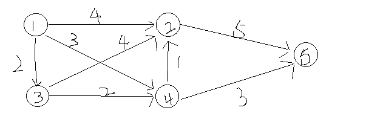
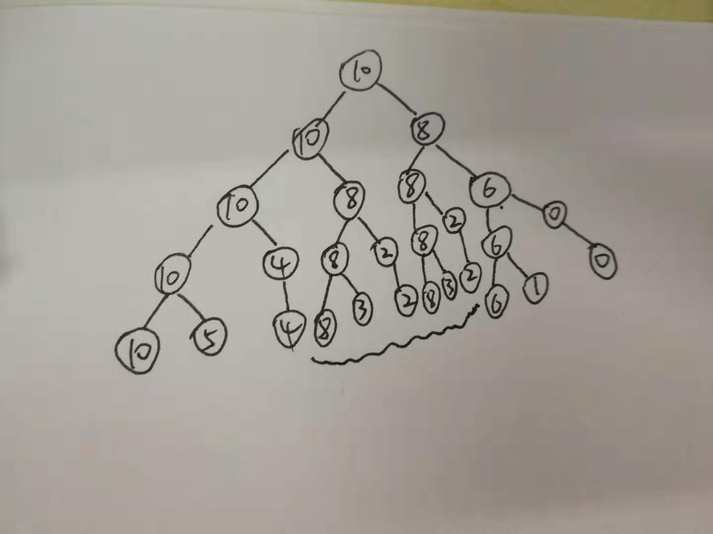
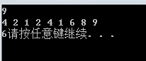
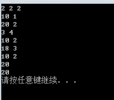

动态规划算法解析与实战

<!-- more -->

**一、算法思想**

动态规划算法的基础是最优原理，它是用来解决贪婪算法和分治算法无法解决或者无法简洁高效解决的算法，一般用于求解下列问题：（1）背包问题 （2）最短路径 等。

动态规划和贪婪算法一样，都一个问题的求解都是分为对很多问题的求解的综合，问题最终的解是多次选择的综合结果，但是贪婪算法中，每次选择最优解，之后不可撤回，但是动态规划中需要考察一系列的抉择，然后才能确定一个最优抉择序列是否包含最优抉择子序列，具体就通过下面的例子来说明：

1.1 最短路径
  有下图所示的单向图，求从源点1到目的点5的最短路径？

如果是利用贪婪算法来进行求解，那么第一步可以到达的点为2，4，3。按照算法，到点3的距离是最短的，所以选择走到点3，然后点3可以到达2，4，接下来走到点4，因为到点4的距离最短，然后此时可以通过点4到达目的点5，最后选得的路径是1->3->4->5，路径长度为7.虽然确实是最短路径，但是可以看出，从1到3，从3到4，从4到5，整个过程是割裂开的，但是一个最短路径是求的整个过程加起来的路径长度最短，很多时候贪婪算法不一定适用，因为它不能回退。

如果是动态规划，那么要考虑的就是，首先选择了从1到3这条路径，之后要确定如何从3到5，如果3到5选择的路径不对，那么就算1到3是最短的，整个结果依然会偏大，所以假设选择了某个点x作为最短路径中的某个点，那么接下来说选择的从x到目的点的路径必须是最短的，这就是包含最优抉择序列的意思，因为考虑这种情况：一个点都没选的时候，此时就相当于要必须选择出从源点到目的点的最短路径，所以可以求出最短路径。

1.2 0/1背包问题
有n个物品和一个容量为c的背包，从n个物品中选择装包的物品，每个物品有自己的重量w和价值p，要求算出如何在不超过背包容量的情况下，要装入物品的价值p最大。

假设n=3，w=[100,14,10],c=116,p=[20,18,15]，如果选择装入第一个物品，那么问题转变为求解c=16，w[14,10],p=[18,15]的最优解，此时有两种解法：装入第一个或者装入第二个，明显看出因为p1>p2,所以装入第一个是此时的最优解，所以得到此条件下的最优结果为[1,1,0]，1代表装入物品，从上可以看出，如果某一步所做的解不是此状态下的最优解，那么它肯定不是初始问题的最优解。也可以不装入第一个物品，此时得到另外一个解[0,1,1]，[0,1,1]是在不装入物品1下的最优解。此时通过计算可以知道肯定是[1,1,0]是最好的结果，可是数据如果很大的时候，该怎么判断某个状态之后，做出的解就是最优解呢，或者进入这个状态之前所做的导致进入这个状态的一个解也是最优解呢，因为如果在某状态下做出的某一个解不是最优解，那这个解也一定不是最初始答案的最优解。

所以上述这种问题的核心就是一个，如何确定做的这一步是最优解的一个组成部分，动态规划的方法是建立一个动态规划递归方程，dp和贪婪算法不一样，是可逆的，可以通过递归方程不断进行迭代，不断修正做出的选择。

例如1.2中提出的背包问题，最优选择序列是由最优子选择序列构成的，我们假设f(i,y)表示背包剩下的容量为y，剩下物品是i、i+1....n的背包问题的最优解。

那么可以得到如下的等式：
f(n,y)=pn (y>=wn) 0(0<=y<wn)
以及f(n,y)=max（f(i+1,y),f(i+1,y-wi)+pi） (y>=wi) f(i+1,y)(0<=y<wi)
上述两个等式的意思是，当剩余容量y大于当前物品i的重量时，那么最优解就是取这个物品和不取这个物品两种情况的最大值，如果剩余容量y小于当前物品i的重量，那么直接就不能放下当前物品。根据最优序列是由最优子序列构成这个结论，可以得到f的递归式子，当递归到n=1的时候就是背包问题最初始时最优解的值，这里就是递归的起点，符合递归的定律，递归必须要有一个可以结束的点。明显f（n，y)是可以通过f(n,y)=max（f(i+1,y),f(i+1,y-wi)+pi） (y>=wi) f(i+1,y)(0<=y<wi)递归求得的.以1.2作为例子举例，如果要求f(3,116)，那么可得f（3,116）=max（f（2,116），f(2,16)+20）,由公式可知f(2,116)=max(f(1,116),f(1,102)+18)、f(2,16)=max(f(1,16),f(1,2)+18)，同理求得f(1,116)=15,f(1,102)=15,f(1,16)=15,f(1,2)=0.
那么可以算出f（3,116）=max（max(15,15+18)，max(15,0+18)+20）=max（33,38）=38
得出最优解是38.然后可以由3个f（n，y）(n等于1,2,3)之间的关系判断出最终结果为[1,1,0]
由上面的计算过程可以看出，无论之前的选择是什么，接下来的选择一定是当前状态下的最大值，也就是最优选择，这就是最优原则，它代表了一个最优选择序列一定由最优选择子序列所构成的，所以应用动态规划就一定要证明该问题适用最优原则，然后就建立动态规划的递归方程组，然后通过不断迭代递归求解该递归方程组，然后由最优解以及各个不同的f(n,y)之间的关系可以求出最优解的组成，上述那个简单的例子中并没有一些重复的计算，但是在复杂的动态规划问题中是存在很多重复的计算的，如果不能避免这些重复的计算，dp的复杂度也会很高，例如有类似于例1.2的题目，但是数据是n=4，w=[20,20，14,10],c=100,p=[20,20，18,15]，在计算f（4,100）=max（f（3,100），f(3,80)+20）中，f（3,100）后续会计算f（2,80），而f（3,80）后续也会计算f（2,80），如果不能很好的避免这些重复计算，动态规划的优越性就荡然无存。
下面就用几个具体的例子的dp解法来进行实战：

**二、实际应用**
2.1 0/1背包问题
 （1）递归求解
  在一中所说的函数f求解方程如下所示：

	int f(int i,int thecapacity)
	{
		if(i==numberofobjects)//遍历到了最后一个物品，这很明显也是递归的出口。
			return (thecapacity<weight[numberofobjects]?0:profit(numberofobjects));
	        if(thecapacity<weight[i])//如果容量不够，那么不能将物品i放入背包，否则是下一种情况。
			return f(i+1,thecapacity);
	        return max(f(i+1,thecapacity),f(i+1,thecapacity-weight[i])+profit[i]);
	}

其中的numberofobjects代表的是物品的个数，i代表目前遍历到了第几个物品，thecapacity代表的是背包剩下的容量，weight数组代表的是每个物品的重量，profit数组代表的是每个物品的价值，其中profit和weight还有thecapacity是全局变量，上述代码的时间复杂度是O（2^n）。
上述这种问题在一个实际的例子当中时，比如n=5，p=[6,3,5,4,6],w
=[2,2,6,5,4],c=10的时候，就会很明显的出现一中提到的重复计算，具体可看下一图：

上图中的波浪线所标注的就是出现重复计算的部分，其实只要在上图树中只要两个节点高度相同，并且剩余容量相同，那么它们所有的后续计算都是重复计算，一般为了避免这种重复计算，采用的方式都是建立一个dp数组，该数组用来存储计算过的f(n,y)的值，具体可以看下面这种无重复计算的f函数：

	int f(int i,int thecapacity)
	{
		if(dp[i][thecapacity]>=0)
	
			return dp[i][thecapacity];//若已经计算过就不用再次计算了
		if(i==numberofobjects)//遍历到了最后一个物品，这很明显也是递归的出口。
		｛
			dp[i][thecapacity]=(thecapacity<weight[numberofobjects]?0:profit(numberofobjects))；
				return dp[i][thecapacity];
		｝
			
	        if(thecapacity<weight[i])//如果容量不够，那么不能将物品i放入背包，否则是下一种情况。
				 dp[i][thecapacity]=f(i+1,thecapacity);
	        else//容量足够，那么选择两种情况里面的最大值
	        	dp[i][thecapacity]=max(f(i+1,thecapacity),f(i+1,thecapacity-weight[i])+profit[i]);
		return dp[i][thecapacity];
	}

时间复杂度已经降低到了O（cn）（c表示背包容量，n表示物品个数）,其中依然有numberofobjects代表的是物品的个数，i代表目前遍历到了第几个物品，thecapacity代表的是背包剩下的容量，weight数组代表的是每个物品的重量，profit数组代表的是每个物品的价值，其中profit和weight还有thecapacity是全局变量，多增加了一个全局变量dp,它的定义应当是vector<vector<int>>dp(n+1,vector<int>(thecapacity+1,-1))，-1代表这个值未曾计算过，最后返回的是dp.back().back(),也就是返回dp[n] [c]。
2.2最长子序列

下面的代码是求最长严格上升子序列（元素之间不需要连续），dp在这种求最长某种限制的子序列，或者说求最大之类的情况下，都是比较适用的，比如下面这个题，具体的就在代码里面看吧。

#code

	#include<iostream>
	#include<vector>
	#include<algorithm>
	using namespace std;
	int lengthOfLIS(vector<int>& nums) {
	    if(nums.size()==0)
	        return 0;
	    vector<int>res(nums.size(),1);//建立dp数组，因为最少包含一个元素，所以最小值肯定是为1，所以初值置为1.
	    for(int i=1;i<nums.size();++i)
	    {
	        for(int j=0;j<i;++j)//如果num[i]大于num[j]，代表num[j]可以接在num[i]后面成为一个上升子序列。
	        {
	            if(nums[i]>nums[j])
	                res[i]=max(res[i],res[j]+1);
	        }
	    }
	    sort(res.begin(),res.end());//排序找出最大值，也就是最长的子序列的长度。
	    return res.back();
	}
	int main()
	{
		long n;
		cin>>n;
		vector<int>nums(n,0);
		while(n--)//构造需要处理的数组
		{
			int temp=0;
			cin>>temp;
			nums[n]=temp;
		}
		
		cout<<lengthOfLIS(nums);//输出最长严格上升子序列的长度
		system("pause");
		return 0;
	
	}

运行的结果如下所示：

2.3求最大值

爱玩游戏的小J，小J给每个游戏标上一个成就值，同时估算了完成这些游戏所需要的时间，现在他只有X天时间，而游戏一旦开始玩，至少需要玩一天才能够停下来，那么他玩完的游戏的成就值之和最大能达到多少呢？

虽然是游戏，其实就是一个0/1背包问题，完成这个游戏等同于放入背包，x天等同于背包容量，所以依然是一样的办法。

#code

	#include<iostream>
	#include<vector>
	#include<algorithm>
	#include<map>
	using namespace std;
	int value(vector<pair<int,int>>&a,int day)
	{
		vector<int>p(day+1,0);//可以看出，其实不一定要用二维数组和递归也能做dp，不过把vector里面的元素换成了pair格式，因为要存耗时天数和成就值。
		for (int k = 0; k<a.size();++k)//可以看出复杂度是c*n
		{
			for(int i=day;i>=0;--i)
			{
				if(a[k].second<=i)//第k个游戏可以完成，那么有两种可能。
					p[i]=max(p[i],p[i-a[k].second]+a[k].first);
			}
		}//双重循环用第二个循环代替了一个单独存储剩余天数的数据，所以可以不用递归。
		return p.back();
	
	}
	int main()
	{
	    int num=0;
	    cin>>num;
		vector<int>res;
		while(num--)
		{
			int game_num=0;
			cin>>game_num;
			int day_num=0;
			cin>>day_num;
			vector<pair<int,int>>game__num;
			while(game_num--)
			{	
				pair<int,int> temp;
				cin>>temp.first;
				cin>>temp.second;
				game__num.push_back(temp);
			}//输入测试用例
			int value_num=value(game__num,day_num);//进行dp运算
			res.push_back(value_num);
		}
		for(int i=0;i<res.size();++i)
		{
			cout<<res[i]<<endl;
		}
		system("pause");
	    return 0;
	     
	}

输出结果如下所示：

