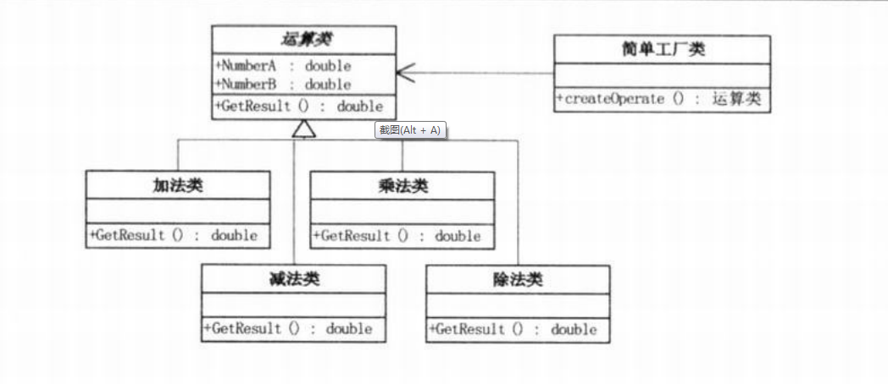
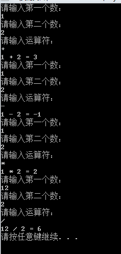

<!-- more -->
对象：一个自包含实体，用一组可识别的特性和行为标识
类：具有相同的属性和功能的对象的抽象的集合
子类继承父类：（1）子类拥有父类所有的非private的属性与功能
            （2）子类拥有自己的属性和功能，即可以扩展父类没有的属性和功能
            （3）子类可以进行方法重写

工厂模式属于创建型模式，大致可以分为三类，简单工厂模式、工厂方法模式、抽象工厂模式。

一、简单工厂模式

首先介绍简单工厂模式，它实例化对象的时候不是一般的new Object()，根据用户的具体输入来实例相应的类。对于客户端来说，去除了具体的类的依赖。只需要给出对具体实例的描述给工厂（例如书中的例子给出+、-、*、/），工厂就会自动返回具体的实例对象，也就是说它的主要特点就是需要在工厂类中做判断，从而创造相应的产品。当需要增加新类型的产品时，就需要修改工厂类，添加相应的实例相关的类。有点抽象，举个例子就明白了。一个计算器作为一个工厂，能够进行加减乘除四种运算，客户需要进行什么样的运算，一定要显示的告诉计算器。

下面是代码实现：

	#include<iostream>
	using namespace std;
	//运算抽象类
	class Operation
	{
	public:
		double numberA;
		double numberB;
		virtual double getResult()=0;
		
	};
	 class Add :public  Operation{
	 
	    // 加法计算,开始的时候getresult没写对，参数多了，一直说无法实例化抽象类，找了好久。。智障了，一定要对所有的函数重写。
	 public:
		 double getResult() {
	 
	        return this->numberA + this->numberB;
	    }
	};
	 
	  class Sub :public  Operation{
	 
	    // jian法计算
	 public:
		 double getResult() {
	 
	        return this->numberA - this->numberB;
	    }
	};
	   class Mul :public  Operation{
	 
	    // *法计算
	 public:
		 double getResult() {
	 
	        return this->numberA * this->numberB;
	    }
	};
	 class Div :public  Operation{

​	   
	 public:
		 // 除法计算
	     double getResult()  
		 {
	        if (numberB == 0) {
	            std::cout<<"除数不能为0";
	        }
	        return this->numberA / this->numberB;
	    }
	};

​	 
​	
	//定义简单工厂类
	 class EasyFactory {
	 
	    // 简单工厂，根据字符串创建相应的对象
	 public :
			static Operation* createOperation(char operate) {
	        Operation* oper;
	        if (operate=='+')
				oper = new Add;
			else if(operate=='-')
				oper=new Sub;
			else if(operate=='*')
				oper=new Mul;
			else 
				oper=new Div;
				
	        return oper;
	    }
	};
	//客户端代码
	int main()
	{
	    double num1, num2;
	    char operate;
		int n=4;
		while(n--){
	    std::cout<<"请输入第一个数："<<endl;        
	    cin>>num1;
	    cout<<"请输入第二个数："<<endl;
	    cin>>num2;
	    cout<<"请输入运算符："<<endl;        
	    cin>>operate;                        
	
	    Operation* oper = EasyFactory::createOperation(operate);
	    oper->numberA = num1;
	    oper->numberB = num2;
	    double result = oper->getResult();
	    cout<<num1<<" "<<operate<<" "<<num2<<" = "<<result<<endl;
		
	    delete oper;
		}
	    system("pause");
	    return 0;
	}

下面是运行结果：

二、策略模式
它定义了算法家族，分别封装起来，让他们之间可以互相替换，此模式让算法的变化，不会影响到使用算法的客户。当需要在不同时间运用不同的业务规则，就可以考虑策略模式。
优点：
（1）策略模式是一种定义一系列算法的方法，从概念上来看，所有这些算法完成的都是相同的工作，只是实现不同，他可以以相同的方式调用所有的算法，减少了各种算法类与使用算法类之间的耦合。

（2）策略模式的Strategy类曾是为Context定义了一些列的可供重用的算法或行为。集成有助于析取出这些算法中的公共功能。

（3）策略模式简化了单元测试，因为每个算法都有自己的类，可以通过自己的接口单独测试。

（4）策略模式就是用来封装算法的。

（5）简单工厂模式需要让客户端认识两个类，而策略模式和简单工厂模式结合的用法，客户端只需要认识一个类Context即可。

与工厂模式的区别：工厂模式选择分支，产生不同的产品，策略模式是针对算法的，不同的算法用不同的类。