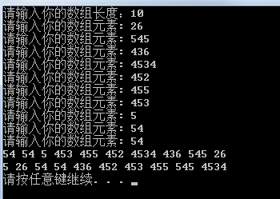
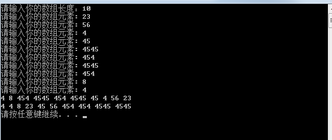
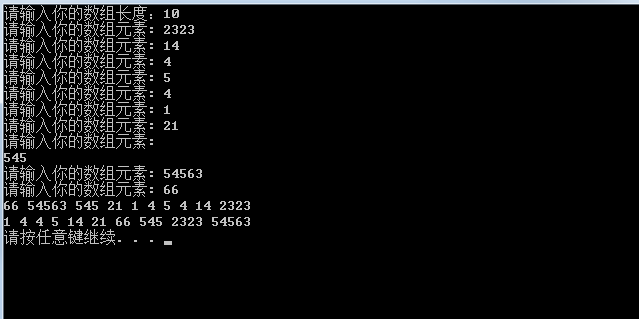
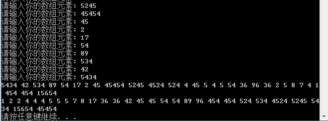
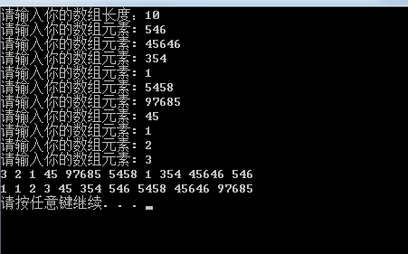
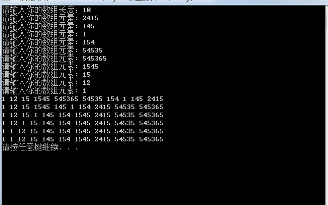
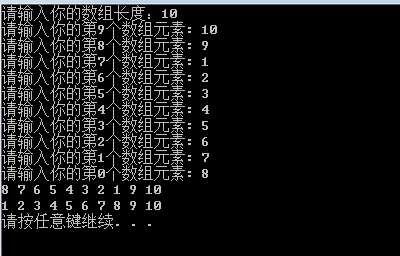

<!-- more -->
一、排序算法
 1.1选择排序

	#include<iostream>
	#include<algorithm>
	#include<vector>
	using namespace std;
	void selectionSort(vector<int>&a,int len)
	{
		
		int j;
	    for(int i=0;i<len;i++)
		{
			int min_index=i;
			for(int j=i+1;j<len;j++)
			{
			  if(a[min_index]>a[j])
				 min_index=j; 
			}
			swap(a[i],a[min_index]);
		}
	}
	
	int main()
	{
	    int num;
		int len;
		cout<<"请输入你的数组长度：";
		cin>>len;
		vector<int>a(len,0);
	    while(len--)
	{
		cout<<"请输入你的数组元素: ";
	    cin>>num;
	    a[len]=num;
	   
	}
	for(int i=0;i<a.size();i++)
	  cout<<a[i]<<" ";
	cout<<endl;
	selectionSort(a,a.size());
	for(int i=0;i<a.size();i++)
	 cout<<a[i]<<" ";
	cout<<endl;
	system("pause");
	return 0;
	}

结果如下图所示：

 1.2插入排序

	#include<iostream>
	#include<algorithm>
	#include<vector>
	using namespace std;
	void insertionSort(vector<int>&a,int len)
	{
		for(int i=1;i<len;i++ )
		{
			//for(int j=i;j>0;j--)
		    //    if(a[j]<a[j-1])
		  //	        swap(a[j],a[j-1]);else break;
			for(int j=i;j>0&&a[j]<a[j-1];j--)
				swap(a[j],a[j-1]);//多次交换，直到到达j应该在的位置。
		}
	}
	
	int main()
	{
		    int num;
			int len;
			cout<<"请输入你的数组长度：";
			cin>>len;
			vector<int>a(len,0);
		    while(len--)
		   {
			cout<<"请输入你的数组元素: ";
		    cin>>num;
		    a[len]=num;
		   
		   }
			for(int i=0;i<a.size();i++)
			  cout<<a[i]<<" ";
			cout<<endl;
			insertionSort(a,a.size());
			for(int i=0;i<a.size();i++)
			 cout<<a[i]<<" ";
			cout<<endl;
			system("pause");
			return 0;
	}

结果如下图所示：

 1.3冒泡排序

	#include<iostream>
	#include<algorithm>
	#include<vector>
	using namespace std;
	void bubbleSort(vector<int>&a,int len)
	{ 
		bool flag=false;//用于判断一次循环之后是否进行过交换，如果没有交换了，说明有序了，不用继续，用来优化函数
		do
		{
			flag=false;
			for(int i=0;i<len-1;i++)
			{
				if(a[i]>a[i+1])
				{
					swap(a[i],a[i+1]);
					flag=true;
				}
			}
			len--;
		
		}
		while(flag);
	}
	
	int main()
	{
	    int num;
		int len;
		cout<<"请输入你的数组长度：";
		cin>>len;
		vector<int>a(len,0);
	    while(len--)
		{
		cout<<"请输入你的数组元素: ";
	    cin>>num;
	    a[len]=num;
	   
		}
		for(int i=0;i<a.size();i++)
		  cout<<a[i]<<" ";
		cout<<endl;
		bubbleSort(a,a.size());
		for(int i=0;i<a.size();i++)
		 cout<<a[i]<<" ";
		cout<<endl;
		system("pause");
		return 0;
	}

结果如下图所示：

 1.4希尔排序
//希尔排序是一个x间隔进行比较的排序算法，一直到最后变成1间隔排序，上面三种都是简单排序。

	#include<iostream>
	#include<algorithm>
	#include<vector>
	using namespace std;
	void shellSort(vector<int>&a,int len)
	{ 
		//这里使用的是序列：1，4，13，40，21.....（3*x+1）
		int h=1;
		while(h<len/3)
			h=3*h+1;//保证h大于等于h/3，这样就可以在比较的时候从中间开始比较前面一个，可能这个序列通过数学验算会快一点。。
		for(;h>=1;h=h/3)//除几无所谓，保证最后h能变成1就可以了，可能是因为除以3会降低复杂度
		{
			for(int i=h;i<len;i++)
			{
				int e =a[i];//这里是明显的插入排序，因为希尔排序就是插入排序的进化版本。
				int j;
				for(j=i;j>=h&&e<a[j-h];j=j-h)//这相当于将原始待排序数组按照h的大小分成几部分分别进行插入排序。
					a[j]=a[j-h];//太大了就往后放，不过插入排序是一个一个往后挪动，希尔排序是根据自己的增量序列来进行移动，一次消除多个逆序对。
				a[j]=e;
			}
			
		}
		
	}
	int main()
	{
	    int num;
		int len;
		cout<<"请输入你的数组长度：";
		cin>>len;
		vector<int>a(len,0);
	    while(len--)
		{
		cout<<"请输入你的数组元素: ";
	    cin>>num;
	    a[len]=num;
	   
		}
		for(int i=0;i<a.size();i++)
		  cout<<a[i]<<" ";
		cout<<endl;
		shellSort(a,a.size());
		for(int i=0;i<a.size();i++)
		 cout<<a[i]<<" ";
		cout<<endl;
		system("pause");
		return 0;
	}

结果如下图所示：

 1.5归并排序
//归并排序需要调用两个程序，一个划分，一个归并。

	#include<iostream>
	#include<algorithm>
	#include<vector>
	using namespace std;
	void merge(vector<int>&a,vector<int>&copy_a,int l,int mid,int r)
	{
		int i=l;
		int j=mid+1;
		int k;
		for( k=l;k<=r;k++)
		{
			if(i>mid||j>r)
				break;
			if(a[i]>a[j])
				copy_a[k]=a[j++];
			else 
				copy_a[k]=a[i++];
		}
		if(i<=mid)
		{
			for(;k<=r;k++)
				copy_a[k]=a[i++];
		}
		if(j<=r)
		{
			for(;k<=r;k++)
				copy_a[k]=a[j++];
		}
		for(;l<=r;l++)
			a[l]=copy_a[l];
		//可以用个简单的逻辑写完前面的，不过就是判断会多一点
		/*
		int i = l, j = mid+1;
	    for( int k = l ; k <= r; k ++ ){
	
	        if( i > mid )   { copy_a[k] = a[j-l]; j ++;}
	        else if( j > r ){ copy_a[k] = a[i-l]; i ++;}
	        else if( a[i-l] < a[j-l] ){ copy_a[k] = a[i-l]; i ++;}
	        else                          { copy_a[k] = a[j-l]; j ++;}
	    }
		for(;l<=r;l++)
			a[l]=copy_a[l];
		*/
		
	}
	void mergeSort(vector<int>&a,vector<int>&copy_a,int l,int r)
	{ 
		if((r-l+1)<=1)
			return ;
	    /*
	    根据实际情况，当数组规模比较小的时候，用插入排序速度比归并排序快，所以上述的返回条件可以修改一下。
		if((r-l+1)<15)
		{
			insertionSort(a,l,r);
			return;
		}
	    也可以先直接将数组按比如2^n(例如：16)个元素划分，然后每段先做插入排序，做完之后在进行归并排序，相当于跳过了从1到2、2到4、4到8、8到16这几次归并。			
		*/
		int mid=l+((r-l)>>1);
		mergeSort(a,copy_a,l,mid);
		mergeSort(a,copy_a,mid+1,r);
		merge(a,copy_a,l,mid,r);
		
	}
	
	int main()
	{
	    int num;
		int len;
		cout<<"请输入你的数组长度：";
		cin>>len;
		vector<int>a(len,0);
		vector<int>copy_a(len,0);//直接申请一个数组作为副本，这样避免反复开辟空间，临时开辟时间成本太高了。
	    while(len--)
		{
		cout<<"请输入你的数组元素: ";
	    cin>>num;
	    a[len]=num;
		copy_a[len]=num;
	   
		}
		for(int i=0;i<a.size();i++)
		  cout<<a[i]<<" ";
		cout<<endl;
		mergeSort(a,copy_a,0,a.size()-1);//正规的排序程序不能这么写，应该封装好，只用输入一个数组进去就可以了。
		for(int i=0;i<a.size();i++)
		 cout<<a[i]<<" ";
		cout<<endl;
		system("pause");
		return 0;
	}

结果如下图所示：

 1.6快速排序
//快速排序元素的选取对排序效率影响很大。

	#include<iostream>
	#include<algorithm>
	#include<vector>
	using namespace std;
	int slecet(vector<int>&a,int l,int r)
	{
		int mid=l+((r-l)>>1);
	    if ( a[ l ] > a[ mid ] )
	        swap( a[ l ], a[ mid ] );
	    if ( a[ l ] > a[ r ] )
	        swap( a[ l ], a[ r ] );
	    if ( a[ mid ] > a[ r ] )
	        swap( a[ mid ], a[ r ] );
	    /* A[ Left ] <= A[ Center ] <= A[ Right ] */
	    swap( a[ mid ], a[ r-1 ] ); /* 将pivot藏到右边，节约一次比较，反正都比过了 */
	    /* 只需要考虑 A[ Left+1 ] … A[ Right–2 ] */
	    return a[ r-1 ]; /* 返回 pivot */
	}
	void quickSort(vector<int>&a,int l,int r)
	{
		if(l>=r)
			return;
		if(r-l==1)//一定要加上这一个判断条件，因为我们用了slecet函数选择元素，会导致只有两个元素的时候归并失效。
		{
			if(a[r]>=a[l])
				return ;
			else
				swap(a[l],a[r]);
			return ;
		}
		int num=slecet(a,l,r);
		int i=l+1;
		int j=r-2;
		while(i<j)
		{
			while(a[i]<num)
				i++;
			while(a[j]>num)
				j--;
			if(i<j)
			{
				swap(a[i],a[j]);
			}
			else
				break;
		}
		
		swap(a[r-1],a[i]);
		for(int i=0;i<a.size();i++)
		  cout<<a[i]<<" ";
		cout<<endl;
		quickSort(a,l,i-1);
		quickSort(a,i+1,r);
	
	}
	int main()
	{
	    int num;
		int len;
		cout<<"请输入你的数组长度：";
		cin>>len;
		vector<int>a(len,0);
		
	    while(len--)
		{
		cout<<"请输入你的第"<<len<<"个数组元素: ";
	    cin>>num;
	    a[len]=num;
	    }
		for(int i=0;i<a.size();i++)
		  cout<<a[i]<<" ";
		cout<<endl;
		quickSort(a,0,a.size()-1);
		for(int i=0;i<a.size();i++)
		 cout<<a[i]<<" ";
		cout<<endl;
		system("pause");
		return 0;
	}

结果如下图所示：

 1.7堆排序
//堆排序需要借助堆这种数据结构。
	

	#include<iostream>
	#include<algorithm>
	#include<vector>
	using namespace std;
	void shiftup(vector<int>&a,int i,int n)
	{
		int num = a[i];//将我们待插入正确位置的元素保存起来
	    while( 2*i+1 <=n ){//找到没有孩子为止
	        int j = 2*i+1;
	        if( j+1 <=n && a[j+1] > a[j] )
	            j += 1;//选出左右孩子中最大的那个孩子
	
	        if( num >= a[j] ) break;//说明位置正确了，可以退出了
	        a[i] = a[j];//如果没有孩子大，向下移，并且它可能比孩子的孩子还要小，所以要继续往下比较。
	        i = j;
	    }
	    a[i] = num;//最后找到了正确的位置。
		return;
	}
	void heapSort(vector<int>&a,int n)
	{
		for(int i=(n-1)/2;i>=0;i--)
			shiftup(a,i,n);
		for(int i=n;i>0;i--)
		{
			swap(a[0],a[i]);
			shiftup(a,0,i-1);//因为只是将最后一个和第一个调换了位置，相当于把根节点移除最小的节点补上，所以只需要寻找新的根节点的位置就可以了，并且这个过程中堆的长度每次减一。
		}
	}
	int main()
	{
	    int num;
		int len;
		cout<<"请输入你的数组长度：";
		cin>>len;
		vector<int>a(len,0);
		
	    while(len--)
		{
		cout<<"请输入你的第"<<len<<"个数组元素: ";
	    cin>>num;
	    a[len]=num;
	    	}
		for(int i=0;i<a.size();i++)
		  cout<<a[i]<<" ";
		cout<<endl;
		heapSort(a,a.size()-1);
		for(int i=0;i<a.size();i++)
		 cout<<a[i]<<" ";
		cout<<endl;
		system("pause");
		return 0;
	}

结果如下图所示：

