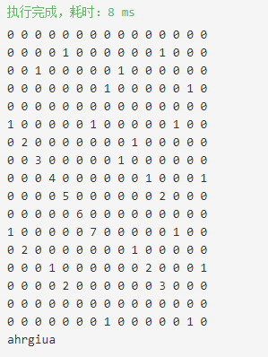

DP算法求解
<!-- more -->

用动态规划做了一个，自己测试了几个测试用例也通过了。

	#include <iostream>
	using namespace std;
	int main()
	{
		string a="jahrgiuaerhgiaeg";
		string b="hsiresahrgiuahgise";
		int l1=a.size();
		int l2=b.size();
	    if(l1==0||l2==0)
	    {
	        cout<<"";
	        return 0;
	    }
		vector<vector<int>>dp(l2,vector<int>(l1,0));
		for(int i=0;i<l1;++i)
		{
			if(a[i]==b[0])
				dp[0][i]=1;
		}
		for(int i=0;i<l2;++i)
		{
			if(a[0]==b[i])
				dp[i][0]=1;
		}
		for(int i=1;i<l2;++i)
		{
			for(int j=1;j<l1;++j)
			{
				if(a[j]==b[i])
					dp[i][j]=dp[i-1][j-1]+1;
	            cout<<dp[i][j]<<" ";
			
			}
	        cout<<endl;
		}
		int max_l=0;
		int max_i=0;
		int max_j=0;
	
	  for(int i=0;i<l1;++i)
	  {
			for(int j=0;j<l2;++j)
			{
				if(dp[j][i]>max_l)
				{
	                
					max_i=i;
					max_l=dp[j][i];
				}
			}
	  }
	    
	    string res;
	  while(max_l--)
	  {
		res=a[max_i--]+res;
	  }
	    cout<<res;
	  system("pasue");
	  
	}

输出为：

思路还是比较简单的，首先得出两个字符串a、b的长度l1和l2，建立一个二维数组dp用于存储以a[j]和b[i]作为结尾的最长公共子串的长度，意思就是说dp[i][j]的意思是以a[j]和b[i]为结尾的最长公共子串的长度，如果说a[j]!=b[i]，也就是说不存在以两者为结尾的子串，所以dp[i][j]=0，如果a[j]==b[i]，那说明可以将a[j]和b[i]作为公共子串的最后一个字符，其长度就是dp[i-1][j-1] + 1.

然后就是预处理的部分，dp矩阵的第一行，对于其中的某个位置(0,j)来说，如果a[j]==b[0]，那么dp[0][j]=1，否则为0.同理对dp第一列进行处理，如果a[0]==b[i]，那么dp[i][0]=1,否则为0。然后对除去第一行和第一列的二维dp数组进行遍历，利用上面的规则重置每个值，最后输出最大值就是最长公共子串。

其实认真观察上面的结论和程序，会知道其实根本就不需要一个dp二维矩阵也可以完成最长公共子串的寻找，因为最后只需要一个最大公共子串的长度和它的坐标，然后就能得出结果，并且每一个dp中的元素的值只与它的左上方值有关，所以可以简化函数，让它的空间复杂度为O（1）。代码如下：

	#include <iostream>
	using namespace std;
	int main()
	{
	    string a="jahrgiuaerhgiaeg";
	    string b="hsiresahrgiuahgise";
	    int l1=a.size();
	    int l2=b.size();
	    if(l1==0||l2==0)
	    {
	        cout<<"";
	        return 0;
	    }
	    int row = 0, col = l2-1; 
	    int max_l= 0,max_i = 0; //记录最大长度和a字符串的某个截至位置
	    while(row < l1){
	        int i = row, j = col;
	        int num = 0;
	        while(i < l1 && j < l2){ //因为是像右下方遍历，所以只会增加，只用小于最大值就ok
	            if(a[i] == b[j])
	                ++num;
	            else
	                num = 0;
	            if(num > max_l){ //更新最大值
	                max_l =num;
	                max_i=i;
	            }
	            i++;
	            j++;
	        }
	        if(col > 0) // 没到最左往左移动
	            col--;
	        else
	            row++;  //到达最左往下移动
	    }
	    string res;
	    while(max_l--)
	    {
	    res=a[max_i--]+res;
	    }
	    cout<<res;
	    system("pasue");
	  
	}

输出结果为：

ahrgiua ，可以看出和上面一种方法得出的结果是一样的。