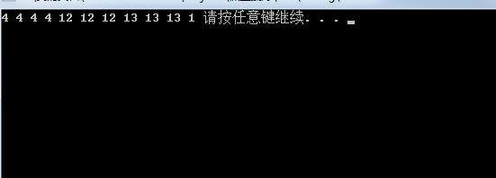
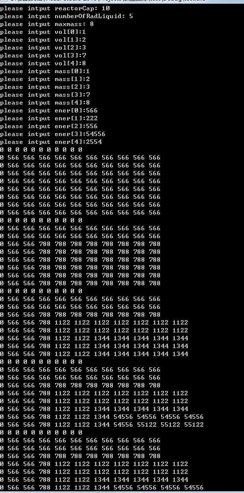
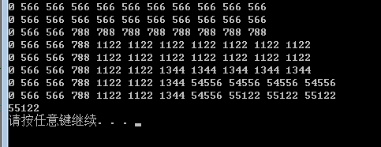

中兴的笔试的两道题目，一个题目是按频次排序，一个题目是动态规划求背包问题。
<!-- more -->
题目描述
题意为从一个无序数组中，将其中的整数按照出现的频次多少来排列（并且出现几次就排列几个），按照出现频次从高倒低排序，并且频次相同的时候做一个稳定排序，先出现的排在前面，比如输入为[1,2,1,2,9,9,1,6,4,4,4,4,7]，那么输出就应该为[4,4,4,4,1,1,1,2,2,9,9,6,7]。
#思路
最开始想的是使用两个vector，一个用来存储频次，一个用来存储元素，例如题目描述中的这个数组就会被存储为times={3,2,2,2,4,1},num={1,2,9,6,4,7},然后再将两者按照times的大小进行排序,因为要求是稳定的，所以采用一个稳定排序算法，我用的是插入排序，然后最后再按照排序之后的结果来得出对应输出就可以了。
#code

	#include<iostream>
	#include<vector>
	#include<map>
	#include<algorithm>
	using namespace std;
		
	vector<int> salaryfrequeny(int num, int * salaries)
	{
		vector<int>res;
		if (num <= 0)
			return res;
		else if (num <= 1)
	        {
	        res.push_back(salaries[0]);
	        return res;
	        }
				
		vector<int > times;
		vector<int > nums;
		map<int, int>suoyin;//也可以直接在num里面寻找，但是我觉得map是以rb_tree为底层的，寻找会快一点。
		int index = 0;
		
		for (int i = 0; i < num; i++)
		{
			int value = salaries[i];
			//vector <int>::iterator ite = find(nums.begin(),nums.end(),value);
			if (suoyin.count(value) == 0)//检查是否第一次遇到这个元素，这里也可以改写成ite==nums.end()
	        //上文说的，觉得map查找快，所以用的map，如果用上面那个，就可以不用使用map了。
			{
				suoyin[value] = index++;
				times.push_back(1);
				nums.push_back(value);
			}
			else
			{
				times[suoyin[value]] += 1;
				//distance(begin(nums), ite)
			}
		}
		
		int len = nums.size();
		for (int i = 1;i<len;++i)
		{
			 
			for (int j = i; j >0&&times[j]>times[j-1]; --j)
			{
				swap(times[j],times[j-1]);
				swap(nums[j],nums[j-1]);
			}
			
		}
		for (int i = 0; i < len; i++)
			res.insert(res.end(), times[i], nums[i]);
		return res;
		
	}
		
	int main()
	{
		const int num = 11;
		int salaries[num] = {12,12,12,13,13,13,1,4,4,4,4 };
		vector<int > result = salaryfrequeny(num, salaries);
		int len = result.size();
		for (int i = 0; i < len; i++)
			cout << result[i] << " ";
		system("pause");
		return 0;
	}

运行结果如下所示：

题目描述
维克多博士创造了一个裂变反应堆，可取用处于液体状态的放射性物质。反应堆的容量是V加仑。他有N瓶的放射性液体，每个都有一定的质量和一定的体积。当液体倒入反应堆时，也产生一些单位的能量。现在，维克多想要将能量输出最大化。但是，有一个限制条件。他研究了原子元素的物理知识和历史，认识到反应堆内放射性液体的总量不能超过特定的临界质量M，否则反应就会失控，并引发剧烈的爆炸。写一个算法，帮助他从反应堆获得最大的能量，而不会让他丢掉性命。
输入：

该方法的输入包括六个参数------
reactorCap，一个整数，表示反应堆的容量(V);
numberOfRadLiquid,一个整数，表示现有小瓶的数量(N);
criticalMass，一个整数，表示反应堆的最大临界质量(M);
volumes，一个整数列表，按顺序表示N份放射性液体的体积;
masses，一个整数列表，按顺序表示N份放射性液体的质量;
energies,一个整数列表，按顺序表示N份放射性液体产生的能量。
输出：
返回一个整数，表示可给定的约束条件下从反应堆中产生的最大能量。
示例：
输入：
reactorCap=100，numberOfRadLiquid=5，criticalMass=15，volumes=[50,40,30,20,10]，masses=[1,2,3,9,5]，energies=[300,480,270,200,180]
输出：
960
解释：
选择1、2、5号瓶中的液体，产生的能量=300+480+180=960.
#思路
在笔试的时候，因为赶浦发的笔试，时间太紧了，直接用的暴力破解，列出所有可能的组合，然后判断是否满足约束条件，再输出满足约束条件里面的最大能量，慢的一匹，下来仔细想了想，这就是背包问题的嘛，利用动态规划解决这道题时，使用一个函数f来表示最大能量，方程为f(v,m,n), 这个方程的解表示n个小瓶在约束条件最大质量m，最大容量v下可以获得的最大能量，那么很显然f(v,m,n)=max(f(v,m,n),f(v,m,n-1),f(v-v(k),m-m(k),n))，利用一个二维数组表示在某个体积和质量的约束下可获得的最大能量，详细理解可以看下面的代码注释，以及输出结果。
#code

```c++
	#include <iostream>
	#include <vector>
	#include <map>
	#include <algorithm>
	using namespace std;
	int maxenergy(int reactorCap, int numofliq, int maxmass, vector<int> volumes, vector<int> mass, vector<int> energies){
		int res;
		vector<vector<int>> p(maxmass + 1, vector<int>(reactorCap + 1, 0));//以容量和质量的最大值建一个二维数组表示质量为i，体积为j时可以获得的最大能量，然后对状态(i,j)进行更新，从后往前更新。
		for (int k = 0; k < mass.size(); ++k)
		{
			for (int i = p.size() - 1; i>0; --i)//不用等于0，因为体积或者质量某一个等于0，都无法放下新瓶子。
			{
				for (int j = p[i].size() - 1; j>0; --j)
				{
					if (mass[k] <= i && volumes[k] <= j)//如果mass[k]小于目前的质量i,volumes[k]小于目前的容量j，说明可以装入第k个瓶子,这里有很多冗余计算。
						p[i][j] = max(p[i][j], (p[i - mass[k]][j - volumes[k]] + energies[k]));//计算最大值，由前面说的那个状态转移方程来计算最大值。
					    //如果我装下这个瓶子，会导致我之前一些瓶子装不下，那么就要判断两者到底谁更大，选择更大的。
				}
			}
			for(int i=0;i<p.size();++i)
			{
				for(int j=0;j<p[i].size();++j)
				{cout<<p[i][j]<<" ";}
				cout<<endl;
			}
		}
```

​	

```c++
	res = p.back().back();//最后一个一定是最大的,因为最后一维才是考虑了所有的瓶子的。
	for(int i=0;i<p.size();++i)
	{
		for(int j=0;j<p[i].size();++j)
		{cout<<p[i][j]<<" ";}
		cout<<endl;
	}
	return res;
}

int main(){
	int reactorCap ;
	cout<<"please intput reactorCap: ";
	cin>>reactorCap;
	int numberOfRadLiquid  ;
	cout<<"please intput numberOfRadLiquid: ";
	cin>>numberOfRadLiquid;
	int maxmass ;
	cout<<"please intput maxmass: ";
	cin>>maxmass;
	vector<int>vol;
	vector<int>mass;
	vector<int>ener;
	for(int i=0;i<numberOfRadLiquid;i++)
	{
		int temp;
	    cout<<"please intput vol["<<i<<"]:";
		cin>>temp;
		vol.push_back(temp);
		
	}
	for(int i=0;i<numberOfRadLiquid;i++)
	{
		int temp;
	    
		cout<<"please intput mass["<<i<<"]:";
		cin>>temp;
		mass.push_back(temp);
```

```c++
	}
	for(int i=0;i<numberOfRadLiquid;i++)
	{
		int temp;
	   
		cout<<"please intput ener["<<i<<"]:";
		cin>>temp;
		ener.push_back(temp);
		
	}
	int res = maxenergy(reactorCap, numberOfRadLiquid, maxmass, vol, mass, ener);
	cout<<res<<endl;;
	system("pause");
	return 0;
}
```

运行结果如下所示：





题目描述
将一个字符串数组中的字母按照以下规则排列：表中任何单词的首字母与其前面单词的尾字母相同！ 函数canArrangeWords的输入应该包含一个整数num(1<=num<=100)和一个单词阵列arr，阵列元素是由所有小写字母组成的单词。单词长度为2-100之间,可取到2和100。能排列成功，返回1，不成功返回-1；
\#思路
这个很像之前说的字符串全排列，用字符串全排列的方法也确实可以做出来，不过加了个flag进去，这样一旦找到一个符合条件的序列，就不继续寻找了。
**##code**

```cpp
    #include <cstring>
    #include <iostream>
    using namespace std;
    int flag = 0;
    void quanpailie1(char **arr, int n, int k) {
        if (k == n) {  
            //不需要看输出结果就可以将下面的注释掉
            for (int i = 0; i < n; ++i)
              cout << arr[i] << '\t';
            cout << endl;
            flag = 1;
            return;  
        }     
        for (int i = k; i < n; ++i) {  
            if (flag==0&&k > 0 && (arr[k-1][strlen(arr[k-1])-1] == arr[i][0])) {  //k!=0，之前的0-k-1个字符串已经排好序，则判断k-1号字符串与之后的字符串,找到能够满足条件的i，将其和k的位置互换，flag如果等于1，代表已经找到了，不用找了，不然会找到所有满足条件的排列为止。
                swap(arr[k],arr[i]);  
                quanpailie1(arr, n, k+1);  
                swap(arr[k],arr[i]);  
            }
            else if ( k==0 ) {  
            //当k=0，前方无元素，所以将第一个元素挨个和后面的元素换一次，因为不确定成功的答案在哪个开头的数组里。
                swap(arr[k],arr[i]);  
                quanpailie1(arr, n, k+1);  
                swap(arr[k],arr[i]);  
            }  
            else
                continue;
        } 
        return; 
    }  
    int main() {
        int n;
        cin >> n;//输入几个字符串
        char **arr = new char*[n];
        for (int i = 0; i < n; ++i) {
            arr[i] = new char[100];
            memset(arr[i], 0, 100);
            cin >> arr[i];
        }
        quanpailie1(arr, n, 0);
        system("pause");
        if (flag)
            return true;
        else
            return false;
        
    }
```


