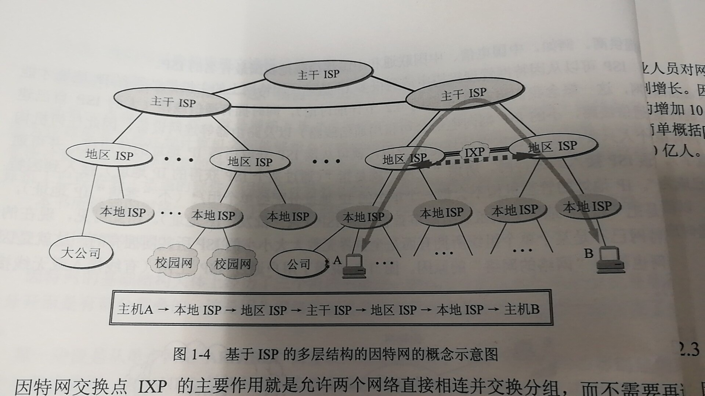
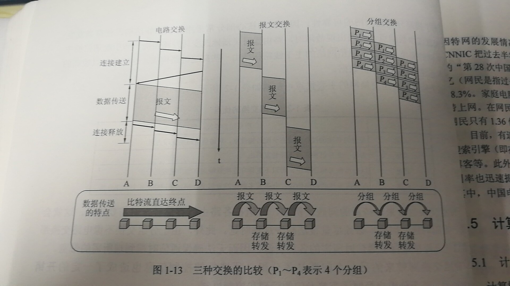
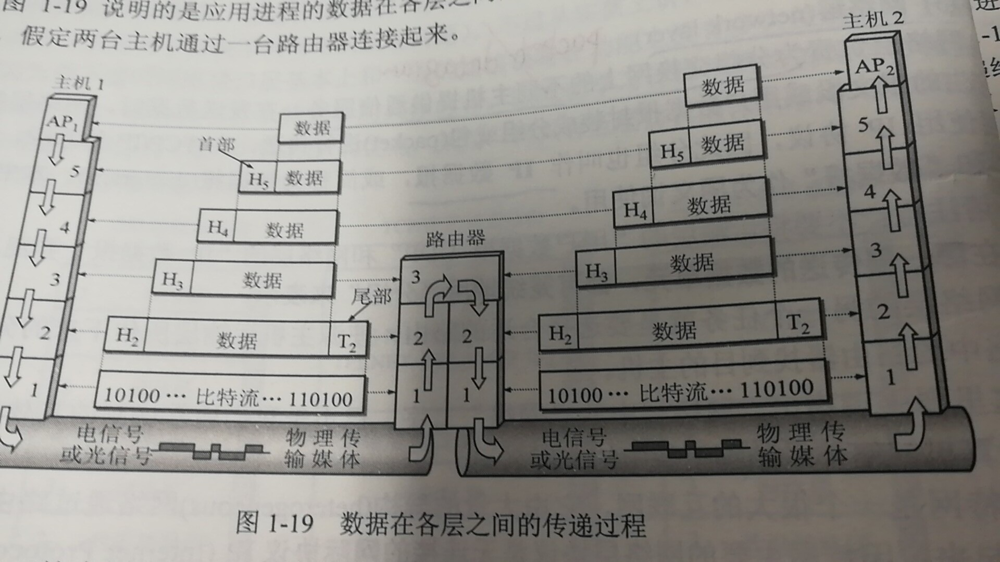

谢希仁老师的计算机网络学习（第六版）
<!-- more -->
因特网就是世界上最大的国际性计算机网络，计算机网络一般是指一些互相连接的、自治（独立）的计算机的集合。
计算机网络向用户提供的最重要的两个功能是：
（1）连通性：指计算机网络上的上网用户之间都可以交换信息，好像这些用户的计算机都可以彼此连通一样。
（2）共享：是指的资源共享，资源共享的含义是多方面的，可以是信息共享、软件共享、硬件共享等。例如，计算机网络上有许多主机存储了大量有价值的电子文档，可以上网的用户自由读取或下载，由于网络的存在，这些资源就好像在用户身边一样。
网络是由若干结点和连接这些结点的链路所组成的，结点可以使计算机、集线器、交换机、路由器等。网络和网络之间可以通过路由器连接起来，构成一个覆盖更大的网络，就是互联网，因此互联网是“网络的网络”，所以网络把许多计算机链接起来，而因特网把网络连接起来。
ISP：因特网服务提供者，移动，联通，电信。用户一般通过ISP连入因特网。ISP也分为主干isp、地区isp、本地isp。
IXP：因特网交换点，用于更快的转发分组，一图胜千言，哈哈哈，如下图所示：

它的作用就是允许两个网络直接相连并交换分组，不需要再通过第三个网络来转发分组。
因特网按照其工作方式可以分为一下两大块：
（1）边缘部分：由所有连接在因特网上的主机（host，又称端系统end system）组成，这部分是用户直接使用，用来进行通信和资源共享。
（2）核心部分：有大量网络和连接这些网络的路由器组成，这部分是为边缘部分提供连通性和交换的。
首先明确一个概念，主机A和主机B进行通信，实际是指主机A上的某个进程和主机B上的另一个进程进行通信，这才可以简称为计算机之间的通信。
端系统之间的通信方式通常划分为两大类：
（1）客户-服务器方式（C/S方式）（分为客户和服务器，两者是指计算机进程，或者说计算机软件）
（2）对等方式（P2P方式）（本质上仍是上一种模式，但是对等连接中每一个主机即是客户又是服务器）
网络核心部分的功能是提供连通性，使边缘部分每一台主机都能像其它主机通信。其中起到特殊作用的是路由器，它是一种专用计算机（不是主机），实现分组交换。
短分组是暂存在路由器的存储器（内存）中而不是存在磁盘中的，保证了较高的交换速率。
分组交换的优点：（1）高效，动态分配传输带宽，对通信链路是逐段占用。(2)灵活，为每一个分组独立的选择转发路由（3）迅速，以分组作为传送单位，可以不先建立连接就能像其它主机发送分组（4）可靠，保证可靠性的网络协议，分布式多路由的分组交换网，网络有良好的生存性。
缺点：（1）存在时延，因为是存储转发（2）携带控制信息照成额外开销。
三种交换的区别：
（1）电路交换，整个报文连续的从源点到达终点，好像在一个管道中出传送
（2）报文交换，整个报文先到相邻节点，全部存储下来再转发，转发到下一个节点
（3）分组交换，当个分组（报文的一部分）到相邻节点，存储下来再转发，转发到下一个节点

按网络的作用范围分类：
（1）WAN广域网
（2）MAN城域网
（3）LAN局域网
（4）PAN个人区域网
计算机网络的性能指标
（1）速率
b/s，bit每秒
（2）带宽
  带宽本来是指某个信号具有的频带宽度，但是在计算机网络中，带宽是指网络的通信线路的传输数据的能力，因此表示的是代为时间内从网络的某一点到另一点所能通过的“最高数据率”。
（3）吞吐量
单位时间内通过某个网络的数据量。
（4）时延
  4.1发送时延是主机或路由器发送数据帧所需要的时间，也叫传输时延。
  4.2传播时延是电磁波在信道中传播一定距离需要话费的时间。
  4.3处理时延，主机或路由器收到分组进行处理花费的时间。
  4.4排队时延，分组在经过路由器时，在路由器内部等待处理话费时间。
（5）时延带宽积
时延*带宽，
（6）往返时间RTT
（7）利用率
ISO在1977年提出了OSI/RM(开放系统互连基本参考模型)，但是TCP/IP才是事实上的国际标准。
分层带来了很多好处：
（1）各层之间独立的，降低复杂度
（2）灵活性好
（3）结构上可分割开
（4）易于实现和维护
（5）能促进标准化工作
介绍一下五个层：
（1）应用层
它是体系结构的最高层，任务是通过应用进程间得交互来完成特定的网络应用，应用层协议定义的是应用进程间通信和交互的规则，这里的进程就是指正在运行的程序，不同的网络应用需要不同的应用层协议，比如万维网的HTTP协议，电子邮件的SMTP协议，文件传输的FTP协议。应用层的交互数据单元称为报文。
（2）运输层
负责向两个主机中进程之间的通信提供通用的数据传输服务。应用进程利用该服务传送应用层报文。运输层主要使用的是以下两种协议：
2.1TCP传输控制协议（transmission control protocol）提供面向连接的、可靠的数据传输服务，其传输的单位是报文段（SEGMENT）。
2.2UDP用户数据报协议（user datagram protocol）提供无连接的、尽最大努力的数据传输服务（不保证数据传输的可靠性），其数据传输的单位是用户数据报。
（3）网络层
负责为分组交换网上的不同主机提供通信服务，发送数据时，把运输层产生的报文段或用户数据报封装成分组或包进行传送，因为TCP/IP体系，由于网络层使用ip协议，因此分组也叫做IP数据报，或简称为数据报。
（4）数据链路层
两个相邻结点传送数据时，链路层将网络层交下来的IP数据报组装成帧，在相邻结点之间传送帧，每一帧包括数据和必要的控制信息（同步信息、地址信息、差错控制等）。
（5）物理层
物理层上所传数据的单位是比特（bit），发送0、1。
简化的传输流程如下所示：

路由器的三层是：物理层、链路层、网络层。
运输层最重要的协议是传输控制协议TCP和用户数据报协议UDP，网络层最重要的协议是网际协议IP。

